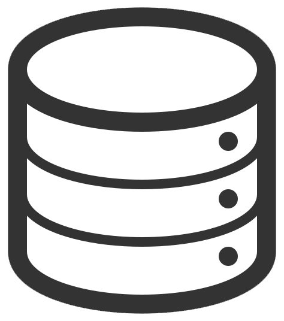

## 📝 배운 지식 정리

### ** Markdown ,  GIT**
- [Markdown](Markdown/Markdown.md)
- [CLI](CLI/CLI.md)
- [Git](GitHub/Git.md)
- [GitHub](GitHub/GitHub.md)
- [Branch](GitHub/Branch.md)
- [GitHub Flow](GitHub/GitHub%20Flow.md)

### ** Python**
- [기초](Python/Python_Basics.md)
- [리스트](Python/Python_List.md)
- [String Formatting](Python/Python_String_Formatting.md)
- [형 변환](Python/Python_Typecasting.md)
- [제어문](Python/Python_Control_Statement.md)
- [문자열](Python/Python_String.md)
- [함수](Python/Python_Function.md)
- [딕셔너리](Python/Python_Dictionary.md)
- [모듈, 패키지, 라이브러리](Python/Python_Module.md)
- [에러, 예외처리](Python/Python_Error.md)
- [스택, 큐](Python/Python_Stack_Queue.md)
- [파일 입출력](Python/Python_File.md)
- [튜플, 세트](Python/Python_Tuple_Set.md)
- [메서드](Python/Python_Method.md)
- [힙](Python/Python_Heap.md)
- [사용자 정의 함수](Python/Python_User_Function.md)
- [이차원 리스트](Python/Python_matrix.md)
- [사용자 정의 클래스](Python/Python_User_Class.md)
- [응용 및 심화](Python/Python_Deep_learning.md)
- [파이썬 기반 프로젝트](Python/Python_Project.md)

### ** MySQL**
- [데이터 베이스]()
- [관계형 데이터 베이스](DB/Relational_Database.md)
- [MySQL Workbench](DB/MySQL_Workbench.md)
- [기초]()
- [단일 테이블 쿼리]()
- [테이블 관리하기]()
- [테이블 조작하기]()
- [다중 테이블 쿼리]()
- [중첩 쿼리]()
- [트랜잭션, 트리거]()
- [정규화, 데이터 모델링]()

[//]: # (### ** PostgreSQL**)

[//]: # (### ** MongoDB**)

### ** HTML**

### ** CSS**

[//]: # (### ** Sass**)

### ** JavaScript**
- [자바스크립트 역사]()
- [DOM]()
- [기초 문법]()
- [함수]()
- [객체]()
- [배열]()
- [이벤트 조작하기]()

[//]: # (### ** TypeScript**)

[//]: # (### ** Java**)

[//]: # (### ** Spring**)

### ** Django**
- [서버에 대하여](Django/About_Server.md)
- [Setting_Guide (가상환경 생성~앱 생성)](Django/Setting_Guide.md)
- [템플릿](Django/Django_Template.md)
- [URLs](Django/Django_URLs.md)
- [모델](Django/Django_Model.md)
- [ORM](Django/Django_ORM.md)
- [쿠키와 세션](Django/Cookie&Session.md)
- [REST API](Django/REST_API.md)
- [HTTP Method : PUT & PATCH 비교](Django/PUT&PATCH.md)

[//]: # (### ** React.js**)

[//]: # (### ** Next.js**)

[//]: # (### ** Vue.js**)

[//]: # (### ** Angular.js**)

[//]: # (### ** Three.js**)

[//]: # (### ** R3F&#40;React Three Fiber&#41;**)

[//]: # (### ** Docker**)

[//]: # (### ** Kubernetes**)

### ** Data Structure, Algorithm**
- [데이터 입출력]()
- [시간복잡도, 빅오 표기법](Python/Python_Time_Complexity.md)
- [스택(Stack), 큐(Queue)]()
- [우선순위 큐(Priority Queue),힙(Heap): 우선순위에 따라 데이터 꺼내는 자료구조]()
- [트리 자료구조(Tree): 활용도 높은 자료구조]()
- [바이너리 인덱스 트리(Binary Index Tree): 특수한 목적의 자료구조]()
- [선택 정렬, 삽입 정렬: 간단하고 기본적인 정렬 알고리즘]()
- [퀵 정렬, 계수 정렬: 더 빠른 정렬 알고리즘]()
- [완전탐색(Exhaustive Search)]()
- [그래프(Graph)]()
- [깊이우선탐색(DFS), 너비우선탐색(BFS)]()
- [다익스트라 알고리즘: 하나의 출발지에서 다른 모든 출발지까지 최단 경로 계산]()
- [플로이드 워셜 알고리즘: 모든 출발지에서 다른 모든 출발지까지 최단 경로 계산]()
- [벨만 포드 알고리즘: 비용이 음수인 간선이 있을 때 최단 경로를 구하는 법]()
- [유니온 파인드 자료구조: 서로소 집합을 판단하는 법]()
- [크루칼 알고리즘: 최소 신장 트리를 찾는 알고리즘]()
- [최소 공통 조상: 트리에서의 최소 공통 조상을 찾는 알고리즘]()
- [위상 정렬: 방향성을 거스르지 않도록 전체 노드 나열하기]()
- [재귀 함수]()
- [유용한 표준 라이브러리]()
- [소수 여부를 빠르게 처리하는 알고리즘 모음]()
- [이진 탐색: 정렬된 데이터에서 빠르게 데이터 찾기]()
- [동적 계획법: 메모리를 더 소모하여 속도 향상시키는 방법]()
- [그리디(Greedy): 현재 상황에서 가장 좋아보이는 것만 고르기]()
- [단순구현(Implementation)]()
- [투 포인터와 구간 합]()

[//]: # (### ** Computer Science&#40;CS&#41;**)

