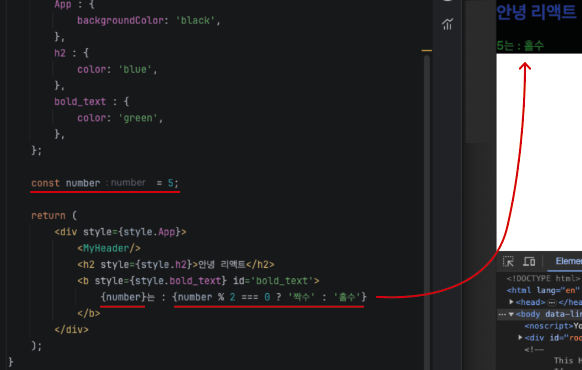

# JSX

## - 목차
1. [JSX 문법(JavaScript XML)](#1-jsx-문법javascript-xml)
    - [Common JS 모듈 vs ES 모듈](#1-common-js-모듈-vs-es-모듈)
    - [컴포넌트](#2-컴포넌트)
        - [컴포넌트 생성 및 내보내기 / 부모 컴포넌트로 가져오기](#--컴포넌트-생성-및-내보내기--부모-컴포넌트로-가져오기)
    - [JSX 문법 규칙](#3-jsx-문법-규칙)
    - [JSX 문법과 CSS 스타일링의 결합](#4-jsx-문법과-css-스타일링의-결합)
    - [JSX에 자바스크립트 값 사용하기](#5-jsx에-자바스크립트-값-사용하기)
        - [Tip) JSX에 삼항연산자 활용](#tip-jsx에-삼항연산자-활용) 
   
---

## (1) JSX 문법(JavaScript XML)

- `자바스크립트` 변수나 함수, 값을 `HTML`에 쉽게 포함하여 사용하도록 고안


<리액트 App.js JSX 문법>

- 리액트는 `함수(모듈)`을 만들고 JSX 문법의 HTML을 리턴해서 `컴포넌트`를 만들수 있음
- `컴포넌트 런칭(Component Launching)` : 모듈을 다른 파일에서 사용가능하도록 내보내기
  - `export default <컴포넌트명>`을 사용

### **1) Common JS 모듈 vs ES 모듈**

- Common JS 모듈
  - `'module.experts'`로 내보내기
  - `'require ('경로')'`로 모듈을 받음


- ES 모듈
  - `'export default'(1개만 내보낼 수 있음)`을 사용하여 내보내기
  - `'import <이름> from ('경로')'`로 모듈을 받음
    - <이름> 은 바꿔도 상관없음, 원하는대로 커스텀 가능


- 리액트는 `ES 모듈`을 사용

<br>

### **2) 컴포넌트**


<리액트 컴포넌트 개념, 출처: 한입 크기로 잘라먹는 리액트>

<br>

### - 컴포넌트 생성 및 내보내기 / 부모 컴포넌트로 가져오기


<컴포넌트 생성 및 내보내기 / 부모 컴포넌트로 가져오기>

<br>

### **3) JSX 문법 규칙**

1) 닫힘 규칙

   - 여는 태그가 있으면 반드시 `닫는 태그`가 있어야 함
     - ex) \<div>\</div>
   - `Self Closing Tag` : \<image>, \<a> 태그도 닫는 태그가 필요한데 이럴 경우, `바로 닫기` 사용 가능
     - ex) \<image />, \<a />, \<br />
   - 없으면 에러 발생
     
<br>

2) 최상위 태그 규칙

   - JSX 문법은 반드시 `단 하나의 부모 요소`를 가져야 함
   
   ```jsx
   // ex)
   
   // 최상위 규칙(O)
   
   return (
        // 무조건 최상위 태그는 1개 
        <div>
            <div></div>   
            <div></div>   
        </div>
   );
   
   // ------------------------------------------
   
   // 최상위 규칙(X)
   
   return (
        // 최상위 태그가 2개 이상
        <div></div>
        <div></div>
   );
   
   // 에러 발생
   ```

   > Q) 만약 최상위 태그로 안 묶고 싶다면?
   >
   > A) `React.Fragment` 기능 이용하여 최상위 태그 대체 가능
   
    

    <리액트 Fragment 사용>
    
   - `import React from 'react';`를 가져오기
   - 리액트의 특수기능을 사용하지 않는다면 `import React from 'react';` 생략 가능
   - 기존의 최상위 태그 \<div> 대신 `<React.Fragment>` 태그 사용
     - <> </> `빈 태그` 사용도 가능
   - 개발자 도구를 살펴보면 기존의 root 태그의 하위 태그였던 \<div class="App"> 이 없어짐

<br>

### **4) JSX 문법과 CSS 스타일링의 결합**

1) 기본 방법


<리액트 기본 CSS 적용>

- CSS는 `import ('경로');`를 통해 가져옴
- 기존의 `class="속성명"`이 아닌 `className="속성명"`을 사용하여 적용
- 기존 CSS의 `.속성명`(.App, .text, ...), `태그명`(h2, div, ...), `#아이디명`(#bold_text, #card, ...) 사용 가능

<br>

2) inline 스타일링 방법


<리액트 inline 스타일링 적용>

- 스타일 `객체`를 생성
- 객체 안에 `키(key)`로 `속성명`, `값(value)`으로 `스타일` 지정 
- 스타일명은 `카멜케이스(camelCase)`로 작성
- 기본 CSS에서는 `className="속성명"`으로 지정했다면 inline 스타일링에서는 `style={객체명.속성명}`으로 중괄호와 점표기법을 활용하여 지정

<br>

### **5) JSX에 자바스크립트 값 사용하기**


<리액트 JSX에 자바스크립트 값 사용>

- `중괄호{}`를 사용하며, 중괄호 안에 `함수, 숫자, 문자열, 연산`의 값을 넣어도 다 렌더링 가능
- 하지만, 배열, true, false 등의 타입은 렌더링 불가

<br>

### Tip) JSX에 삼항연산자 활용



<리액트 삼항연산자 사용>

- 연산, 수식이 값으로 활용가능하기에 `삼항연산자` 사용도 가능
  - 삼항연산자 : `조건 코드 ? 참일 경우 리턴 값 : 거짓일 경우 리턴 값`으로 구성
- 이를 이용하여 `조건부 렌더링`이 가능 (자주 사용됨)