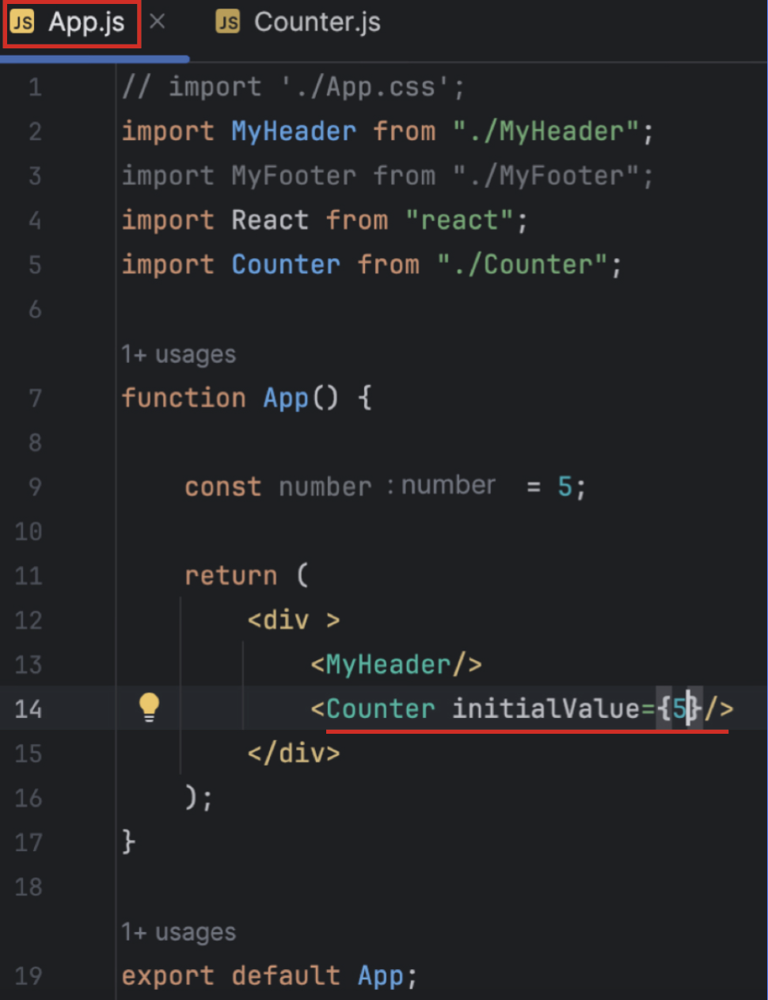
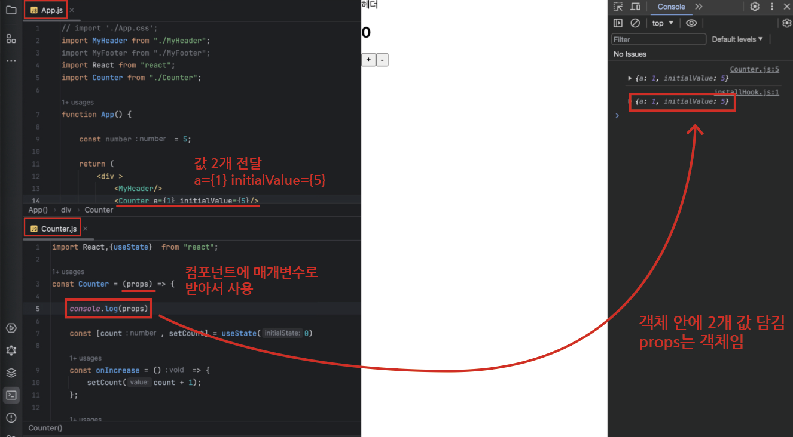
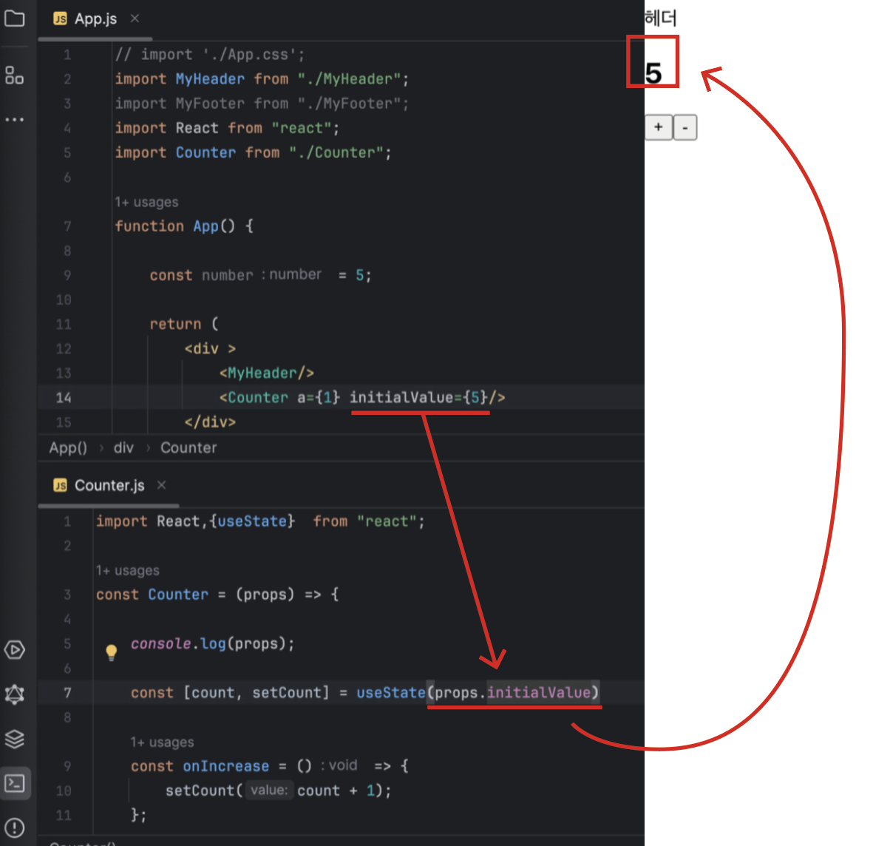
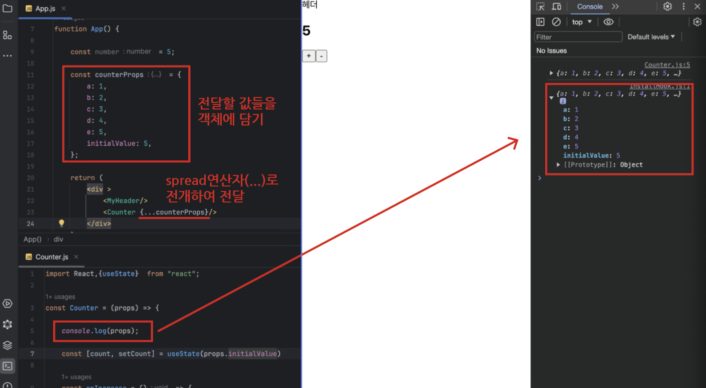
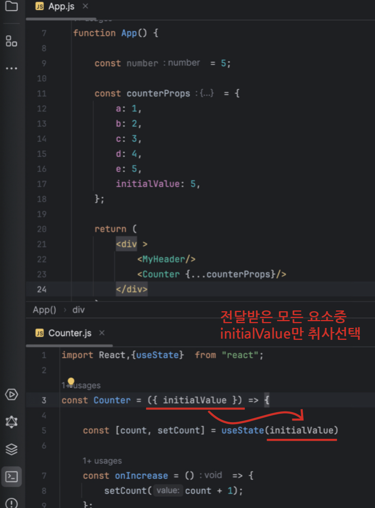
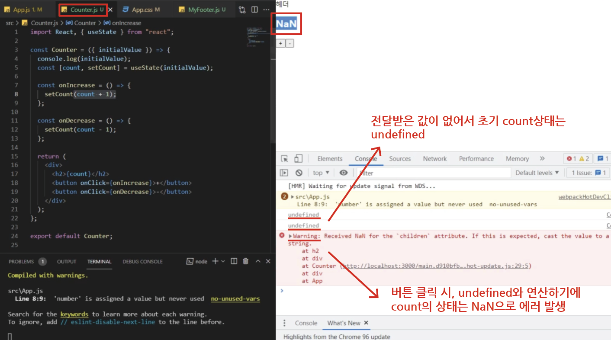
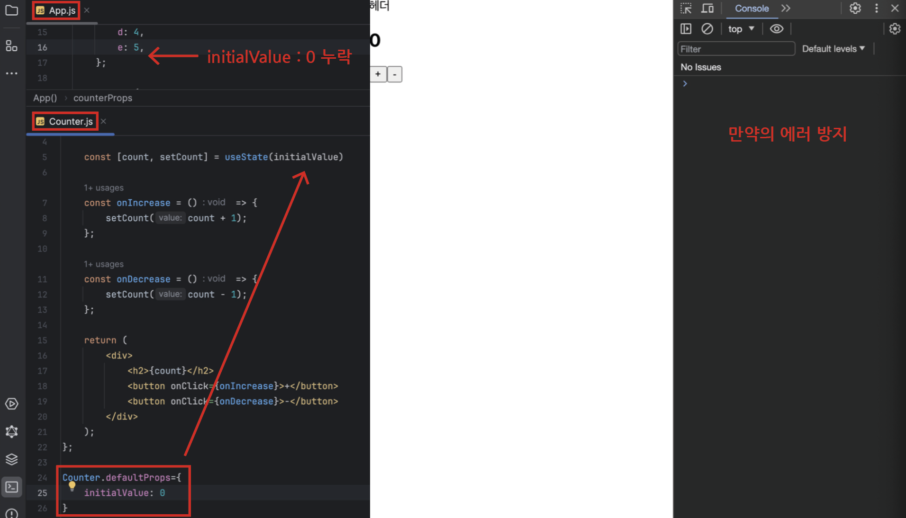

# Props

---

## (1) Props

- 컴포넌트에 `데이터를 전달`하는 방법
- 부모 -> 자식으로 이름을 붙여서 값을 전달

 

<App.js 부모 컴포넌트에서 값 전달>

- 위의 예시 경우, 부모 컴포넌트 App.js에서 자식 컴포넌트 Counter.js로 initialValue란 이름에 5의 값을 전달
- 이름은 커스텀 가능, 값은 중괄호에 담기

 

<Counter.js 자식 컴포넌트에서 값 받기>

- 위의 예시 경우, 부모 컴포넌트 App.js에서 값을 2개 전달
  - a={1} initialValue={5}
- `자식 컴포넌트` Counter.js에서 컴포넌트에 `매개변수 props`로 받아서 사용
- props를 출력하면 콘솔에서 받은 2개의 값이 담긴 객체가 출력
  - 즉, `props는 객체`임

 

<자식 컴포넌트에서 받은 객체 props 접근>

- 점표기법을 사용하여 객체 안의 값에 개별 접근 가능
  - ex) props.initialValue
- 하지만 전달하는 `값이 많아질수록` <Counter a={1} b={2} initialValue={5} ...>와 같이 `JSX 코드가 길어지게` 되어 `가독성에 좋지 않음`

 

<부모 컴포넌트에서 객체에 값을 담아 전달>

- 전달할 값들을 모두 `객체`에 담음
- 전달할 자식 컴포넌트에 `Spread 연삱자(...)`로 요소들을 전개하여 전달

 

<자식 컴포넌트에서 객체를 받아 원하는 요소 취사선택>

- 위와 같이 자식 컴포넌트에서는 객체로 값을 전달받기 때문에 `비구조화 할당`을 통해 받을 수 있음
- 전달받은 모든 값 중 원하는 요소를 선택 가능
  - ex) { initialValue }

 

Q) 만약 부모 컴포넌트에서 자식 컴포넌트로 전달할 때, 특정 값을 빼고 보냈는데 그 값을 자식 요소에서 사용한다면?

<App.js에서 initialValue를 안 보냈는데 Counter.js에서 initialValue를 사용할 경우>

- 전달받은 값이 없어서 `initialValue`를 콘솔에 출력하면 `undefined`가 출력됨
- 버튼을 클릭 할 경우, '+'버튼은 `undefined + 1 = NaN`, '-'버튼도 `undefined - 1 = NaN`이기에 `에러`가 발생

 

Q) 이러한 누락 값에 대한 에러 발생을 막기 위해 어떻게 할까?

<자식 요소에 defaultProps를 사용>

- 부모 컴포넌트로부터 전달된 값에 누락이 있더라도 에러가 발생하지 않도록 하기위해 `defaultProps` 객체를 사용하여 해당하는 `변수의 기본 값을 지정`해놓을 수 있음
- 만약의 에러 방지