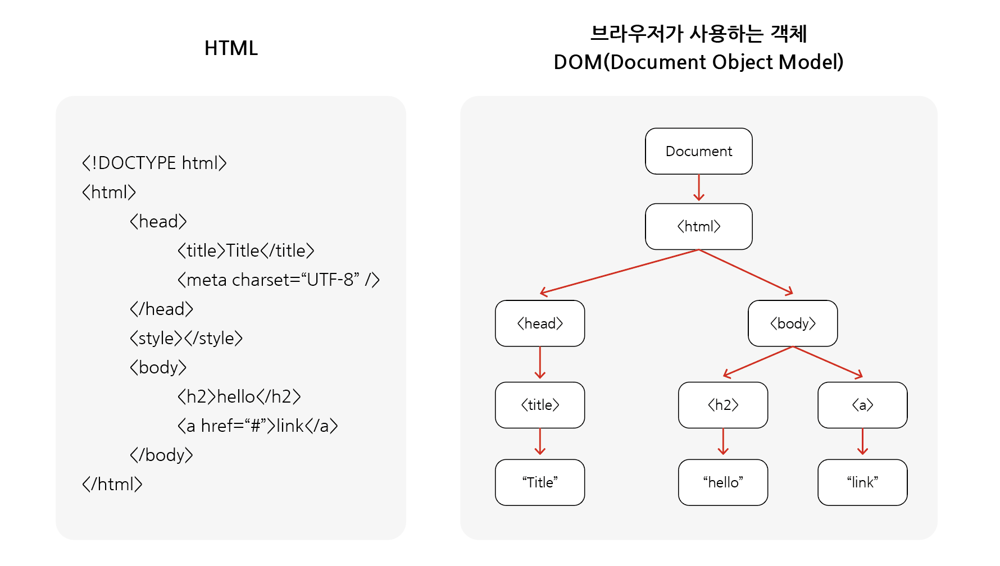
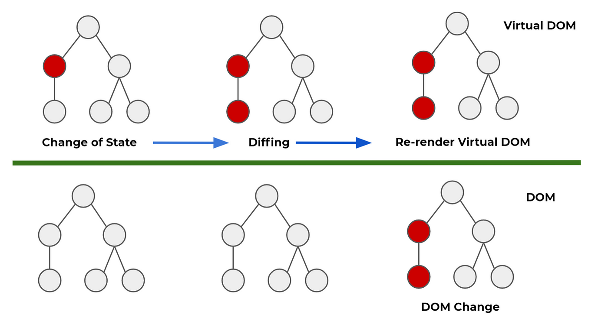

# React

## - 목차
1. [React가 필요한 이유](#1-react가-필요한-이유)
    - [Shotgun Surgery(산탄총 수술)](#1-shotgun-surgery산탄총-수술)
        - [컴포넌트](#--컴포넌트)
        - [컴포넌트 장점](#--컴포넌트-장점)
    - [명령형 프로그래밍 vs 선언형 프로그래밍](#2-명령형-프로그래밍-vs-선언형-프로그래밍)
    - [virtual DOM(가상 돔)](#3-virtual-dom가상-돔)
        - [DOM](#--dom)
        - [virtual DOM](#--virtual-dom)

---

## (1) React가 필요한 이유

### **1) Shotgun Surgery(산탄총 수술)**

- 코드 중복이 있을 때, 중복된 코드의 한 부분을 수정하면 이 코드를 사용하는 동일한 부분을 모두 일일이 수정해 주어야 함
- 유지 보수의 어려움

### - 컴포넌트

- 여러 페이지에서 `공통`으로 사용될만한 요소(헤더, 네브바, 푸터)를 별도 파일, 모듈로 제작
- 이를 `컴포넌트`로서 필요할 때마다 불러와 사용

### - 컴포넌트 장점

- 작성해야하는 코드 양이 줄어듦
- 재사용성, 유지 보수에 용이함

> 리액트 : 컴포넌트 기반의 UI 라이브러리

### **2) 명령형 프로그래밍 vs 선언형 프로그래밍**

Q) 카운터 프로그램을 만들 경우

- 명령형 프로그래밍 로직 
  1) 결과를 표시할 요소를 가져옴
  2) 현재 결과값을 10진수 기준, 숫자형으로 변환하여 current 상수에 저장
  3) current 상수에 저장된 값을 표시할 요소에 plus면 +1하고 minus면 -1해서 넣기

- 명령형 프로그래밍 예시
  - jQuery(제이쿼리)

- 선언형 프로그래밍 로직
  1) plus 누르면 결과값에 +1, minus 누르면 반대로 한다.

- 선언형 프로그래밍 예시
  - React(리액트)

### **3) virtual DOM(가상 돔)**

### - DOM

> DOM : Document Object Model, 문서 객체 모델

<DOM_구조>

<화면 표시 과정>

- 위의 그림들은 브라우저가 html을 이해(parsing, 파싱)하는 DOM 구조와 이를 읽고 화면에 렌더링하는 과정을 보여줌
- 이처럼 DOM은 여러 과정을 거쳐서 처리됨
- 계속해서 DOM이 변경된다면 위의 연산이 반복적으로 수행되고 성능저하의 원인이 됨

### - virtual DOM

<DOM과 virtual DOM 비교>

- virtual DOM의 경우, 이전의 가상 돔과 새로운 가상돔을 비교 한 뒤, 변경된 내용만 DOM에 적용함
- 브라우저가 처리할 연산 양(렌더링 양)을 줄여주어 효율적임
- virtual DOM이 아닌 buffer를 사용할 수 있으나 까다로움
- 이러한 virtual DOM을 활용하는 리액트를 사용하는 것이 유리함