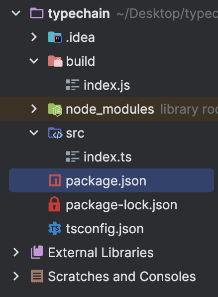

# TypeScript 프로젝트 시작하기

## 목차

1. [TypeScript 수동 설정](#1-typescript-수동-설정)
    1. [TypeScript 수동 설정의 필요성](#1-1-typescript-수동-설정의-필요성)
    2. [target](#1-2-target)
        - [node.js 설치하기](#--nodejs-설치하기)
        - [package.json 설정](#--packagejson-설정)
        - [TypeScript 설치](#--typescript-설치)
        - [TypeScript 설치 확인](#--typescript-설치-확인)
        - [src 폴더 및 index.ts 파일 생성](#--src-폴더-및-indexts-파일-생성)
        - [index.ts 파일 코드 작성](#--indexts-파일-코드-작성)
        - [tsconfig.json 파일 생성](#--tsconfigjson-파일-생성)
        - [include](#--include)
        - [outDir](#--outdir)
        - [package.json에 build 스크립트 작성](#--packagejson에-build-스크립트-작성)
        - [bash에서 잘 동작하는지 확인하기](#--bash에서-잘-동작하는지-확인하기)
        - [target](#--target)

<br/>
<br/>

## 1. TypeScript 수동 설정

### 1-1. TypeScript 수동 설정의 필요성

- `Next.js`, `Create-React-App(CRA)`를 이용할 경우, 대부분은 수동으로 TypeScript 프로젝트를 설정할 일이 없음
- 프레임워크, 라이브러리, 패키지가 TypeScript 프로젝트를 만들어줌
- 따라서 설정파일을 작성하는 것이 `필수는 아님`
- 하지만 수동으로 설정해야하는 상황이 있을 수 있기에 `알고 있는 것을 추천함`

<br/>

### 1-2. target

### - node.js 설치하기

```bash
$ npm init -y
```

<br/>

### - package.json 설정

```json
// "main": "index.js" 삭제
// script 수정

{
  "name": "typechain",
  "version": "1.0.0",
  "description": "",
  "scripts": {
  },
  "keywords": [],
  "author": "",
  "license": "ISC"
}
```

<br/>

### - TypeScript 설치

```bash
$ npm install -D typscript

# -D : TypeScript를 devDependencies에 설치됨
```

<br/>

### - TypeScript 설치 확인

```json
// package.json

{
  "name": "typechain",
  "version": "1.0.0",
  "description": "",
  "scripts": {},
  "keywords": [],
  "author": "",
  "license": "ISC",
  "devDependencies": {
    "typescript": "^5.3.3"
  }
}
```

<br/>

### - src 폴더 및 index.ts 파일 생성

- root 위치에 src 폴더 생성 및 해당 폴더 안에 index.ts 파일 생성

<br/>

### - index.ts 파일 코드 작성

```ts
// index.ts 예시 코드 작성

const hello = () => {
    return "hi";
};
```

<br/>

### - tsconfig.json 파일 생성

- 컴파일을 위해 tsconfig.json 파일 생성

```bash
$ touch tsconfig.json

# tsconfig.json 파일을 통해 IDE는 TypeScript로 작업 중임을 인식하고
# TypeScript를 위한 다양한 기능을 제공함
```

<br/>

### - include

- tsconfig.json에서 TypeScript 파일 위치를 알려주기
- 해당 include의 배열에 있는 모든 디렉토리의 TypeScript 위치를 찾게 됨

<br/>

### - outDir

- "outDir": "build" : build라는 폴더에 컴파일된 JavaScript 파일 넣기

```json
// tsconfig.json

{
  "include": [
    "src"
  ],
  "compilerOptions": {
    "outDir": "build"
  }
}
```

<br/>

### - package.json에 build 스크립트 작성

```json
// package.json

...
"scripts": {
"build": "tsc"
},
...
```

<br/>

### - bash에서 잘 동작하는지 확인하기

```bash
$ npm run build
```



<컴파일 확인 - build 폴더 생성 및 index.js 파일로 컴파일>

<br/>

### - target

- compilerOptions에서 컴파일될 JavaScript의 버전인 `target`을 작성
- 작성하지 않을 경우, `ES3` 또는 `ES5`로 지정됨
- 대부분의 node.js와 브라우저가 지원하는 `ES6`를 사용하는 것을 지향함
- 가장 최신의 버전의 경우, 호환성을 충족하지 못하는 문제가 발생할 수 있으므로 지양
- 프로젝트에 따라서 `적절한 버전`을 사용하는 것이 가장 좋음

```json
// tsconfig.json

{
  "include": [
    "src"
  ],
  "compilerOptions": {
    "outDir": "build",
    "target": "ES3"
  }
}
```

- `ES3`로 컴파일 : const와 화살표 함수의 개념이 없어 var 및 일반 함수 표현식 사용

```javascript
// index.js

var hello = function () {
  return "hi";
};
```

- `ES6`로 컴파일 : const 및 화살표 함수 등의 최신 문법 적용

```javascript
// index.js

const hello = () => {
  return "hi";
};
```