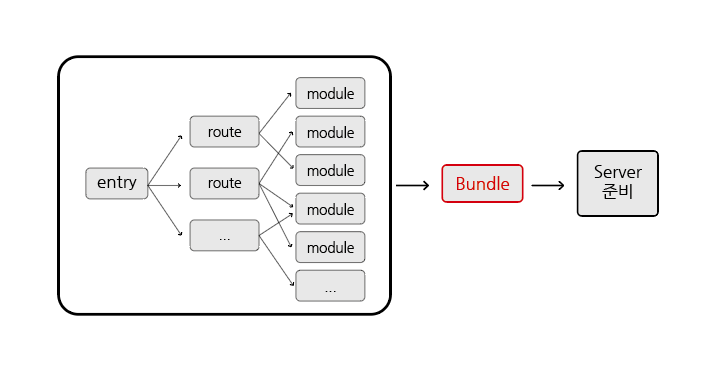
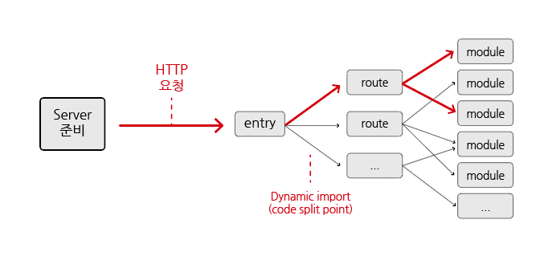

# Vite 소개

## 목차

1. [Vite](#1-vite)
    1. [Vite 사용 이유](#1-1-vite-사용-이유)
    2. [Vite 이용한 속도 개선 방법](#1-2-vite-이용한-속도-개선-방법)
        - [번들러 기반 빌드의 문제점](#--번들러-기반-빌드의-문제점)
        - [느린 서버 시작 속도 개선](#--느린-서버-시작-속도-개선)
        - [느린 서버 업데이트 속도 개선](#--느린-서버-업데이트-속도-개선)
        - [TypeScript 트랜스파일링 속도](#--typescript-트랜스파일링-속도)

 
 

## 1. Vite

- `Vue.js` 및 `React` 프로젝트 템플릿에 기본적으로 사용되는 `로컬 개발 서버`
- `TypeScript` 및 `JSX`를 지원
- 번들링을 위해 내부적으로 `Rollup`과 `esbuild`를 사용

 

### 1-1. Vite 사용 이유

- 기존에는 React를 이용하기 위해 `create-react-app`을 사용했는데 상대적으로 속도가 느림
- `vite`를 이용하여 React 앱을 설치하면 빌드 속도 및 새로운 코드의 적용 시, 반영 `속도가 매우 빠름`
- ES Module(import/export default) 개발 이전에는 모듈화하여 JavaScript를 처리하는 메커니즘이 없었기에 `bundle(묶기)이 필요`
- 따라서, create-react-app을 활용해 모듈화하여 작업 후, `번들링을 통해 빌드 등을 처리`하고 있음
- webpack, Rollup 및 Parcel 등의 `번들러 도구`를 통해 프론트엔드 개발 경험이 향상 됨
- 하지만 프로젝트가 커짐과 동시에 JavaScript 코드의 양, 모듈의 개수가 매우 증가하여 JavaScript 기반 도구에
  대한 `성능 병목 현상`, `느린 서버 가동`, `느린 HMR으로 느린 업데이트 반영`이
  발생하기 시작하였음
- 이를 해결하기 위해 Vite를 사용함

 

### 1-2. Vite 이용한 속도 개선 방법

### - 번들러 기반 빌드의 문제점

- 개발 서버를 스타트 할 때, `번들러 기반 빌드 설정`은 서비스를 제공하기 전에 `전체 애플리케이션을 크롤링하고 빌드`해야 함
- 따라서 모듈이 많아질수록 속도가 느려질 수 있음

     
    번들러 기반 빌드 과정

 

### - 느린 서버 시작 속도 개선

- Vite는 모듈을 `종속성(dependency)`과 `소스코드` 두 가지 범주로 나누어 서버 시작 시간을 개선함
- 번들링 완료 후, 서버를 준비하는 것이 아닌 Vite는 서버를 항시 준비 시킴

    - `종속성(dependency)` : 개발 중 `자주 변경되지 않는` 일반 JavaScript이며 큰 종속성은 처리비용이 큼
        - Vite는 `esbuild`를 사용해 종속성을 `사전 번들`로 제공
        - esbuild는 Go로 작성되었으며, JavaScript 번들러에 비해서 `10~100배 빠르게` 종속성을 사전에 미리 번들링함
    - `소스코드(source code)` : JavaScript가 아닌 변환이 필요한 요소(JSX, CSS 등)들이며 자주 편집됨
        - 모든 소스코드를 동시에 로드할 필요 없음 (경로 기반 코드 분할)
        - Vite는 기본 `ES Module`을 통해 소스코드 제공
        - ES module은 브라우저가 번들러 작업의 일부를 `인계`받게 할 수 있음
        - Vite는 브라우저가 요청할 때만 소스코드를 변환하고 제공

     
    ESM 기반 빌드 과정

 

### - 느린 서버 업데이트 속도 개선

- `번들러 기반 빌드 설정`은 파일 편집 후, `전체 번들을 다시 빌드`하기에 비효율적임
- 업데이트 속도는 앱의 크기에 따라서 선형적으로 저하됨
- 번들 재구성에 `비용이 많이` 들며, 페이지 새로고침 시, 현재 `상태(state)가 손상됨`
- 따라서 일부 번들러들이 핫 모듈 교체(`HMR`)을 지원함
    - `HMR` : 전체 번들을 다시 빌드하지 않고 변경된 모듈만 교체하여 화면에 반영
- 하지만 HRM 업데이트 속도도 응용 프로그램 크기 증가에 따라 크게 저하됨
- Vite의 HMR은 `ES Module`을 통해 수행되기에 애플리케이션의 크기와 상관없이 `업데이트가 일관되게 빠름`

 

### - TypeScript 트랜스파일링 속도

- Vite는 기본적으로 TypeScript를 지원하며, esbuild(Go로 작성)를 이용해 트랜스파일링하기에 속도가 매우 빠름
- 하지만 Type Checking 기능이 없음
- 이유는 IDE 내에서 타입을 확인하기에 트랜스파일링만 제공함