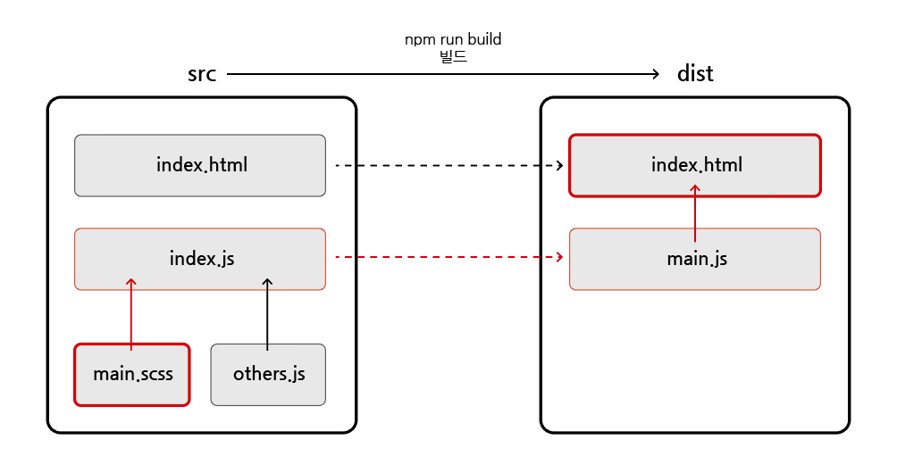
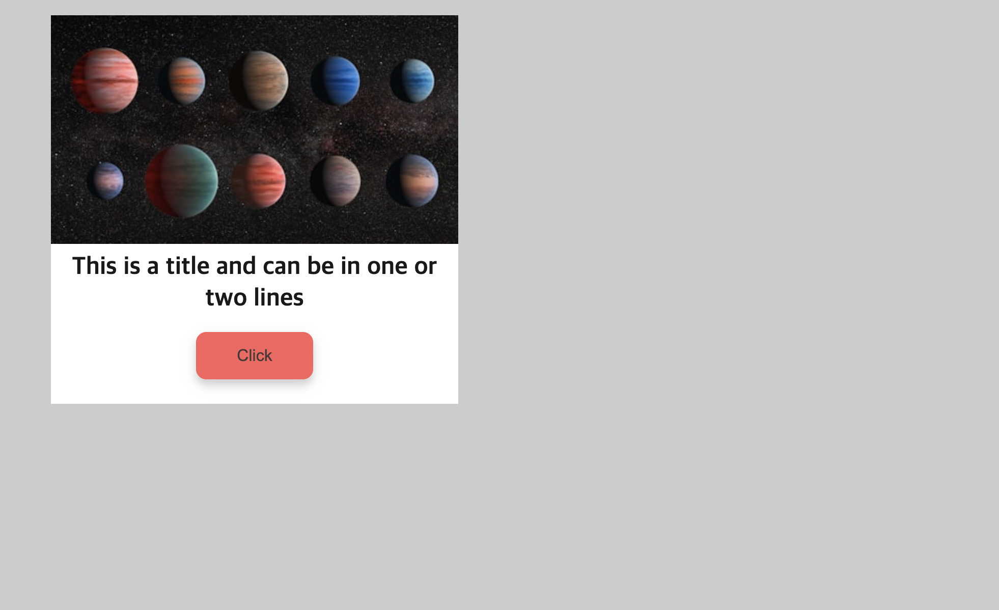

# Plugin

## 목차

1. [Plugin]()
    1. [HTML Webpack Plugin 종류]()
    2. [HtmlWebpackPlugin 사용해보기]()
        - [패키지 설치]()
        - [webpack.config.js 설정]()
        - [src/index.html 작성]()
        - [index.html 빌드 확인]()
        - [스타일링 빌드]()

<br/>
<br/>

## 1. Plugin

- 플러그인은 로더가 할 수 없는 `다른 작업을 수행`할 목적으로 제공
- 플러그인은 웹팩으로 변환한 파일에 `추가적인 기능`을 더하고 싶을 때, 사용함

<br/>

### 1-1. HTML Webpack Plugin 종류

- [Webpack 공식 사이트 - Plugins](https://webpack.js.org/plugins/)

| plugin               | 설명                                |
|----------------------|-----------------------------------|
| HtmlWebpackPlugin    | webpack 번들을 제공하는 HTML 파일 생성을 단순화함 |
| CleanWebpackPlugin   | 빌드 이전의 결과물을 제거함                   |
| MiniCssExtractPlugin | CSS가 필요한 JS 파일별로 CSS 파일 생성함       |
| ...                  | ...                               |

<br/>

### 1-2. HtmlWebpackPlugin 사용해보기

- HtmlWebpackPlugin은 웹팩이 html 파일을 읽어서 `html 파일을 빌드할 수 있도록 해 줌`
- 기존에는 빌드 결과물 폴더인 dist 폴더에 index.html을 만들어사용했지만 빌드 전 폴더인 `src`에서 `html`을 다룰 수 있게 됨

<br/>

### - 패키지 설치

```bash
$ npm i -D html-webpack-plugin
```

<br/>

### - webpack.config.js 설정

```js
// webpack.config.js

const path = require("path");

// html-webpack-plugin 패키지에서 HtmlWebpackPlugin 가져오기
const HtmlWebpackPlugin = require("html-webpack-plugin");

module.exports = {
  mode: "development",
  entry: path.resolve(__dirname, "src/index.js"),
  output: {
    path: path.resolve(__dirname, "dist"),
    filename: "main.js",
  },
  module: {
    rules: [
      {
        test: /\.s[ac]ss$/i,
        use: ["style-loader", "css-loader", "sass-loader"],
      },
    ],
  },

  // plugins 배열 안에 plugin들 추가
  plugins: [
    // 플러그인을 다양한 용도로 여러 번 사용하기에 new 연산자로 호출하여 플러그인의 인스턴스를 생성하여 사용
    new HtmlWebpackPlugin({
      // dist 폴더에 결과물로서 생성할 파일이름
      filename: "index.html",
      // 플러그인이 처리할 템플릿
      template: "src/index.html",
    }),
  ],
};
```

<br/>

### - src/index.html 작성

- 예시 코드 작성

```html
<!--src/index.html-->

<!DOCTYPE html>
<html lang="en">
<head>
    <meta charset="UTF-8"/>
    <meta name="viewport" content="width=device-width, initial-scale=1.0"/>
    <title>Document</title>
</head>
<body>
<div class="grid">
    <div class="card card-image">
        <div class="image">
            
        </div>
        <div class="body">
            <div class="wrap">
                <h3 class="title">
                    <a href="#">This is a title and can be in one or two lines</a>
                </h3>
                <button class="btn">Click</button>
            </div>
        </div>
    </div>
</div>
</body>
</html>
```

<br/>

### - index.html 빌드 확인

- npm run build 명령어 실행 시, dist/index.html로 빌드되는 것을 확인 할 수 있음
- script 태그로 dist/main.js를 받는 것을 볼 수 있음

```html
<!--dist/index.html-->

<!DOCTYPE html>
<html lang="en">
<head>
    <meta charset="UTF-8"/>
    <meta name="viewport" content="width=device-width,initial-scale=1"/>
    <title>Document</title>
    <!--dist 폴더의 main.js가 import되고 있음-->
    <script defer="defer" src="main.js"></script>
</head>
<body>
<div class="grid">
    <div class="card card-image">
        <div class="image"></div>
        <div class="body">
            <div class="wrap">
                <h3 class="title"><a href="#">This is a title and can be in one or two lines</a></h3>
                <button class="btn">Click</button>
            </div>
        </div>
    </div>
</div>
</body>
</html>
```

<br/>

### - 스타일링 빌드

- src/styles/main.scss 파일은 어떤 과정으로 빌드되고 있을까?

<p align="center">
    <br/>
    <span>scss 파일이 빌드 파일로 import되는 과정</span>
</p>

<br/>

- `scss` 파일은 src 폴더의 `index.js` 파일로 import됨
- src 폴더의 `index.js` 파일은 빌드 과정을 통해 dist 폴더의 `main.js`로 빌드됨
- 빌드된 `main.js`는 빌드된 `index.html` 파일로 최종적으로 import됨
- 즉, src/main.scss 파일을 작성한 후, 빌드를 하면 바로 위의 연결을 통해 최종 dist의 index.html에 적용됨

```scss
//src/main.scss

body {
  background-color: #ccc;
  padding: 48px;
  font-size: 16px;
}

$font-primary: sans-serif;
$color-primary: #fa625d;
$color-black: rgba(0, 0, 0, 0.9);
$color-white: #ffffff;

$color-primary-30: lighten($color-primary, 20%);
$color-primary-70: darken($color-primary, 10%);
$color-black-30: lighten($color-black, 20%);

// for the card
$background-card: $color-white;
// for the tag
$font-tag-label: $font-primary;
$color-tag-label: $color-primary;
// for the title
$font-title: $font-primary;
$color-title: $color-black;

// for the card sass
.card-image {
  background-color: $background-card;
  position: relative;
  max-width: 400px;

  .image {
    line-height: 0;
    margin-top: -34px;
    position: relative;
    z-index: 1;

    img {
      max-width: 100%;
    }
  }

  .wrap {
    padding: 0 1em 1.5em 1em;
    text-align: center;
  }

  .title {
    font-family: $font-title;
    font-size: 1.5em;
    margin: 8px 0 16px;
    line-height: 1.3;

    a {
      color: $color-title;
      text-decoration: none;

      &:hover {
        color: $color-black-30;
        transition: all 0.6s ease;
      }
    }
  }

  .btn {
    background-color: $color-primary;
    color: $color-black-30;
    border: 0;
    border-radius: 10px;
    box-shadow: 0 5px 15px rgba(0, 0, 0, 0.1), 0 6px 6px rgba(0, 0, 0, 0.1);
    padding: 14px 40px;
    font-size: 16px;
    cursor: pointer;

    &:active {
      transform: scale(0.98);
    }
  }
}
```

<br/>

<p align="center">
    <br/>
    <span>scss 파일까지 적용된 빌드된 UI</span>
</p>