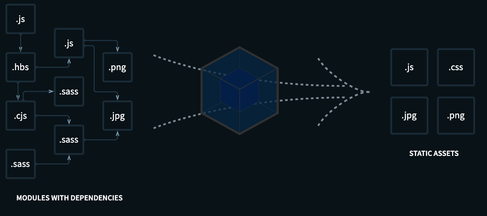

# Webpack 소개

## 목차

1. [Webpack이란?](#1-webpack이란)
    1. [Webpack의 필요성](#1-1-webpack의-필요성)
        - [장점](#--장점)
    2. [Create-React-App 패키지](#1-2-create-react-app-패키지)
2. [Webpack을 이용해 개발환경 만들기](#2-webpack을-이용해-개발환경-만들기)
    1. [주요 개념](#2-1-주요-개념)
        - [Entry](#--entry)
        - [Output](#--output)
        - [Loader](#--loader)
        - [Plugin](#--plugin)
    2. [Babel](#2-2-babel)

 
 

## 1. Webpack이란?

- 웹팩이란 `오픈 소스 JavaScript 모듈 번들러`로서 여러 개로 나누어진 파일들을 `하나의 JavaScript` 코드로 `압축하고 최적화`하는 `라이브러리`

 

### 1-1. Webpack의 필요성

### - 장점

1. 여러 파일의 JavaScript 코드를 압축하여 최적화할 수 있기에 `로딩에 대한 네트워크 비용을 줄일 수 있음`
2. `모듈 단위의 개발`이 가능하기 때문에 `가독성`, `유지보수`가 쉬움

 

     
    웹팩의 의존성 그래프

 

### 1-2. Create-React-App 패키지

- React 설치 시, 내부에서 이미 웹팩을 사용하여 개발환경을 생성함
- 따라서, React 사용 시, 별도의 설정 없이 모듈을 import하고 이미지를 사용하고, CSS 및 소스코드 수정 시, 바로 반영되는 효과를 가져올 수 있었음

 
 

## 2. Webpack을 이용해 개발환경 만들기

### 2-1. 주요 개념

### - Entry

- `의존성 그래프의 시작점`을 웹팩에서는 엔트리(Entry)라고 함
- 웹팩은 엔트리를 통해 `필요한 모듈을 로딩`하고 `하나의 파일로 묶음`
- `여러 개`의 엔트리가 존재할 수 있음

 

### - Output

- 엔트리에 설정한 JavaScript 파일을 시작으로 하나로 묶음
- 번들 된 `결과물을 처리할 위치`를 output에 기록

 

### - Loader

- 웹팩은 오직 JavaScript와 Json만 이해할 수 있음
- 로더는 `다른 Type의 파일`(img, font, stylesheet 등)을 웹팩이 `이해하고 처리 가능한 모듈로 변환`시키는 작업을 함
- style-loader, css-loader, sass-loader, babel-loader 등 많은 로더들이 있음

 

### - Plugin

- 로더가 파일 단위로 처리하는 반면, `플러그인`은 번들 된 `결과물을 처리`함
- 로더가 변환하는 동안, 플러그인은 `bundle optimization`, `asset management`, `injection of environment` 같은 작업을 진행

 

### 2-2. Babel

- 최신 JavaScript 문법을 지원하지 않는 브라우저들을 위해 최신 JavaScript 문법을 `구형 브라우저에서도 작동 가능하도록 변환시켜주는 라이브러리`