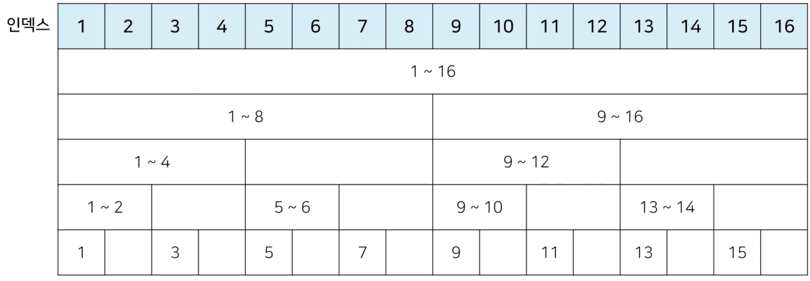
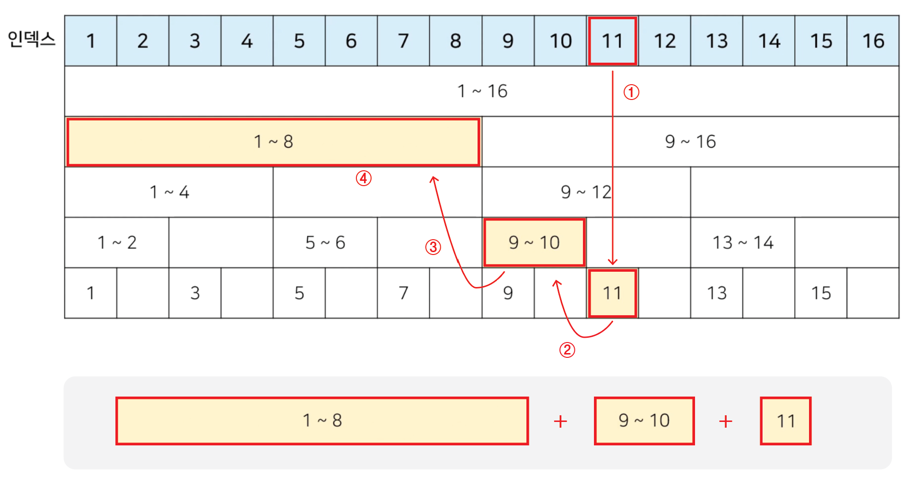

# 바이너리 인덱스 트리

## 목차

<br>
<br>

## 1. 바이너리 인덱스 트리(Binary indexed tree)

### 1-1. 구간 합(Interval Sum) 문제

- 어떤 수 N개, 중간에 수의 변경이 빈번히 발생, 그 중간에 어떤 부분의 합을 구하려함.
- 만약, 1, 2, 3, 4, 5라는 수가 있고 3번째 수를 6으로 바꾸고 2번째 부터 5번째까지 합을 구하라고 한다면 17이 출력됨
- 그 상태에서 다섯번째 수를 2로 바꾸고 3번째 부터 5번째까지 합을 구하라고 한다면 12가 출력

- 데이터 개수 : N(1 <= N <= 1,000,000)
- 데이터 변경 횟수 : M(1 <= M <= 10,000)
- 구간 합 계산 횟수 : K(1 <= K <= 10,000)

<br>

### 1-2. 바이너리 인덱스 트리란?

- `2진법` 인덱스 구조를 활용해 구간 합 문제를 효과적으로 해결할 수 있는 자료구조
- `팬윅 트리(fenwick tree)`라고도 함

<br>

### - 정수에 따른 2진수 표기

| 정수 | 2진수 표기                             |
|----|------------------------------------|
| 7  | 00000000 00000000 00000000 0000111 |
| -7 | 11111111 11111111 11111111 1111001 |

> <1의 보수 방식><br>
>
> - 1의 보수 방식은 음수의 표현을 할 때 어떤 양의 2진수를 11111111에서 빼는 것
> - x라는 양의 2진수를 음수로 바꾸려면 `11111111 - x`
> - 11111111 - x라는 것의 의미는 x의 1 또는 0을 모두 반전시키는 것과 같음
> - 결과에서 1을 더함

<br>

### - 0이 아닌 마지막 비트를 찾는 방법

- 특정한 숫자 k의 0이 아닌 마지막 비트를 찾기 위해서는 `k & -k`를 계산

> <파이썬 비트 변환><br>
>
> - `bin(정수)` : 10진수를 2진수로 변환
> - `0b'이진수'` : 2진수를 10진수로 변환
> - `int('2진수 문자열', 2)` : 2진수 문자열을 10진수로 변환
>
> <파이썬 비트 연산자><br>
>
> - `a & b` : 비교시 둘 다 1이여야 1, 하나라도 0이면 0
> - `a | b` : 비교시 둘 다 0이여야 0, 하나라도 1이면 1
> - `a ^ b` : 같으면 0, 다르면 1
> - `~x` : 1이면 0, 0이면 1로 반대를 반환
> - `~x` : 1이면 0, 0이면 1로 반대를 반환
> - `~x` : 1이면 0, 0이면 1로 반대를 반환
> - `~x` : 1이면 0, 0이면 1로 반대를 반환
> - `~x` : 1이면 0, 0이면 1로 반대를 반환
> - `~x` : 1이면 0, 0이면 1로 반대를 반환
> - `~x` : 1이면 0, 0이면 1로 반대를 반환
> - `~x` : 1이면 0, 0이면 1로 반대를 반환
> - `~x` : 1이면 0, 0이면 1로 반대를 반환

<br>

```python
# ex) K & -K 예시

n = 8
for i in range(n + 1):
    print(i, "의 마지막 비트:", (i & -i))

# 출력
# '0의 마지막 비트: 0'
# '1의 마지막 비트: 1'
# '2의 마지막 비트: 2'
# '3의 마지막 비트: 1'
# '4의 마지막 비트: 4'
# '5의 마지막 비트: 1'
# '6의 마지막 비트: 2'
# '7의 마지막 비트: 1'
# '8의 마지막 비트: 8'
```

<br>
<br>

## 2. 바이너리 인덱스 트리 만들기

### 2-1. 트리 구조 만들기

- 0이 아닌 마지막 비트 = 내가 저장하고 있는 값들의 개수



- N개의 데이터에서 시간복잡도가 최악의 경우에도 `O(logN)`을 보장함

<br>

### 2-2. 누적 합(Prefix Sum)

- 1부터 N까지의 합(누적 합) 구하기: 0이 아닌 마지막 비트만큼 빼면서 구간들의 값의 합 계산

- 예시 : 인덱스 11까지의 합



<br>
<br>

## 3. 바이너리 인덱스 트리 코드

### 3-1. 파이썬 코드

```python
import sys
input = sys.stdin.readline

# 데이터 개수(n), 변경회수(m), 구간 합 계산 횟수(k)
n, m, k = map(int, input().split())

# 전체 데이터의 개수는 최대 1,000,000개
arr = [0] * (n + 1)
tree = [0] * (n + 1)

# i번째 수까지의 누적합을 계산하는 함수
def prefix_sum(i):
    result = 0
    while i > 0:
        result += tree[i]
        # 0이 아닌 마지막 비트만큼 빼가면서 이동
        i -= (i & -i)
    return result


# i번째 수를 dif만큼 더하는 함수
def update(i, dif):
    while i <= n:
        tree[i] += dif
        i += (i & -i)


# start부터 end까지의 구간 합을 계산하는 함수
def interval_sum(start, end):
    return prefix_sum(end) - prefix_sum(start - 1)


for i in range(1, n + 1):
    x = int(input())
    arr[i] = x
    update(i, x)

for i in range(m + k):
    a, b, c = map(int, input().split())
    # 업데이트(update) 연산인 경우
    if a === 1:
        update(b, c - arr[b]) # 바뀐 크기(dif)만큼 적용
        arr[b] = c
    # 구간 합(interval sum) 연산인 경우
    else:
        print(interval_sum(b, c))
```
