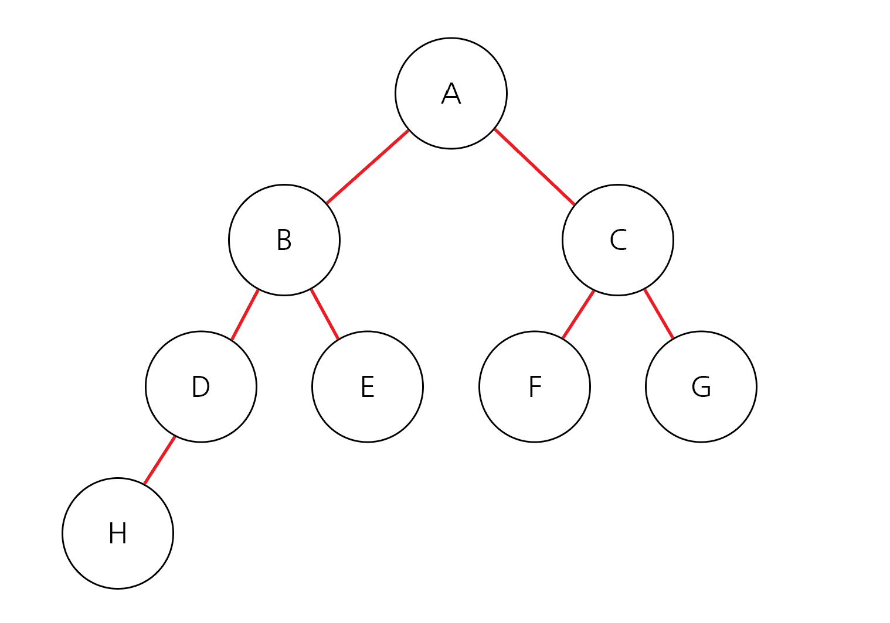
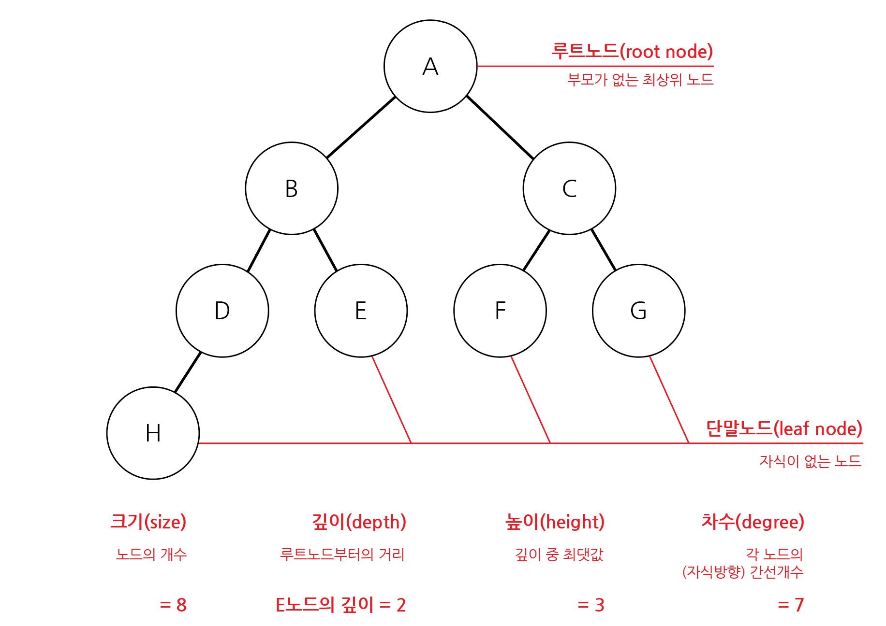
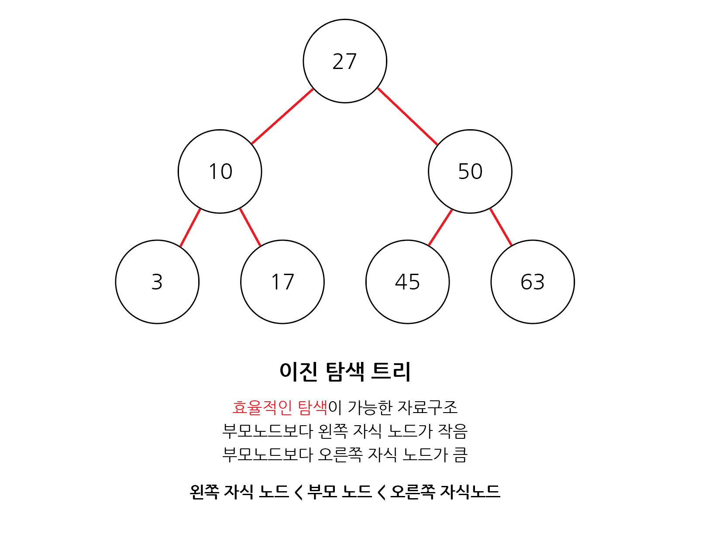
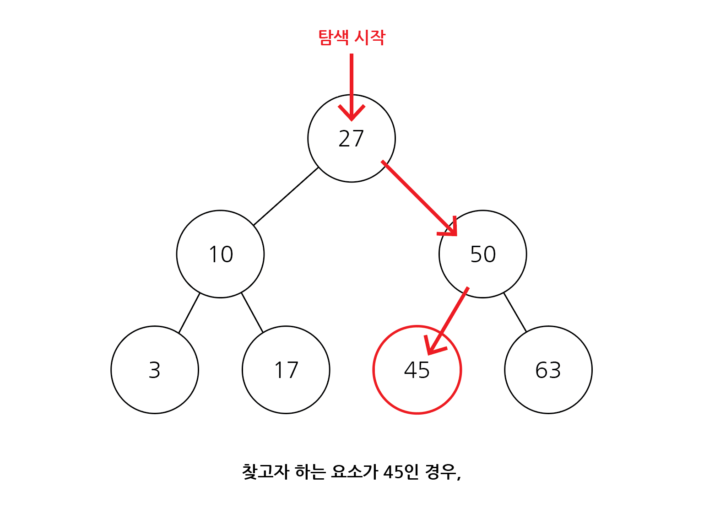
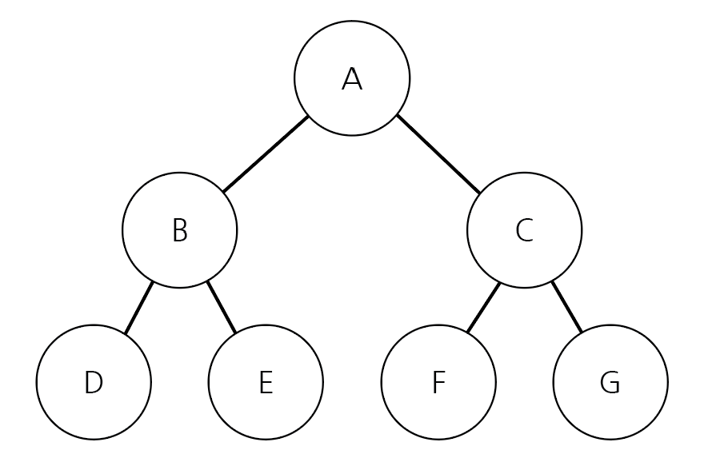

# 트리 자료 구조

## 목차

1. [트리(Tree)](#1-트리tree)
    1. [트리 관련 용어](#1-1-트리-관련-용어)
    2. [이진 탐색 트리(Binary Search Tree)](#1-2-이진-탐색-트리binary-search-tree)
        - [이진 탐색 트리 예시](#이진-탐색-트리-예시)
        - [이진 탐색 트리 시간복잡도](#이진-탐색-트리-시간복잡도)
    3. [트리의 순회(Tree Traversal)](#1-3-트리의-순회tree-traversal)
        - [대표적인 트리 순회 방법](#대표적인-트리-순회-방법)
        - [트리 순회 예시](#트리-순회-예시)
    4. [트리의 순회 구현 예제](#1-4-트리의-순회-구현-예제)

<br>
<br>

## 1. 트리(Tree)

- 트리는 가계도와 같은 `계층적인 구조`를 표현할 때 사용하는 자료구조



<트리 도식화>

<br>

### 1-1. 트리 관련 용어



- 루트 노드(root node) : 부모가 없는 최상위 노드
- 단말 노드(leaf node) : 자식이 없는 노드
- 크기(size) : 트리에 포함된 모든 노드의 개수
- 깊이(depth) : 루트 노드부터의 거리
- 높이(height) : 깊이 중 최댓값
- 차수(degree) : 각 노드의 (자식 방향) 간선 개수
    - 기본적으로 트리의 `크기`가 `N`일 경우, `전체 간선 개수`는 `N-1개`

<br>

### 1-2. 이진 탐색 트리(Binary Search Tree)

- 이진 탐색이 동작할 수 있도록 고안된 효율적인 탐색이 가능한 자료구조
- 이진 탐색 트리의 특징 : 왼쪽 자식 노드 < 부모 노드 < 오른쪽 자식 노드
    - 부모 노드보다 왼쪽 자식노드가 작음
    - 부모 노드보다 오른쪽 자식노드가 큼



<이진 탐색 트리 도식화>

<br>

### - 이진 탐색 트리 예시

- 이진 탐색 트리가 이미 구성되어있다고 가정 후, 데이터 조회
- 찾고자하는 원소 : 45



- 루트 노드부터 방문하여 탐색
- 현재 노드와 찾는 원소를 비교하여 찾는 원소가 크면 오른쪽으로 작으면 왼쪽으로 이동
- 찾는 원소를 만나면 탐색 종료

<br>

### - 이진 탐색 트리 시간복잡도

- 이상적(좌우 크기가 대칭)인 이진 탐색 트리에서 데이터를 탐색하는 경우, 시간복잡도는 `O(logN)`

<br>

### 1-3. 트리의 순회(Tree Traversal)

- 트리 자료구조에 포함된 노드를 특정한 방법으로 한 번씩 방문하는 방법을 의미
    - 트리 정보를 시각적으로 확인할 수 있음

<br>

### - 대표적인 트리 순회 방법

- 전위 순회(pre-order traverse) : 루트를 먼저 방문한 다음 왼쪽, 오른쪽 차례로 방문

    - 루트 -> 왼쪽 -> 오른쪽

- 중위 순회(in-order traverse) : 왼쪽 자식을 방문한 뒤에 루트를 방문, 마지막으로 오른쪽 노드 방문

    - 왼쪽 -> 루트 -> 오른쪽

- 후위 순회(post-order traverse) : 왼쪽, 오른쪽 자식을 차례로 방문한 뒤에 루트를 방문
    - 왼쪽 -> 오른쪽 -> 루트

<br>

### - 트리 순회 예시



- 전위 순회 : A -> B -> D -> E -> C -> F -> G
- 중위 순회 : D -> B -> E -> A -> F -> C -> G
- 후위 순회 : D -> E -> B -> F -> G -> C -> A

<br>

### 1-4. 트리의 순회 구현 예제

```python
# ex)

# 트리 순회 구현 예제 코드 (Pyhton)

class Node:
    def __init__(self, data, left_node, right_node):
        self.data = data
        self.left_node = left_node
        self.right_node = right_node

# 전위 순회(Pre-order Traversal)
def pre_order(node):
    print(node.data, end=' ')
    if node.left_node != None:
        pre_order(tree[node.left_node])
    if node.right_node != None:
        pre_order(tree[node.right_node])

# 중위 순회(In-order Traversal)
def in_order(node):
    if node.left_node != None:
        in_order(tree[node.left_node])
    print(node.data, end=' ')
    if node.right_node != None:
        in_order(tree[node.right_node])

# 후위 순회(Post-order Traversal)
def post_order(node):
    if node.left_node != None:
        post_order(tree[node.left_node])
    if node.right_node != None:
        post_order(tree[node.right_node])
    print(node.data, end=' ')

n = int(input())
tree = {}

for i in range(n):
    data, left_node, right_node = input().split()
    if left_node == "None":
        left_node = None
    if right_node == "None":
        right_node = None
    tree[data] = Node(data, left_node, right_node)

pre_order(tree['A'])
print()
in_order(tree['A'])
print()
post_order(tree['A'])


# 입력
# 7
# A B C // 노드 A의 왼쪽 자식 노드는 B, 오른쪽 자식 노드는 C
# B D E // 노드 B의 왼쪽 자식 노드는 D, 오른쪽 자식 노드는 E
# C F G // 노드 C의 왼쪽 자식 노드는 F, 오른쪽 자식 노드는 G
# D None None // 노드 D의 왼쪽 자식 노드는 None, 오른쪽 자식 노드는 None
# E None None // 노드 E의 왼쪽 자식 노드는 None, 오른쪽 자식 노드는 None
# F None None // 노드 F의 왼쪽 자식 노드는 None, 오른쪽 자식 노드는 None
# G None None // 노드 G의 왼쪽 자식 노드는 None, 오른쪽 자식 노드는 None

# 출력
# "A B D E C F G "
# "D B E A F C G "
# "D E B F G C A "
```

참고문제 : [SWEA\_중위순회](https://swexpertacademy.com/main/code/problem/problemDetail.do?contestProbId=AV140YnqAIECFAYD&categoryId=AV140YnqAIECFAYD&categoryType=CODE&problemTitle=1231&orderBy=FIRST_REG_DATETIME&selectCodeLang=ALL&select-1=&pageSize=10&pageIndex=1)
