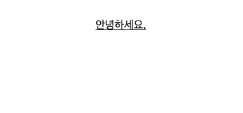

# Tailwind CSS 설정

## 목차

1. [설정하기](#1-설정하기)
    1. [패키지 설치](#1-1-패키지-설치)
    2. [npx tailwindcss init](#1-2-npx-tailwindcss-init)
    3. [postcss.config.cjs 파일 생성](#1-3-postcssconfigcjs-파일-생성)
    4. [tailwind.config.cjs 경로 추가](#1-4-tailwindconfigcjs-경로-추가)
    5. [index.css 레이어](#1-5-indexcss-레이어)
    6. [App.tsx 작성](#1-6-apptsx-작성)

<br/>
<br/>

## 1. 설정하기

### 1-1. 패키지 설치

- `postcss`, `autoprefixer`, `tailwindcss` CSS 관련 패키지 설치
- `tailwindcss` : 클래스 기반의 CSS 프레임워크
- `postcss` : CSS 변환 및 확장 도구
- `autoprefixer` : postcss의 플러그인으로 다양한 브라우저에서 일관된 스타일링을 보장할 수 있도록 해 줌

```bash
$ npm install -D postcss autoprefixer tailwindcss
```

<br/>

### 1-2. npx tailwindcss init

- 해당 명령어를 통해 tailwindcss 시작
- `tailwind.config.cjs` 파일이 생성됨

```bash
$ npx tailwindcss init
```

<br/>

### 1-3. postcss.config.cjs 파일 생성

- postcss.config.cjs 파일 생성하기

```js
// postcss.config.cjs

module.exports = {
  plugins: {
    tailwindcss: {},
    autoprefixer: {},
  },
};
```

<br/>

### 1-4. tailwind.config.cjs 경로 추가

- tailwind CSS를 사용할 경로들을 `content` 배열에 넣기
- src 폴더 하위의 모든 파일 중 확장자가 js, jsx, ts, tsx인 파일 (주의! 확장자명 간에 띄워쓰기 금지)
- 루트 경로의 index.html 파일
- src 폴더의 index.css 파일

```js
// tailwind.config.cjs

/** @type {import('tailwindcss').Config} */
module.export = {
  // 경로 추가
  content: [
    "./src/**/*.{js,jsx,ts,tsx}",
    "./index.html",
    "./src/index.css"
  ],
  theme: {
    extend: {},
  },
  plugins: [],
};
```

<br/>

### 1-5. index.css 레이어

- src/index.css 파일에서 기존에 작성된 스타일을 지우고
- @layer 문을 이용해 Base, components, utilities 레이어 선언

```css
/*src/index.css*/

@tailwind base;
@tailwind components;
@tailwind utilities;
```

<br/>

### 1-6. App.tsx 작성

- tailwind CSS가 적용되는지 App.tsx 파일 수정
- tailwind의 underline 적용해보기

```tsx
// src/App.tsx

import "./App.css";

function App() {
    return (
        <>
            <p className="underline">안녕하세요.</p>
        </>
    );
}

export default App;
```

<br/>

<p align="center">
    <br/>
    <span>tailwind CSS의 underline 적용한 모습</span>
</p>