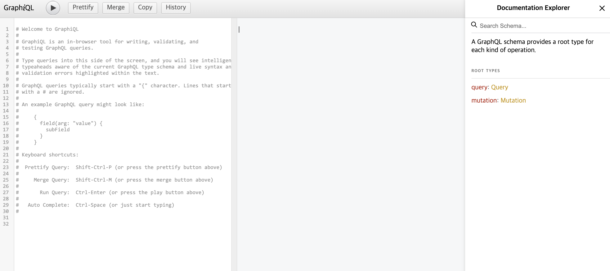

# Apollo Client 구조

## 목차

1. [Apollo Client](#1-apollo-client)
2. [App 구조 생성하기](#2-app-구조-생성하기)
    1. [Vite 이용하여 React 생성](#2-1-vite-이용하여-react-생성)
    2. [dependency 설치](#2-2-dependency-설치)
    3. [패키지 설치](#2-3-패키지-설치)
    4. [폴더 및 파일 구조 생성](#2-4-폴더-및-파일-구조-생성)
    5. [db.ts 작성](#2-5-dbts-작성)
    6. [json-graphql-server를 실행할 스크립트 작성](#2-6-json-graphql-server를-실행할-스크립트-작성)

<br/>
<br/>

## 1. Apollo Client

- Apollo Client를 이용해서 `React 부분`을 구현할 수 있음
- Apollo Client를 이용해 기본적인 `CRUD 기능을 갖춘 To Do App 만들기`

<br/>
<br/>

## 2. App 구조 생성하기

### 2-1. Vite 이용하여 React 생성

```bash
$ npm init vite
```

```bash
# 프로젝트 설정

Need to install the following packages:
create-vite@5.2.2
Ok to proceed? (y) y
✔ Project name: … ./
✔ Select a framework: › React
✔ Select a variant: › TypeScript

Scaffolding project in /Users/gon/Desktop/react-graphql-todo-app...

Done. Now run:

  npm install
  npm run dev
```

<br/>

### 2-2. dependency 설치

```bash
$ npm install
```

<br/>

### 2-3. 패키지 설치

- `graphql`, `@apollo/client`, `json-graphql-server`, `react-icons` 패키지 설치
- `json-graphql-server` : 데이터만 넣으면 GraphQL 서버가 됨

```bash
$ npm install graphql @apollo/client json-graphql-server react-icons
```

<br/>

- `postcss`, `autoprefixer`, `tailwindcss` CSS 관련 패키지 설치

```bash
$ npm install -D postcss autoprefixer tailwindcss
```

<br/>

- Node.js 형식의 module 키워드 사용할 수 있도록 패키지 설치

```bash
$ npm i --save-dev @types/node
```

<br/>

### 2-4. 폴더 및 파일 구조 생성

- `src/apollo/client.ts` : apollo-client 객체 생성
- `src/apollo/todos.ts` : query 및 mutation을 작성
- `src/components/TodoItem.tsx` : 할 일 아이템 컴포넌트
- `src/types.ts` : TypeScript 인터페이스 관리
- `db.ts` : 데이터들 json으로 넣고 json-graphql-server 패키지를 이용해 서버 처리

<br/>

### 2-5. db.ts 작성

- 데이터 하나 작성하기
- module.exports로 내보내기

```ts
// db.ts

module.exports = {
    todos: [
        {
            id: 0,
            text: "개발공부하기",
            checked: false,
        },
    ],
};
```

<br/>

### 2-6. json-graphql-server를 실행할 스크립트 작성

- package.json에 스크립트 추가하기
- `json-graphql-server`로 `db.ts` 파일을 `3001번` 포트에서 실행하기

```json
//package.json

{
  "scripts": {
    // server 스크립트 추가 : json-graphql-server로 db.ts 파일을 3001번 포트에서 실행하기
    "server": "json-graphql-server db.ts --p 3001"
  }
}
```

<br/>

- `npm run server`로 서버를 실행하면 GraphiQL 화면을 볼 수 있음

```bash
GraphQL server running with your data at http://localhost:3001/
```

<br/>

<p align="center">
    <br/>
    <span>json-graphql-server로 실행한 서버의 GraphiQL</span>
</p>