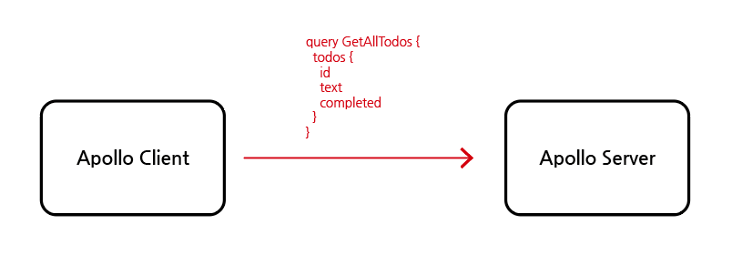
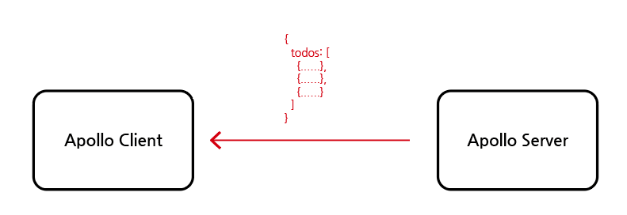
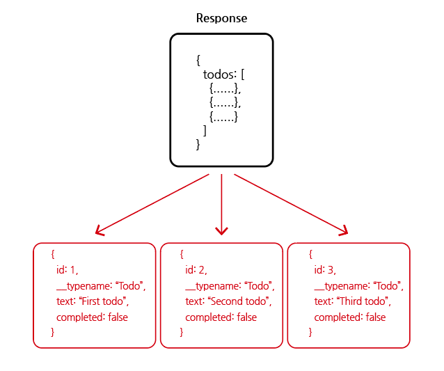
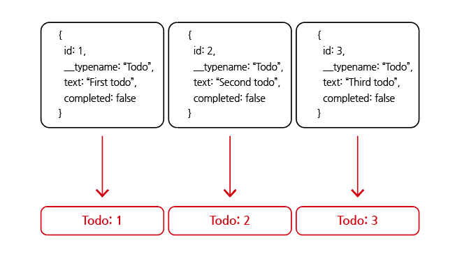
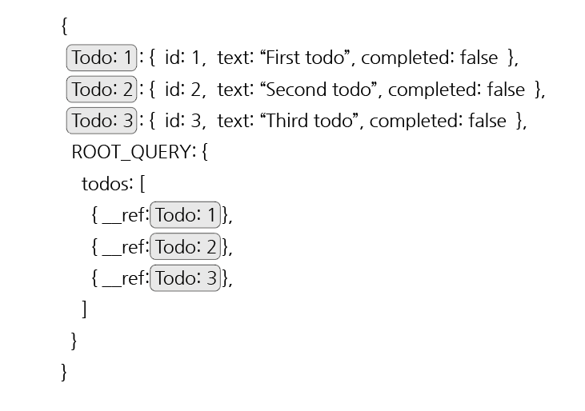

# Apollo Client Cache

## 목차

1. [캐시](#1-캐시)
2. [GraphQL 캐시](#2-graphql-캐시)
    1. [요청](#2-1-요청)
    2. [응답](#2-2-응답)
    3. [정규화(normalization)](#2-3-정규화normalization)
        - [분할(split)](#--분할split)
        - [고유 식별자 할당](#--고유-식별자-할당)
        - [만약 서버에서 ID필드를 넣어주지 않으면?](#--만약-서버에서-id필드를-넣어주지-않으면)
    4. [정규화된 상태](#2-4-정규화된-상태)
    5. [데이터 사용](#2-5-데이터-사용)

<br/>
<br/>

## 1. 캐시

- 데이터나 값을 미리 복사해놓는 임시 보관 장소
- 데이터 접근 또는 연산에서 시간을 절약하고 싶은 경우에 사용함

<br/>

## 2. GraphQL 캐시

### 2-1. 요청

- Apollo Client에서 query 요청을 Apollo Server로 보냄

<p align="center">
    <br/>
    <span>Apollo Client에서 보낸 query 요청</span>
</p>

<br/>

### 2-2. 응답

- Apollo Server에서 응답 데이터를 반환함
- 데이터 개체마다 `__typename` 속성이 자동으로 생성됨

<p align="center">
    <br/>
    <span>Apollo Server에서 응답</span>
</p>

<br/>

### 2-3. 정규화(normalization)

- 데이터 베이스의 정규화는 데이터 중복을 피하기 위해 기본키와 외래키를 사용하여 데이터를 분할하는 과정임
- GraphQL 정규화도 유사함

<br/>

### - 분할(split)

- 정규화 첫 번째 단계에서는 응답으로 받은 데이터 배열을 개별 개체로 분할(split) 함

<p align="center">
    <br/>
    <span>분할</span>
</p>

<br/>

### - 고유 식별자 할당

- 두 번째 단계에서는 각 항목에 고유한 식별자를 할당함
- Apollo Client에서는 기본적으로 `[id] + [__typename]`을 사용함

<p align="center">
    <br/>
    <span>식별자(CACHE ID)</span>
</p>

<br/>

### - 만약 서버에서 ID필드를 넣어주지 않으면?

- ID 대신 todoId를 사용해주면 되고 사용하기 위해서는 설정이 필요함

```js
const cache = new InMemoryCache({
  typePolicies: {
    Todo: {
      keyFields: ["todoId"],
    }
  }
})
```

<br/>

### 2-4. 정규화된 상태

- 데이터가 나열되어 있으며 `각 데이터는 고유한 식별자와 매핑됨`
- Root query에서는 데이터를 가져오는 것이 아닌 `식별자를 참조함`
- 즉, 데이터 베이스의 기본키-외래키를 매핑하는 것과 유사함

<p align="center">
    <br/>
    <span>정규화 상태</span>
</p>

<br/>

### 2-5. 데이터 사용

- React에서 `state`로 데이터를 컨트롤했었지만 `GraphQL`을 사용할 때는 `캐시 안에 들어있는 데이터`를 가져와서 사용하고 업데이트하면 됨