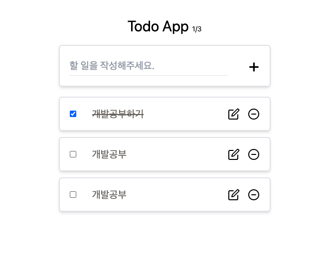

# 컴포넌트 생성

## 목차

1. [UI 생성](#1-ui-생성)

<br/>
<br/>

## 1. UI 생성

```tsx
// src/components/TodoItem.tsx

import React, {FC, useState} from "react";
import {IList} from "../types.ts";
import {FiEdit, FiMinusCircle} from "react-icons/fi";

interface TodoItemProps {
    item: IList;
}

const TodoItem: FC<TodoItemProps> = ({item}) => {
    const [edit, setEdit] = useState(true);
    const [task, setTask] = useState(item.text);

    return (
        <li className="flex items-center justify-between p-5 my-3 text-2xl duration-300 hover:scale-105 border-2 rounded-md shadow-md">
            <div className="flex items-center w-10/12">
                <input checked={item.checked} type="checkbox" className="hover:scale-105 hover:cursor-pointer"/>
                <input
                    className={`outline-none h-[25px] text-xl w-full mx-5 px-3 disabled:bg-transparent focus:border-b-[1px] ${item.checked && 'line-through'} text-stone-500`}
                    type="text"
                    disabled={!edit}
                    value={task}
                    onChange={e => setTask(e.target.value)}/>
            </div>
            <div className="flex justify-between w-1/6">
                <FiEdit className="hover:scale-105 hover:cursor-pointer"/>
                <FiMinusCircle className="hover:scale-105 hover:cursor-pointer"/>
            </div>
        </li>
    )
}

export default TodoItem;
```

<br/>

<p align="center">
    <br/>
    <span>TodoItem 컴포넌트 생성</span>
</p>