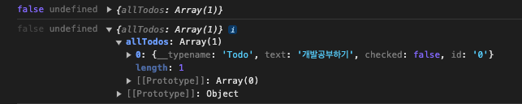

# 데이터 가져오기 - useQuery

## 목차

1. [useQuery](#1-usequery)
    1. [App.tsx](#1-1-apptsx)
    2. [UI 생성](#1-2-ui-생성)

<br/>
<br/>

## 1. useQuery

- Hooks로 데이터 베이스(db.ts)에 있는 todo 데이터 가져오기

<br/>

### 1-1. App.tsx

- `useQuery()`를 사용하고 `인수로 쿼리`를 보내면, loading, error, data를 받을 수 있음
- `loading` : 로딩 상태인지에 대한 true/false 값 반환
- `error` : 에러 발생 시, 에러 메시지 반환
- `data` : 반환된 데이터를 담고 있음

```tsx
// src/App.tsx

// useQuery Hook 과 todos의 GET_TODOS 쿼리 가져오기
import {useQuery} from "@apollo/client";
import {GET_TODOS} from "./apollo/todos";

function App() {
    // 비구조화 할당으로 loading, error, data 받기
    const {loading, error, data} = useQuery(GET_TODOS);
    console.log(loading, error, data);

    return (
        // ...
    );
}

export default App;
```

<br/>

<p align="center">
    <br/>
    <span>useQuery 결과 loading, error, data 콘솔 출력</span>
</p>

<br/>

### 1-2. UI 생성

- useQuery로 받은 데이터를 UI 생성 후, 넣어주기

```tsx
// src/App.tsx

import {useQuery} from "@apollo/client";
import {GET_TODOS} from "./apollo/todos";
import "./App.css";
import {IList} from "./types.ts";
import TodoItem from "./components/TodoItem.tsx";
import {useState} from "react";

function App() {
    // 데이터 쿼리
    const {loading, error, data} = useQuery(GET_TODOS);
    console.log(loading, error, data);
    const [input, setInput] = useState("")

    // 완료 to do/ 전체 to do 나타내는 함수
    const counter = (): string => {
        if (data?.allTodos as IList[]) {
            const completed = (data.allTodos as IList[]).filter((todo: IList) => todo.checked);
            return `${completed.length}/${(data.allTodos as IList[]).length}`;
        }
        return "0/0"
    }

    if (error) return <div>Network Error</div>;
    return (
        <div className="flex flex-col items-center">
            <div className="mt-5 text-3xl">Todo App{" "}<span className="text-sm">{counter()}</span></div>
            <div className="w-5/6 md:w-1/2 lg:w-3/5">
                <form className="flex justify-between p-5 my-5 text-4xl border-2 rounded-md shadow-md">
                    <input
                        placeholder="할 일을 작성해주세요."
                        type="text"
                        className="outline-none border-b-[1px] text-xl w-10/12 focus:border-b-[3px]"
                        value={input} onChange={(e) => setInput(e.target.value)}
                    />
                    <div>
                        <button type="submit" className="hover:scale-105">+</button>
                    </div>
                </form>
                {loading ? <div>loading...</div> :
                    <ul>
                        {data && data.allTodos.map((item: IList) => (
                            <TodoItem
                                key={item.id}
                                item={item}
                            />
                        ))}
                    </ul>
                }
            </div>
        </div>
    );
}

export default App;
```