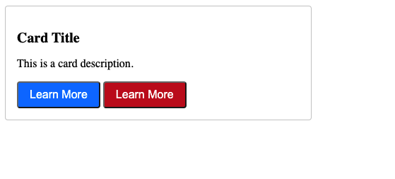
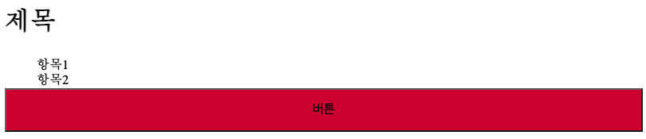

# Semantic

## 목차

1. [Semantic Web](#1-semantic-web)
2. [Semantic in CSS](#2-semantics-in-css)
    1. [OOCSS](#2-1-oocss)
        - [OOCSS 예시](#oocss-예시)
    2. [BEM](#2-2-bem)
        - [BEM 구성](#bem-구성)
        - [BEM 예시](#bem-예시)
    3. [SMACSS](#2-3-smacss)
3. [참고](#3-참고)
    1. [클래스 이름이 너무 길어지는 건 아닐까?](#3-1-클래스-이름이-너무-길어지는-건-아닐까)
    2. [CSS Semantic의 목적](#3-2-css-semantic의-목적)

<br>
<br>

## 1. Semantic Web

- 웹 데이터를 `의미론`적으로 `표현`하고 `연결`하는 개념
- 컴퓨터가 `데이터의 내용과 문맥`을 더 효율적으로 이해하고 지능적으로 활용하도록 함
- 보여지는 것을 넘어 요소가 가진 `목적`과 `역할`에 집중함

<br>
<br>

## 2. Semantics in CSS

### 2-1. OOCSS

- `Object-Oriented CSS(객체 지향 CSS)`의 약자

<br>

### - OOCSS 예시

```html
<div class="card">
    <h2 class="card-title">Card Title</h2>
    <p class="card-description">This is a card description.</p>
    <button class="btn bg-blue">Learn More</button>
    <button class="btn bg-red">Learn More</button>
</div>
```

```css
/*기본 Card 구조*/
.card {
    border: 1px solid #ccc;
    border-radius: 4px;
    padding: 16px;
    width: 50%;
}

/*Card 제목*/
.card-title {
    font-size: 20px;
    font-weight: bold;
    margin-bottom: 8px;
}

/*Card 설명*/
.card-description {
    font-size: 16px;
    margin-bottom: 16px;
}

/*기본 버튼 구조*/
.btn {
    display: inline-block;
    border-radius: 4px;
    padding: 8px 16px;
    font-size: 1rem;
    font-weight: 400;
    color: #212529;
    text-align: center;
    text-decoration: none;
    cursor: pointer;
}

/*파란 배경*/
.bg-blue {
    background-color: #007bff;
    color: #fff;
}

/*빨간 배경*/
.bg-red {
    background-color: #cb2323;
    color: #fff;
}
```



<OOCSS 예시 결과>

<br>

### 2-2. BEM

- `Block Element Modifier`의 약자로 블록, 요소, 수정자를 사용해 클래스 이름을 구조화하는 방법론

<br>

### - BEM 구성

1. Block

- 문단 `전체`에 적용된 요소 또는 요소를 담고 있는 컨테이너
- 재사용 가능한 독립적 블록, `가장 바깥쪽 상위 요소`
- 재사용을 위해 `margin, padding을 적용하지 않음`

```css
.block {
}
```

2. Element

- block이 포함하고 있는 `한 조각`
- block을 구성하는 `종속적인 하위 요소`

```css
.block__element {
}
```

3. Modifier

- block 또는 element의 `속성`

```css
.block__modifier {
}
```

<br>

### - BEM 예시

```html
<div class="card">
    <h2 class="card__title">제목</h2>
    <ul class="card__list">
        <li class="card__list-item--none">항목1</li>
        <li class="card__list-item--none">항목2</li>
    </ul>
    <button class="card__button card__button--red">버튼</button>
</div>
```

```css
/*Block*/
.card {
    display: flex;
    flex-direction: column;
}

/*Element*/
.card__title {
    font-size: 2rem;
}

.card__list {
    margin: 0;
}

.card__button {
    font-size: 1rem;
    padding: 1rem;
    cursor: pointer;
}

/*Modifier*/
.card__list-item--none {
    list-style: none;
}

.card__button--red {
    background-color: crimson;
}
```



<BEM 예시 결과>

<br>

### 2-3. SMACSS

<br>
<br>

## 3. 참고

### 3-1. 클래스 이름이 너무 길어지는 건 아닐까?

- 클래스를 생성할 때, 가장 중요한 건 클래스의 이름이 무엇을 나타내는지 `명확하게 전달`할 수 있는가에 대한 것임
- 각각의 명명법은 개인적인 취향에 따라 다르지만, `빠르고 명확한 표기를 우선적`으로 해야 함
- `너무 깊게 고민하지 않도록` 하는 것도 중요

<br>

### 3-2. CSS Semantic의 목적

- 재사용 가능한 모듈로 분리함으로써, `유지보수성`과 `확장성`을 향상시킴
- 개발자 간의 `협력이 향상`되어 공통 언어와 코드 이해를 확립함
- 방법론을 `조합하여 혼용`하는 사례도 있음
    - ex) Airbnb...
