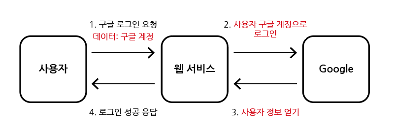
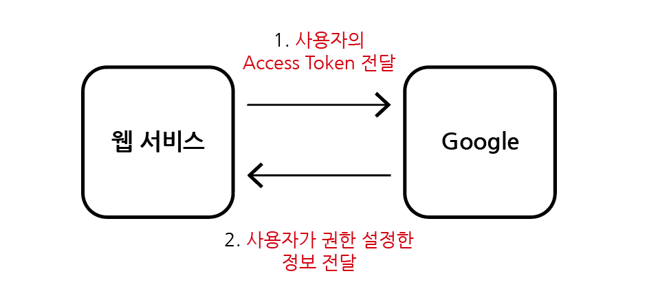
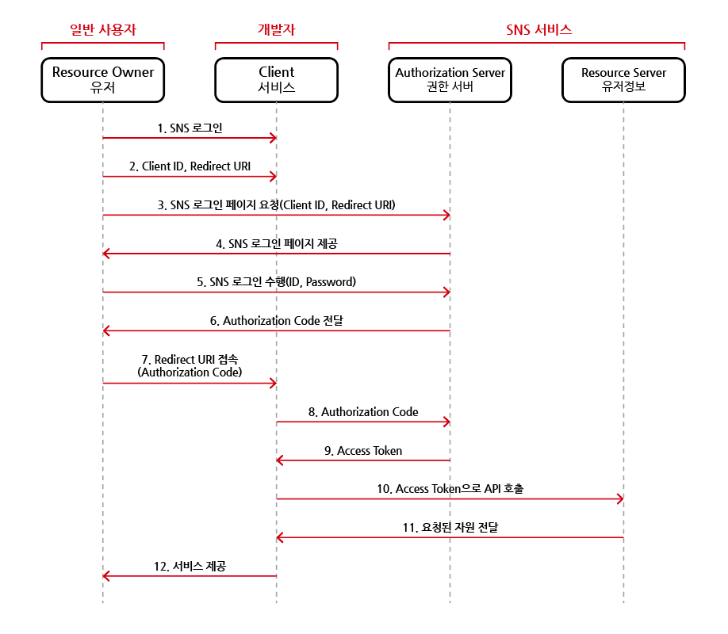

# OAuth

## 목차

1. [OAuth](#1-oauth)
    1. [안전하지 않은 인증 방식 예시](#1-1-안전하지-않은-인증-방식-예시)
    2. [Access Token 이용](#1-2-access-token-이용)
    3. [OAuth 2.0](#1-3-oauth-20)

 
 

## 1. OAuth

- 웹 서비스 개발 시, 웹 서버에 비밀번호를 제공하지 않더라도 Google, Naver, KaKao와 같은 `서드파티 계정`의 일부 `접근 권한을 부여`할 수 있음
- 사용자로부터 어떠한 `토큰 정보만을 제공`받아 SNS에 보내면 해당 사용자 계정의 `일부 접근 권한을 서버가 받아와` 그것으로 회원가입, 로그인을 수행함
- SNS를 이용한 소셜 로그인, 간편 로그인 기능을 의미함

 

### 1-1. 안전하지 않은 인증 방식 예시

- 사용자가 웹 서버에 자신의 SNS 계정을 직접 알려주는 인증 방법
- 사용자의 계정이 노출되는 위험이 있음

     
    안전하지 않은 인증

 

### 1-2. Access Token 이용

- 사용자가 `지정한 권한`에 대해서만 SNS의 정보에 접근할 수 있도록 제한하기
- 상대적으로 안전함

     
    Access Token을 이용한 인증

 

### 1-3. OAuth 2.0

|         구성요소         | 설명                                                                                                                                     |
|:--------------------:|----------------------------------------------------------------------------------------------------------------------------------------|
|    Resource Owner    | 특정한 서비스를 사용하려는 유저 개인정보(Resource)의 소유자(개인)을 의미함                                                                                     |
|        Client        | 특정 서비스 일반적으로 웹/앱 서버를 의미하나 클라이언트라고 부름 유저의 정보를 제공하는 SNS의 입장에서는 클라이언트이기 때문임                                                       |
|   Resource Server    | 유저의 개인정보를 가진 서버/SNS를 의미함 클라이언트는 해당 서버에 Access Token을 보내 유저의 정보를 받음                                                                 |
| Authorization Server | 실질적으로 권한 부여를 담당하는 서버 유저는 자신의 SNS 정보(ID, PW)를 넘겨 Authorization Code를 받음 클라이언트는 유저로부터 받은 Authorization Code를 넘겨 Access Token을 받음 |

 

- OAuth 2.0 동작 예시는 다음과 같음

     
    OAuth2.0 동작방식

