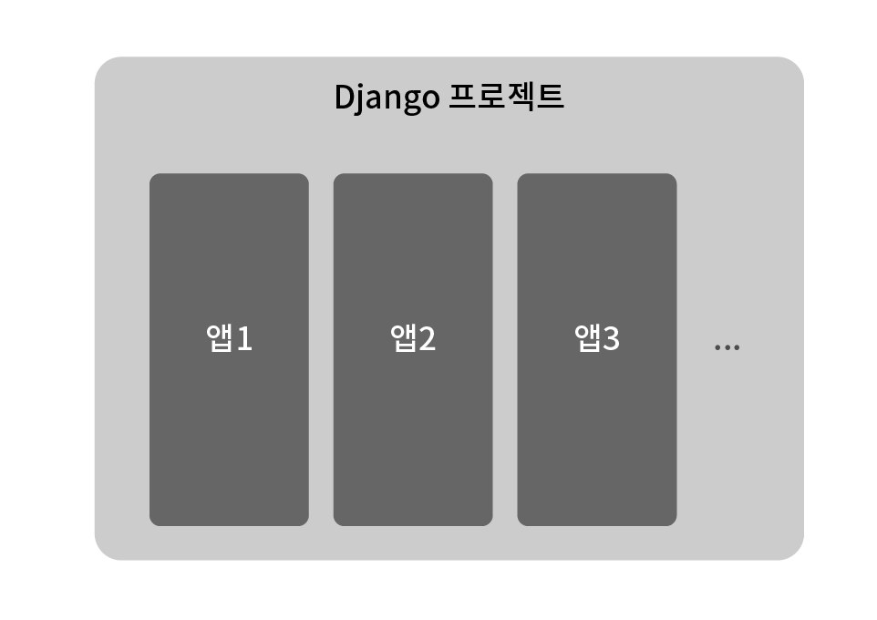
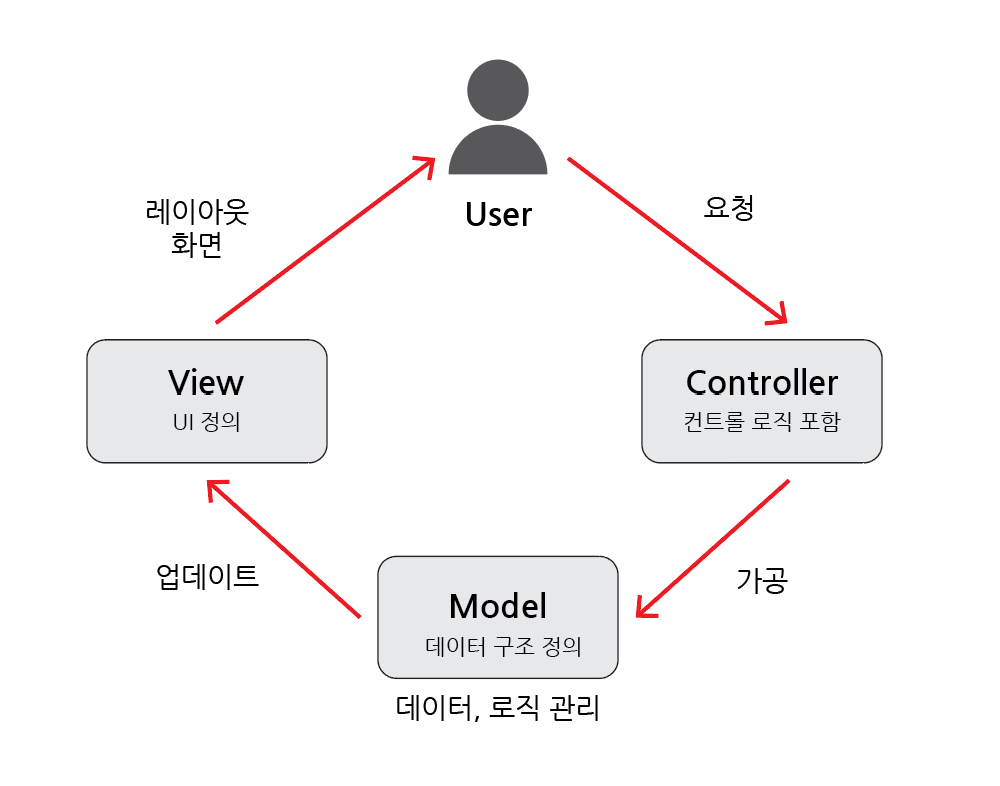
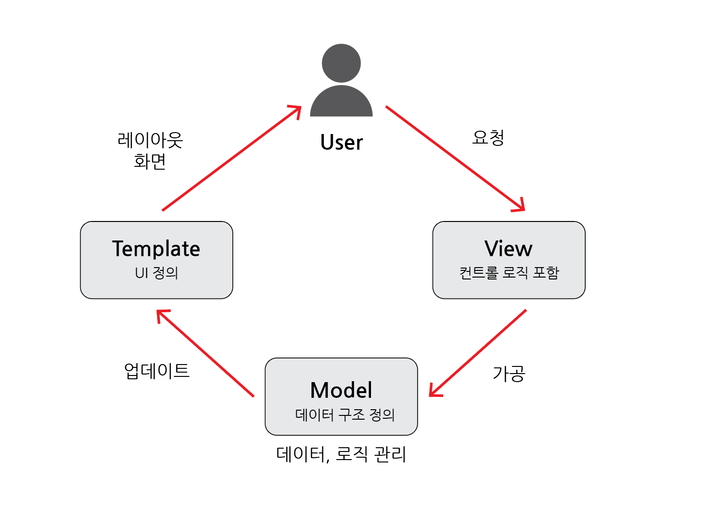
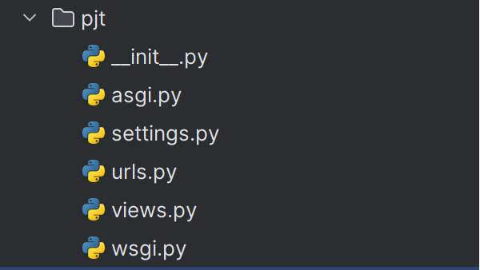
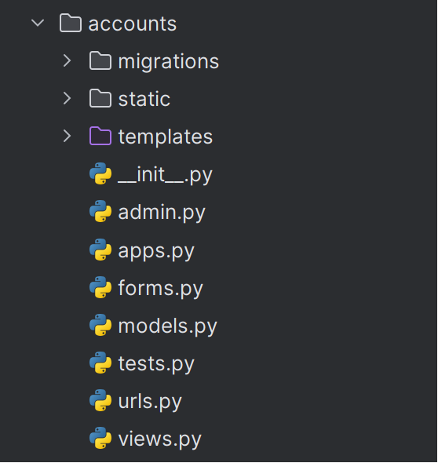
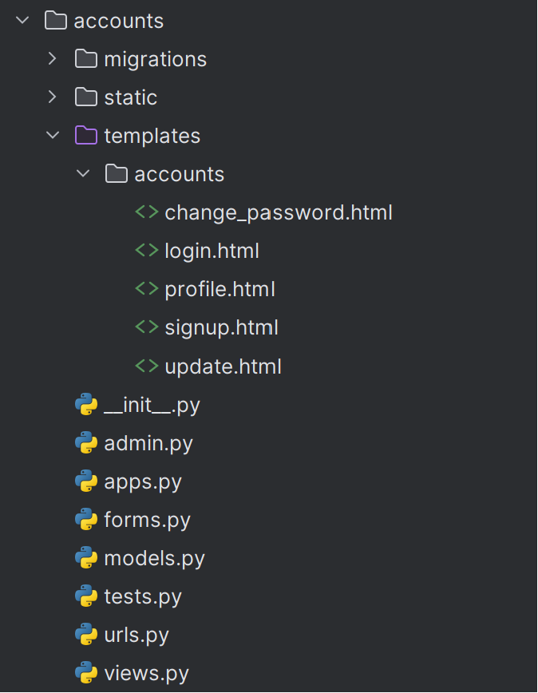
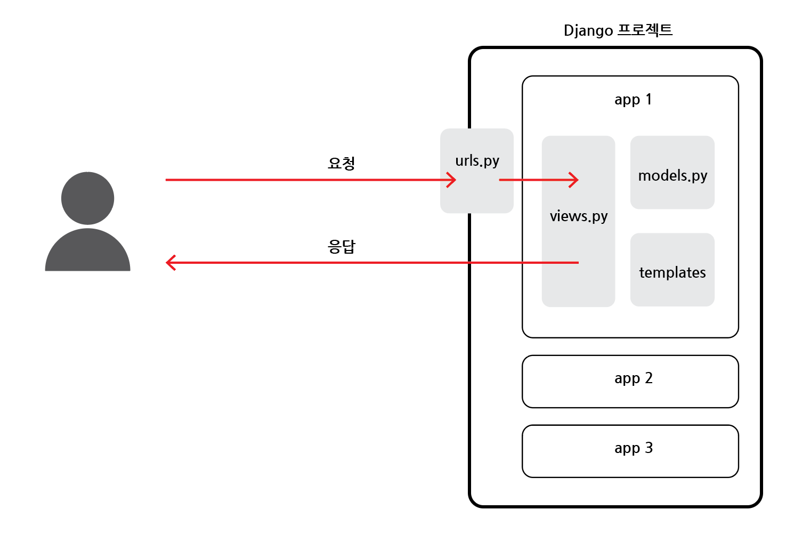

# Django 디자인 패턴

## 목차

1. [Django 프로젝트와 앱](#1-django-프로젝트와-앱)
    1. [Django project](#1-1-django-project)
    2. [Django application](#1-2-django-application)
        - [프로젝트, 앱 예시](#프로젝트-앱-예시)
        - [앱 생성](#앱-생성)
        - [앱 등록](#앱-등록)
2. [Django 디자인 패턴](#2-django-디자인-패턴)
    1. [디자인 패턴](#2-1-디자인-패턴)
    2. [MVC 디자인 패턴](#2-2-mvc-디자인-패턴)
    3. [MTV 디자인 패턴](#2-3-mtv-디자인-패턴)
    4. [프로젝트 구조](#2-4-프로젝트-구조)
    5. [앱 구조](#2-5-앱-구조)
3. [요청과 응답](#3-요청과-응답)
    1. [URLs](#3-1-urls)
    2. [View](#3-2-view)
    3. [Template](#3-3-template)
        - [Django에서 template을 인식하는 경로 규칙](#django에서-template을-인식하는-경로-규칙)
        - [페이지 확인](#페이지-확인)
        - [코드 작성](#코드-작성)
4. [참고](#4-참고)
    1. [MTV 디자인 패턴 정리](#4-1-mtv-디자인-패턴-정리)
    2. [왜 Django는 MTV라고 하는가?](#4-2-왜-django는-mtv라고-하는가)
    3. [render 함수](#4-3-render-함수)

<br>
<br>

## 1. Django 프로젝트와 앱



<br>

### 1-1. Django project

- 애플리케이션 `집합`
- DB설정, URL연결, 전체 앱 설정 등을 처리

<br>

### 1-2. Django application

- `독립적`으로 작동하는 `기능 단위 모듈`
- 각자 특정한 기능을 담당하며 다른 앱들과 함께 하나의 프로젝트를 구성

<br>

### - 프로젝트, 앱 예시

- 블로그
    - `프로젝트` : 블로그(전체)
    - `앱` : 게시글, 댓글, 카테고리 회원 관리 (DB, 로직) 등...

<br>

### - 앱 생성

- 앱 이름은 `복수형`으로 지정하는 것을 권장

```bash
$ python manage.py startapp articles
```

<br>

### - 앱 등록

- 반드시 앱 생성 후, 등록해야 함
- 등록 후, 생성은 불가능

```bash
# settings.py

INSTALLED_APPS = [
  'articles', # articles 앱 등록
  'django.contrib.admin',
  'django.contrib.auth',
  'django.contrib.contenttypes',
  'django.contrib.sessions',
  'django.contrib.messages',
  'django.contrib.staticfiles',
]
```

<br>
<br>

## 2. Django 디자인 패턴

### 2-1. 디자인 패턴

- 소프트웨어 `설계`에서 발생하는 문제를 해결하기 위한 일반적인 `해결책`
- 공통적인 문제를 해결하는데 쓰이는 `형식화` 된 관행

<br>

### 2-2. MVC 디자인 패턴

- `Model - View - Controller`의 구성

    - 모델: 데이터와 비즈니스 로직을 관리
    - 뷰: 레이아웃과 화면을 처리
    - 컨트롤러: 모델과 뷰로 명령을 전달

- 애플리케이션을 구조화하는 대표적인 패턴
- 데이터, 사용자 인터페이스, 비즈니스 로직을 분리
- 시각적 요소와 배후에서 실행되는 로직을 서로 영향없이 `독립적`이고 쉽게 `유지보수`할 수 있는 애플리케이션을 만들기 위함



<MVC 디자인 패턴>

<br>

### 2-3. MTV 디자인 패턴

- `Model - Template - View`의 구성

    - 모델: 데이터와 비즈니스 로직을 관리
    - 템플릿: 레이아웃과 화면을 처리
    - 뷰: 모델과 템플릿으로 명령을 전달

- `Django`에서 애플리케이션을 구조화하는 패턴
- 기존의 `MVC 패턴`과 동일하나 명칭을 다르게 정의
    - `View` -> `Template`
    - `Controller` -> `View`



<MTV 디자인 패턴>

<br>

### 2-4. 프로젝트 구조



- `settings.py` : 프로젝트의 모든 설정 관리
- `urls.py` : URL과 이에 해당하는 적절한 views 연결
- `__init__.py` : 해당 폴더를 패키지로 인식하도록 설정
- `asgi.py` : 비동기식 웹 서버와의 연결 관련 설정
- `wsgi.py` : 웹 서버와의 연결 관련 설정
- `manage.py` : Django 프로젝트와 다양한 방법으로 상호작용하는 커맨드라인 유틸리티

<br>

### 2-5. 앱 구조



- `admin.py` : 관리자용 페이지 설정
- `models.py` : DB와 관련된 Model을 정의
- `views.py` : HTTP 요청을 처리하고 해당 요청에 대한 응답을 반환 (url, mode, template과 연계)
- `apps.py` : 앱의 정보가 작성된 곳
- `tests.py` : 프로젝트 테스트 코드를 작성하는 곳

<br>
<br>

## 3. 요청과 응답

### 3-1. URLs

```python
# urls.py

from django.contrib import admin
from django.urls import path
from articles import views

urlpatterns = [
    path('admin/', admin.site.urls),
    path('articles/', views.index),
]
```

- urls.py 입장에서 articles 패키지에서 views 모듈을 가져오는 것
- `http://128.0.0.1:8000/articles/`로 요청이 왔을 때, views 모듈의 index 뷰 함수를 호출

<br>

### 3-2. View

```python
# views.py

from django.shortcuts import render

def index(request):
    return render(request, 'articles/index.html')
```

- 특정 경로에 있는 template과 request 객체를 결합해 응답 객체를 반환하는 index view 함수 정의
- 모든 view 함수는 첫 번째 인자로 `요청 객체(request)`를 `필수적`으로 받음

<br>

### 3-3. Template

1. articles 앱 폴더 안에 templates 폴더 작성
2. templates 폴더 안에 템플릿 페이지 작성



<Template 폴더>

- 반드시 templates 폴더명이여야 함
- 개발자가 직접 생성해야 함

<br>

### - Django에서 template을 인식하는 경로 규칙

> - app폴더 / templates / articles / index.html
> - app폴더 / templates / example.html

- 위에서 django는 `templates/`까지 기본 경로로 인식

<br>

### - 페이지 확인

- http://127.0.0.1:8000/articles/ 로 확인 가능

<br>

### - 코드 작성

- 데이터 흐름에 따라서 코드를 작성함
- URLs -> View -> Template 순으로 작성



<데이터 흐름에 따른 코드 작성>

<br>
<br>

## 4. 참고

### 4-1. MTV 디자인 패턴 정리

- Model

    - 데이터와 관련된 로직을 관리
    - 응용프로그램의 데이터 구조를 정의하고 데이터 베이스의 기록을 관리

- Template

    - 레이아웃과 화면을 처리
    - 화면 상의 사용자 인터페이스 구조와 레이아웃을 정의

- View
    - Model & Template과 관련한 로직을 처리해서 응답을 반환
    - 클라이언트 요청에 대해 처리를 분기하는 역할
    - 데이터가 필요시 model에 접근하여 데이터 가져옴
    - 가져온 데이터를 template으로 보내 화면 구성
    - 구성된 화면을 응답으로 만들어 클라이언트에게 반환

<br>

### 4-2. 왜 Django는 MTV라고 하는가?

- Django 공식문서에서는 아래와 함께 답하고 있음

> Q) 장고는 MVC패턴으로 보여집니다, 하지만 컨트롤러를 “뷰”라고 부르고, 뷰를 “템플릿”이라고 합니다. 어떻게 일반적으로 사용하는 이름을 사용하지 않았나요?
>
> - 음, 기준이 되는 이름은 논쟁의 여지가 있습니다. 저희가 MVC를 해석하기로는, “뷰”는 사용자에게 보여지는 데이터들을 설명합니다. 데이터가 “어떻게” 데이터가 “보이는”지가 아니라 “어떤” 데이터를
    보여주는지로 볼 수 있습니다. 뷰는 “당신이 어떤 데이터를 보는지” 를 설명하지 “당신이 어떻게 보는지”를 설명하지 않습니다. 이것은 사소한 차이입니다. 따라서, 우리의 경우 “뷰”는 특정 URL에 대한
    파이썬 콜백 함수입니다. 왜냐하면, 콜백함수는 어떤 데이터를 보여주는지 설명하기 때문이죠. 또한, 내용과 표시를 구분하는 것이 현명합니다. 여기서 템플릿이 등장합니다. 장고에서는 “뷰”는 어떤 데이터를
    보여줄지를 구현합니다. 그러나 뷰는 일반적으로 템플릿에 어떻게 데이터가 보여질 지를 위임합니다. 그렇다면 “컨트롤러”는 어디에 맞을까요? 장고의 경우, 아마 프레임워크 자체 일것입니다. 프레임워크가 장고
    URL설정에 따라 요청을 적절한 뷰에게 전달합니다. 만약 두문자어를 원한다면, 장고를 “MTV” 프레임워크라고 할수 있습니다. “모델”, “템플릿” 그리고 “뷰”로 말이죠. 이렇게 나누는것이 더 적절합니다.
    결국 효율적으로 작업을 끝낼 수 있습니다. 그리고 어떻게 이름이 붙여지는지 상관없이 장고는 가장 논리적은 방법으로 일을 처리합니다.

- 출처 : https://docs.djangoproject.com/ko/4.1/faq/general/#faq-mtv

<br>

### 4-3. render 함수

```python
render(request, template_name, context)
```

- 주어진 템플릿을 주어진 context 데이터와 결합하고 렌더링 된 텍스트와 함께 HttpResponse(응답) 객체를 반환하는 함수

1. `request` : 응답을 생성하는데 사용되는 요청 객체
2. `template_name` : 템플릿 이름의 경로
3. `context` : 템플릿에서 사용할 데이터 (딕셔너리 타입으로 작성)

---

자료참고 : https://developer.mozilla.org/ko/docs/Glossary/MVC
