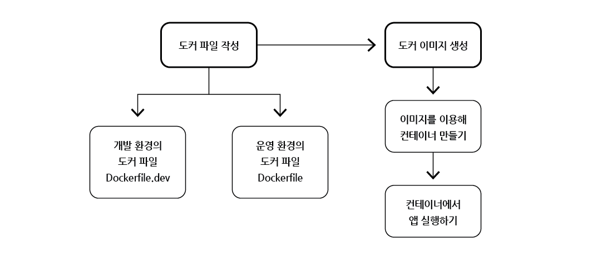
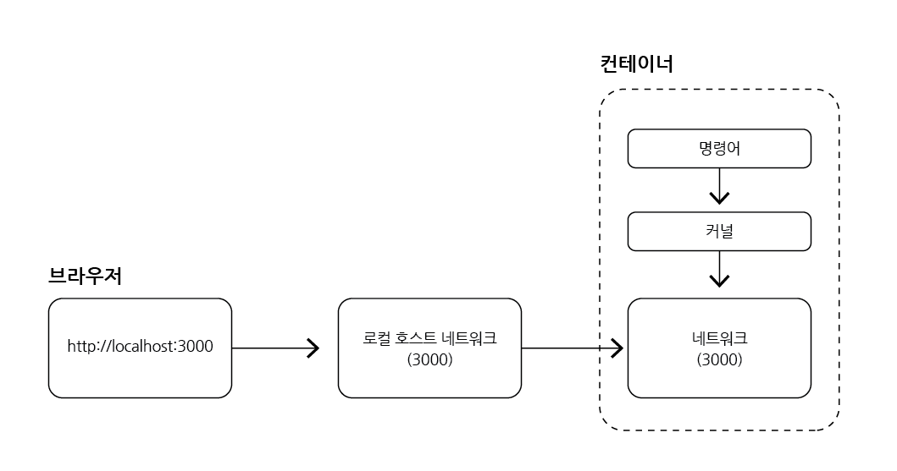

# 리액트를 위한 도커 파일 작성

## 목차

1. [도커로 어플을 실행하기 위해서 필요한 것](#1-도커로-어플을-실행하기-위해서-필요한-것)
2. [리액트 프로젝트 도커 파일](#2-리액트-프로젝트-도커-파일)
    1. [Dockerfile.dev 작성](#2-1-dockerfiledev-작성)
    2. [빌드](#2-2-빌드)
    3. [실행](#2-3-실행)
        - [localhost:3000 접속불가 (포트 맵핑)](#--localhost3000-접속불가-포트-맵핑)

<br/>
<br/>

## 1. 도커로 어플을 실행하기 위해서 필요한 것



- Dockerfile을 한 가지만 생성하였지만, 실제로는 Dockerfile을 `개발 단계`를 위한 용도와 `실제 배포 후`를 위한 용도를 분리하여 따로 작성하는 것이 좋음
- `Dockerfile.dev` : 개발 단계를 위한 용도
- `Dockerfile` : 실제 배포 후 운영을 위한 용도

<br/>
<br/>

## 2. 리액트 프로젝트 도커 파일

### 2-1. Dockerfile.dev 작성

- `FROM` : 베이스 이미지 가져오기
- `WORKDIR` : 컨테이너 안에서 앱을 실행하게 되는데 그 컨테이너 안의 어떤 경로에 리액트를 위한 파일들을 넣어줄건지 설정 (원하는 경로로 설정ㄴ)
- `COPY` : 컨테이너 디렉토리(WORKDIR) 안에 복사할 파일 (첫 번째 COPY는 종속성 설치를 위해 package.json 파일만, 두 번째 COPY는 나머지 파일도 가져오기)
- `RUN` : package.json의 dependencies의 모듈들(종속성)을 컨테이너 안에 설치하기 위한 명령어
- `CMD` : 리액트를 실행할 명령어 (npm run start)

<br/>

| 키워드     | 내용                    |
|---------|-----------------------|
| FROM    | node:16-alpine        |
| WORKDIR | /usr/src/app          |
| COPY    | package.json ./       |
| RUN     | npm install           |
| COPY    | ./ ./                 |
| CMD     | "npm", "run", "start" |

<br/>

### 2-2. 빌드

- Dockerfile.dev를 작성한 후, 이 도커 파일로 이미지를 생성하면 됨

```bash
# 빌드하기

$ docker build ./
```

<br/>

### 2-3. 실행

- 도커 이미지 빌드 완료 후, 실행하기

```bash
# 실행하기

$ docker run <생성된 이미지 이름>
```

<br/>

### - localhost:3000 접속불가 (포트 맵핑)

- `docker run <이미지 이름>`를 입력하고 `localhost:3000`으로 접근하면 `오류`가 발생함
- 컨테이너를 실행하기 위해서는 `새로운 명령어`를 사용해야 함
- `-p 3000:3000`을 명령어에 추가
- 파일 스냅샷과 명령어를 컨테이너에 복사하는 것과 같이 네트워크도 로컬 네트워크에 있던 것을 `컨테이너의 네트워크에 맵핑`시켜 주어야 함

```bash
# 수정된 실행 명령어

$ docker run -p 3000:3000 <이미지 이름>
```

<br/>



<포트 맵핑>