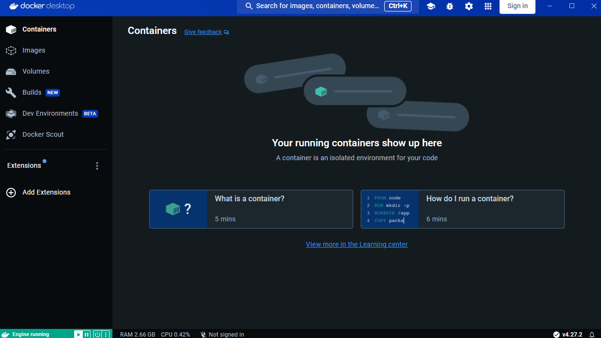
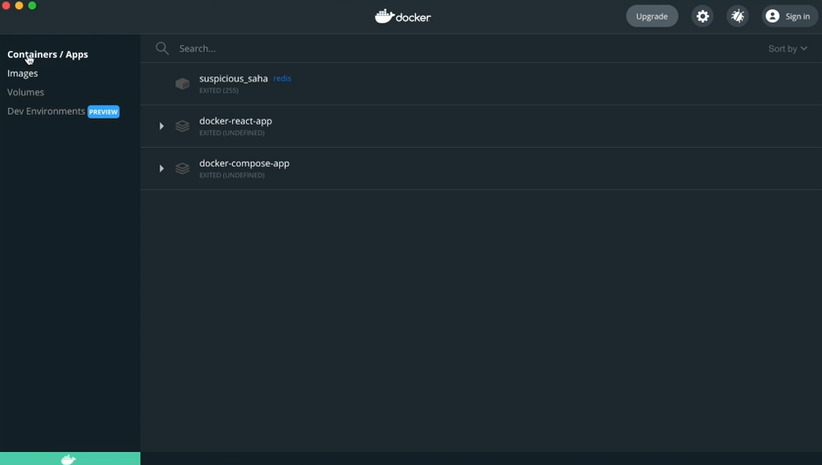

Docker 설치

## 목차

1. [윈도우 설치](#1-윈도우-설치)
2. [Mac 설치](#2-mac-설치)

 
 

## 1. 윈도우 설치

1. 도커 홈페이지 이동 -> [docker 공식 사이트](https://www.docker.com/)
2. Get started 이동
3. Windows 버전 설치

<설치된 윈도우 도커 프로그램 실행>

 
 

## 2. Mac 설치

1. 도커 홈페이지 이동 -> [docker 공식 사이트](https://www.docker.com/)
2. Get started 이동
3. Apple Mac 버전 설치

<설치된 Mac 도커 프로그램 실행>