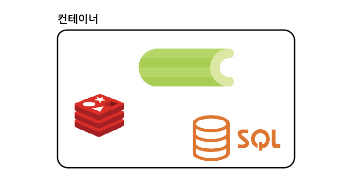

# Docker 소개

## 목차

1. [도커를 사용하는 이유](#1-도커를-사용하는-이유)
    1. [기존 다운로드 방식](#1-1-기존-다운로드-방식)
    2. [도커 유무 비교](#1-2-도커-유무-비교)
        - [기존 방식](#--기존-방식)
        - [도커 활용](#--도커-활용)
2. [도커란 무엇인가?](#2-도커란-무엇인가)
    1. [도커 정의](#2-1-도커-정의)
    2. [컨테이너](#2-2-컨테이너)

<br/>
<br/>

## 1. 도커를 사용하는 이유

- 어떠한 프로그램을 다운 받는 과정을 굉장히 간단하게 만들기 위해서이다.

<br/>

### 1-1. 기존 다운로드 방식

```
- 기본적인 다운로드 과정

인스톨러 내려받기 --> 인스톨러 실행 --> 프로그램 설치 완료
```

- 하지만, 갖고 있는 서버, 패키지 버전, 운영체제 등 여러 이유에 의해 프로그램을 설치하는 과정에서 `많은 에러가 발생`하게 됨
- 또한 `설치 과정이 복잡해짐`

<br/>

### 1-2. 도커 유무 비교

- Redis 다운로드 과정을 비교해보기

<br/>

### - 기존 방식

1. Redis 홈페이지로 이동 -> [redis.io](https://redis.io/)
2. 다운로드 명령어 실행

```bash
$ wget https://download.redis.io/redis-stable.tar.gz
$ tar -xzvf redis-stable.tar.gz
$ cd redis-stable
$ make

# wget이 없기에 에러 발생
```

- 특정 프로그램을 받을 때, 필요한 부수적인 것들도 같이 설치해야하기에 다운로드 과정이 복잡해지고 에러가 많이 발생함

<br/>

### - 도커 활용

1. 도커 명령어 실행하면 다운로드 완료

```bash
$ docker run -it redis
```

- 도커 이용하여 설치 시, 예상치 못한 에러가 발생할 가능성이 줄어들며 설치하는 과정도 간단해짐
- 다만, 도커는 선택사항이며 필수는 아님

<br/>
<br/>

## 2. 도커란 무엇인가?

### 2-1. 도커 정의

- `컨테이너`를 사용하여 응용프로그램을 더 쉽게 만들고 배포하고 실행할 수 있도록 설계 된 도구
- `컨테이너` 기반의 오픈소스 가상화 플랫폼이며 생태계임

<br/>

### 2-2. 컨테이너

- 도커, 서버에서의 컨테이너는 다양한 프로그램, 실행환경을 `추상화`하고 `동일한 인터페이스를 제공`하여 프로그램의 배포 및 관리를 단순하게 해줌
- AWS, Azure, Google cloud 등 어디에서든 실행 가능하게 해줌



<컨테이너 개념 다이어그램>