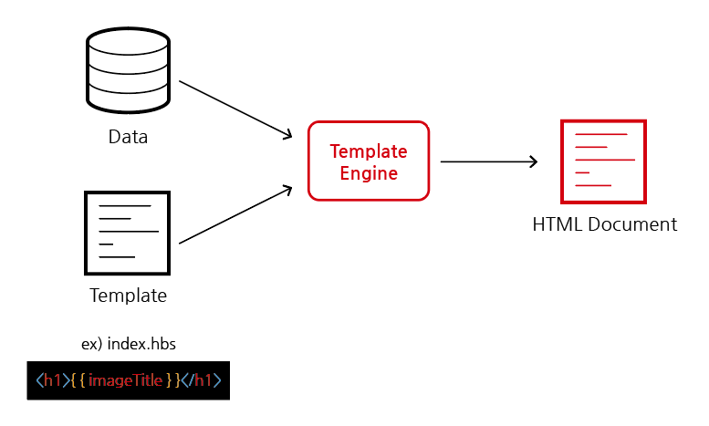

# Template Engine, Template Layout

## 목차

1. [Template Engine](#1-template-engine)
    1. [Template Engine의 필요성](#1-1-template-engine의-필요성)
    2. [Template Engine 역할](#1-2-template-engine-역할)
    3. [Template Engine 종류](#1-3-template-engine-종류)
    4. [Template Engine 사용법](#1-4-template-engine-사용법)
        - [패키지 설치](#--패키지-설치)
        - [Template Engine을 서버에 등록](#--template-engine을-서버에-등록)
        - [Template 생성](#--template-생성)
        - [동적인 데이터 부분 처리 - res.render()](#--동적인-데이터-부분-처리---resrender)
2. [Template Layout](#2-template-layout)
    1. [Template Layout 생성하기](#2-1-template-layout-생성하기)
    2. [레이아웃 적용 안 하거나 다른 레이아웃 적용하기](#2-2-레이아웃-적용-안-하거나-다른-레이아웃-적용하기)
        - [레이아웃 적용 안 하기](#--레이아웃-적용-안-하기)
        - [다른 레이아웃 적용하기](#--다른-레이아웃-적용하기)
        - [전체 app에 특정 레이아웃 덮어쓰기](#--전체-app에-특정-레이아웃-덮어쓰기)

<br/>
<br/>

## 1. Template Engine

### 1-1. Template Engine의 필요성

- `express.static()`을 통해 정적인 파일들을 제공해줄 수 있었으나 `동적인 데이터`를 담기는 힘듦
- MVC 패턴의 경우, 가공된 데이터들을 View에서 동적으로 보여주어야 하는데 정적 파일 처리로는 어려움
- 따라서 데이터들을 `동적으로 보여주고 처리`하기 위해서 Template Engine을 사용하면 편리함

<br/>

### 1-2. Template Engine 역할

<p align="center">
    <br/>
    <span>Template Engine의 역할</span>
</p>

- Template Engine이 `동적인 결과(데이터)를 정적인 파일(HTML)에 담아줌`
- 따라서 View와 서버 코드를 따로 작성할 수 있음

<br/>

### 1-3. Template Engine 종류

- Template Engine의 종류는 여러가지가 있으며 대표적으로 `Pug`, `EJS`, `hbs(handlebars)` 등이 있음
- 대부분 기능 및 사용법이 비슷함
- ex) Haml.js, Squirrelly, Eta, combyne.js, Nunjucks ...

<br/>

### 1-4. Template Engine 사용법

- Template Engine 중 `hbs`를 사용해보기

<br/>

### - 패키지 설치

```bash
$ npm i hbs
```

<br/>

### - Template Engine을 서버에 등록

- `app.set()` : 엔진을 등록하고 view 파일들 명시하는데 이용하는 메서드
- [Express.js 공식 사이트 - app.set()](https://expressjs.com/en/4x/api.html#app.set)

```js
// server.js

// 특정 엔진을 템플릿 엔진으로 사용하기 위한 설정
app.set('view engin', 'hbs');

// view 파일들이 모여있는 폴더 views를 절대 경로로 명시
app.set('views', path.join(__dirname, 'views'));
```

<br/>

### - Template 생성

- views/index.hbs 파일 생성
- `{{}}` : hbs에서는 동적으로 보여질 부분을 중괄호 2개 사용하여 감싸기
- 정적 파일의 절대 경로를 `'/static'`으로 설정한 경우, src, href 경로도 `static/...`으로 시작해야 함

```js
// server.js

app.use('/static', express.static(path.join(__dirname, 'public')));
// 절대 경로를 '/static'으로 지정
```

```html
<!--views/index.hbs-->

<!DOCTYPE html>
<html lang="en">
<head>
    <title>Document</title>
    <link rel="stylesheet" href="static/css/style.css">
</head>
<body>
<h1>{{imageTitle}}</h1>

</body>
</html>
```

```html
<!--views/posts.hbs-->

<!DOCTYPE html>
<html lang="en">
<head>
    <title>Document</title>
    <link rel="stylesheet" href="static/css/style.css">
</head>
<body>
<p>It is a {{templateName}} template</p>
</body>
</html>
```

<br/>

### - 동적인 데이터 부분 처리 - res.render()

- `res.render()` 메서드 사용

1. 서버에서 처리

```js
// server.js

// '/'경로에 왔을 때, index.hbs 템플릿 파일을 이용하고 템플릿 파일에 이용된 변수를 넣어줌
app.get('/', (req, res) => {
  res.render('index', {
    imageTitle: "It is a image"
  });
});
```

<br/>

2. 컨트롤러에서 처리하기

```js
// controllers/posts.controller.js

function getPost(req, res) {
  res.render('posts', {
    templateName: "post",
  });
}
```

<br/>
<br/>

## 2. Template Layout

- React의 레이아웃, Django의 Base template과 같이 `계속 필요한 요소(navbar, footer)`를 Layout으로 만들 수 있음

<br/>

### 2-1. Template Layout 생성하기

- views/layout.hbs
- `{{{}}}` : Layout에서는 변화되는 부분에 중괄호 3개를 사용함

```html
<!--views/layout.hbs-->

<!DOCTYPE html>
<html>
<head>
    <title>Document</title>
    <link rel="stylesheet" href="static/css/style.css"/>
</head>
<body>
<h1>It is a layout</h1>
{{{body}}}
</body>
</html>
```

<br/>

- layout을 사용하는 파일에서는 필요한 부분만 남기고 다 지우기

```html
<!--views/index.hbs-->

<h1>{{imageTitle}}</h1>

```

```html
<!--views/posts.hbs-->

<p>It is a {{templateName}} template</p>
```

<br/>

### 2-2. 레이아웃 적용 안 하거나 다른 레이아웃 적용하기

### - 레이아웃 적용 안 하기

- 특정 템플릿의 경우, 레이아웃이 적용되지 않아야 하는 경우가 있을 수 있음
- res.render() 메서드의 매개변수로 `{layout: false}`를 전달하여 레이아웃을 비활성화 할 수 있음

```js
// server.js

app.get('/', (req, res) => {
  // index 페이지 템플릿 렌더링, 레이아웃 비활성화
  res.render('index', {title: 'Express App'}, {layout: false});
});
```

<br/>

### - 다른 레이아웃 적용하기

- res.render() 메서드의 매개변수로 `{layout: "다른 레이아웃 이름"}`을 전달하여 해당 레이아웃을 적용할 수 있음

```js
// server.js

app.get('/', (req, res) => {
  // index 페이지 템플릿 렌더링, other.hbs 레이아웃 적용하기
  res.render('index', {title: 'Express App'}, {layout: 'other'});
});
```

<br/>

### - 전체 app에 특정 레이아웃 덮어쓰기

- app.set() 메서드의 첫 번째 매개변수로 `'view options'` 설정한 후 원하는 레이아웃 `{layout: "다른 레이아웃 이름"}` 전달

```js
// server.js

app.set('view options', {layout: 'other'});
```