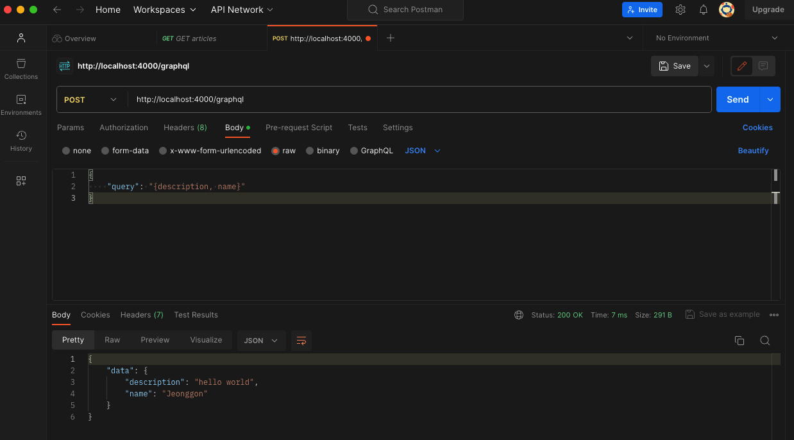
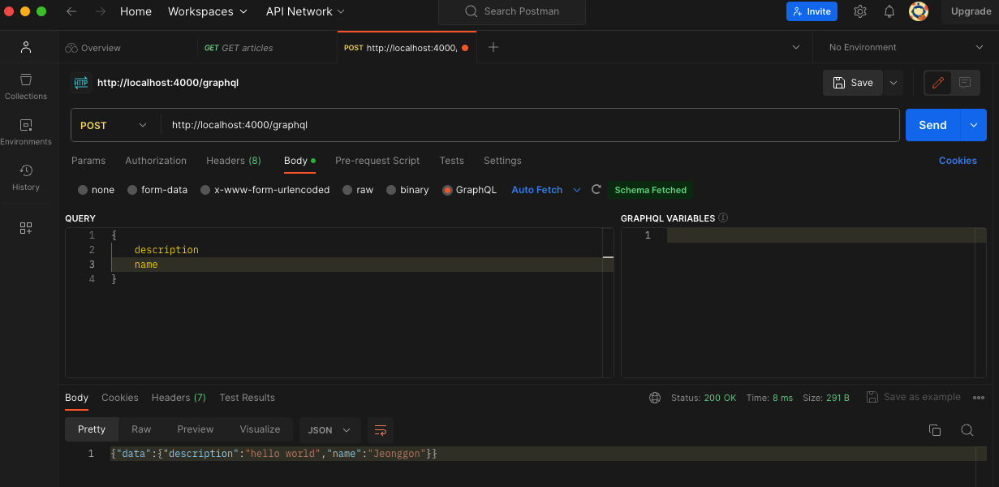

# Express GraphQL Server 생성

## 목차

1. [Express.js](#1-expressjs)
    1. [서버 만들기](#1-1-서버-만들기)
        - [폴더 생성](#--폴더-생성)
        - [npm init -y](#--npm-init--y)
        - [종속성 설치](#--종속성-설치)
        - [server.js 파일 생성](#--serverjs-파일-생성)
        - [스키마 작성](#--스키마-작성)
        - [graphqlHTTP 서버에 스키마, 데이터 넣기](#--graphqlhttp-서버에-스키마-데이터-넣기)
        - [서버 실행 후, 요청 보내기](#--서버-실행-후-요청-보내기)

<br/>
<br/>

## 1. Express.js

- Node.js의 웹 애플리케이션 프레임워크인 Express를 사용하여 `간단하게 GraphQL API 서버`를 실행해보기

<br/>

### 1-1. 서버 만들기

### - 폴더 생성

- 루트 폴더 만들기

<br/>

### - npm init -y

- Node package manager 초기화

<br/>

### - 종속성 설치

- Express에 GraphQL을 사용하기 위해서는 Express와 함께 2개의 추가 종속성을 설치해야 함

```bash
$ npm install express express-graphql graphql --save
```

<br/>

1. `express-graphql 모듈` : 연결 스타일 미들웨어를 지원하는 모든 HTTP 웹 프레임워크로 GraphQL HTTP 서버를 만듦

```js
// server.js 예시

const express = require('express');
const {graphqlHTTP} = require('express-graphql');

const app = express();

// /graphql 경로로 요청이 오면 해당 요청에 대한 응답처리
app.use(
  '/graphql',
  graphqlHTTP({
    schema: MyGraphQLSchema,
    graphql: true,
  })
);

app.listen(4000);
```

<br/>

2. `graphql 모듈` : Type Schema를 `구축(데이터 묘사)`하고 해당 Type Schema에 대해 `쿼리를 제공`하는 두 가지 중요한 기능을 제공함

```js
// graphql 모듈 예시

var {buildSchema} = require('graphql');

// 타입 스키마 생성
var schema = buildSchema(`
  type Query {
    description: String
  }
`);
```

<br/>

### - server.js 파일 생성

```js
// 기본 server.js

const express = require("express");

const PORT = 4000;

const app = express();

app.listen(PORT, () => {
  console.log(`Running a GraphQL API server at http://localhost:${PORT}/graphql`);
});
```

<br/>

### - 스키마 작성

```js
// server.js
// graphql 모듈을 이용하여 스키마 작성하기

const express = require("express");
const {buildSchema} = require("graphql");

const PORT = 4000;
const app = express();

const schema = buildSchema(`
    type Query {
        description: String
        name: String
    }
`);

app.listen(PORT, () => {
  console.log(`Running a GraphQL API server at http://localhost:${PORT}/graphql`);
});
```

<br/>

### - graphqlHTTP 서버에 스키마, 데이터 넣기

- 데이터 내용이 담긴 root 객체 만들기
- 해당 객체는 스키마의 타입을 준수해야 함
- graphqlHTTP 메서드에 앞서 작성한 스키마와 root 객체 전달하기

```js
// server.js

const express = require("express");
const {graphqlHTTP} = require("express-graphql");
const {buildSchema} = require("graphql");

const PORT = 4000;
const app = express();

const schema = buildSchema(`
    type Query {
        description: String
        name: String
    }
`);

// 데이터가 담긴 root 객체
const root = {
  name: "Jeonggon",
  description: "hello world",
};

// graphqlHTTP 메서드에 스키마와 데이터 객체 넣어주기
app.use(
  "/graphql",
  graphqlHTTP({
    schema: schema,
    rootValue: root,
  })
);

app.listen(PORT, () => {
  console.log(`Running a GraphQL API server at http://localhost:${PORT}/graphql`);
});
```

<br/>

### - 서버 실행 후, 요청 보내기

- 서버 실행하기

```bash
$ node server.js
```

```
출력

Running a GraphQL API server at http://localhost:4000/graphql
```

<br/>

- Postman으로 요청 보내기 (JSON, GraphQL)
- 메서드는 POST로 설정

<p align="center">
    <br/>
    <span>body를 JSON 형식으로 요청 및 응답</span>
</p>

<br/>

<p align="center">
    <br/>
    <span>body를 GraphQL 형식으로 요청 및 응답</span>
</p>