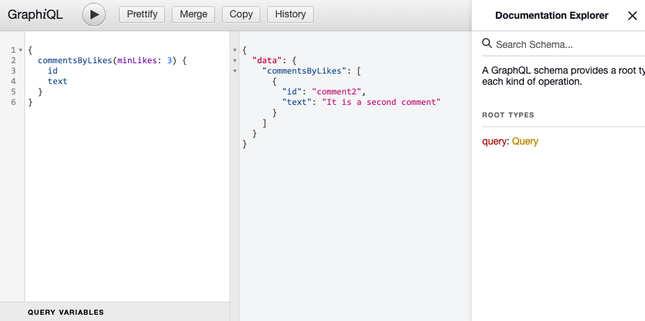
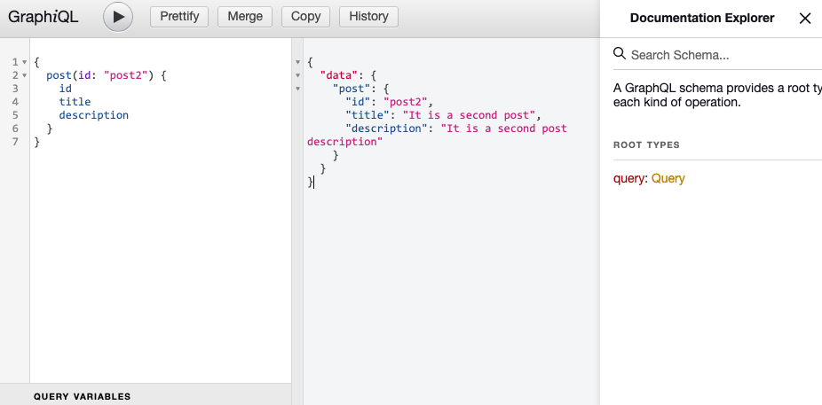

# 필터링

## 목차

1. [comments 필터링 기능 추가하기](#1-comments-필터링-기능-추가하기)
    1. [comments.graphql 파일에서 스키마 정의](#1-1-graphql-파일에서-스키마-정의)
    2. [Resolver 만들기](#1-2-resolver-만들기)
    3. [model에서 로직 작성](#1-3-model에서-로직-작성)
    4. [resolver 파일에 getCommentsByLikes 로직 가져오기](#1-4-resolver-파일에-getcommentsbylikes-로직-가져오기)
2. [ID 이용해 데이터 가져오기](#2-id-이용해-데이터-가져오기)
    1. [posts.graphql 파일에서 스키마 정의](#2-1-postsgraphql-파일에서-스키마-정의)
    2. [해당 쿼리에 대응하는 Resolver 함수 생성](#2-2-해당-쿼리에-대응하는-resolver-함수-생성)
    3. [id에 맞는 post를 가져오는 로직 model에 작성](#2-3-id에-맞는-post를-가져오는-로직-model에-작성)
    4. [resolver 파일에 getPostById 로직 가져오기](#2-4-resolver-파일에-getpostbyid-로직-가져오기)

<br/>
<br/>

## 1. comments 필터링 기능 추가하기

- `comments` 데이터에서 `likes`가 `특정 숫자 이상`인 comments만 가져올 수 있도록 하기

```graphql
#comments/comments.graphql 기존 파일

type Query {
    comments: [Comment]
}

type Comment {
    id: ID!
    text: String!
    likes: Int
}
```

<br/>

### 1-1. comments.graphql 파일에서 스키마 정의

- `commentsByLikes(minLikes: Int!): [Comment]`를 추가하기

```graphql
#comments/comments.graphql

type Query {
    comments: [Comment]
    commentsByLikes(minLikes: Int!): [Comment]
}

#...
```

<br/>

### 1-2. Resolver 만들기

- resolver 함수의 인자 중 `필터링`을 위해 `args`가 필요함
- args는 순서 상, `2번째 인자`로 받기에 `(\_, args)`와 같이 parent는 언더바('_')로 처리하고 args는 args로 받기
- resolver 파일은 최대한 간단하게 작성하는 것이 좋기에 로직은 model 파일에서 작성

```js
// comments/comments.resolvers.js

const commentsModel = require("./comments.model");

module.exports = {
  Query: {
    comments: () => {
      return commentsModel.getAllComments();
    },

    // 해당 resolver 추가
    commentsByLikes: (_, args) => {
      // 해당 로직은 model 모듈에서 분리해서 작성
    },
  },
};
```

<br/>

### 1-3. model에서 로직 작성

- model에서 minLikes를 받아 filter()로 comments에서 likes가 minLikes 이상인 comment들 리턴하는 로직 생성

```js
// comments/comments.model.js

const comments = [
  {
    id: "comment1",
    text: "It is a first comment",
    likes: 1,
  },
  {
    id: "comment2",
    text: "It is a second comment",
    likes: 10,
  }
];

function getAllComments() {
  return comments;
}

// 해당 필터링 로직 생성
function getCommentsByLikes(minLikes) {
  return comments.filter((comment) => comment.likes >= minLikes);
}

module.exports = {
  getAllComments,

  // 내보내기
  getCommentsByLikes,
};
```

<br/>

### 1-4. resolver 파일에 getCommentsByLikes 로직 가져오기

```js
// comments/comments.resolvers.js

const commentsModel = require("./comments.model");

module.exports = {
  Query: {
    comments: () => {
      return commentsModel.getAllComments();
    },
    commentsByLikes: (_, args) => {
      // 로직 가져오기, 매개변수 args 객체에 담긴 minLikes 보내기
      return commentsModel.getCommentsByLikes(args.minLikes);
    },
  },
};
```

<br/>

<p align="center">
    <br/>
    <span>resolver 함수 및 args 인자를 통한 필터링 결과 예시</span>
</p>

<br/>
<br/>

## 2. ID 이용해 데이터 가져오기

- `posts` 데이터에서 `postID`를 이용해서 post 가져오기

<br/>

### 2-1. posts.graphql 파일에서 스키마 정의

- `post(id: ID!): Post` 쿼리를 스키마에 추가
- 단일 데이터이므로 [Post]가 아닌 Post임

```graphql
#posts/posts.graphql

type Query {
    posts: [Post]
    post(id: ID!): Post
}

type Post {
    id: ID!
    title: String!
    description: String!
    comments: [Comment]
}
```

<br/>

### 2-2. 해당 쿼리에 대응하는 Resolver 함수 생성

```js
// posts/posts.resolvers.js

const postsModel = require("./posts.model");

module.exports = {
  Query: {
    posts: () => {
      return postsModel.getAllPosts();
    },

    // 해당 resolver 추가
    post: (_, args) => {
      // 해당 로직은 model 모듈에서 분리해서 작성 
    },
  },
};
```

<br/>

### 2-3. id에 맞는 post를 가져오는 로직 model에 작성

```js
// posts/posts.model.js

const posts = [
  {
    id: "post1",
    title: "It is a first post",
    description: "It is a first post description",
    comments: [
      {
        id: "comment1",
        text: "It is a first comment",
        likes: 1,
      },
    ],
  },
  {
    id: "post2",
    title: "It is a second post",
    description: "It is a second post description",
    comments: [],
  },
];

function getAllPosts() {
  return posts;
}

// 로직 작성
function getPostById(id) {
  return posts.find((post) => post.id === id);
}

module.exports = {
  getAllPosts,

  // 로직 내보내기
  getPostById,
};
```

<br/>

### 2-4. resolver 파일에 getPostById 로직 가져오기

```js
// posts/posts.resolvers.js

const postsModel = require("./posts.model");

module.exports = {
  Query: {
    posts: () => {
      return postsModel.getAllPosts();
    },
    post: (_, args) => {
      // 로직 가져오기
      return postsModel.getPostById(args.id);
    },
  },
};
```

<br/>

<p align="center">
    <br/>
    <span>resolver 함수 및 args 인자를 통한 데이터 선별 결과 예시</span>
</p>