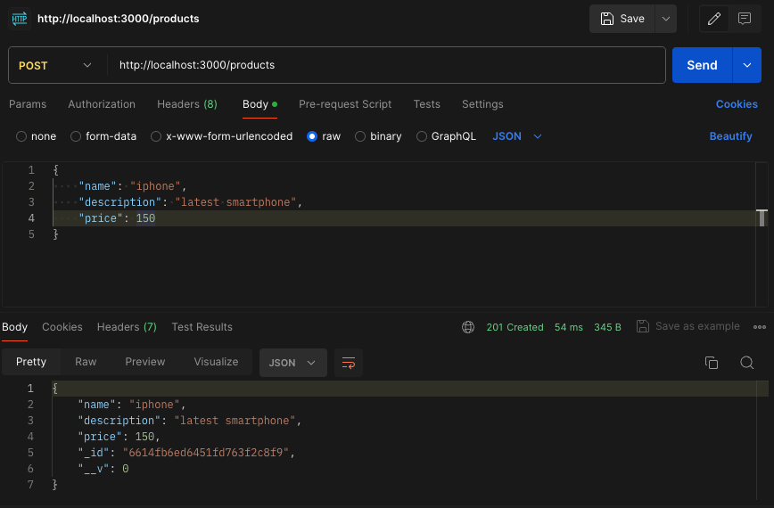
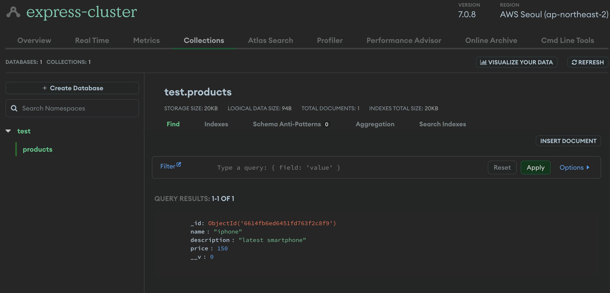
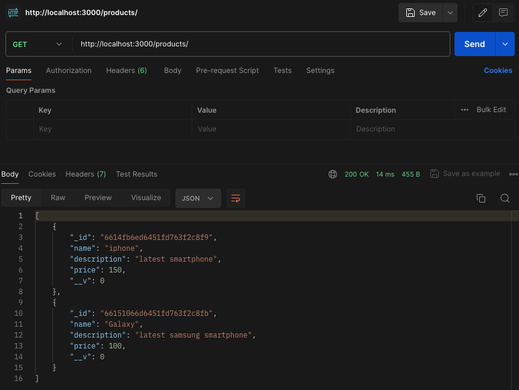
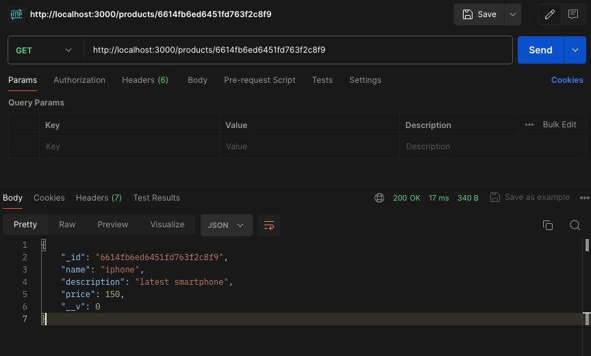
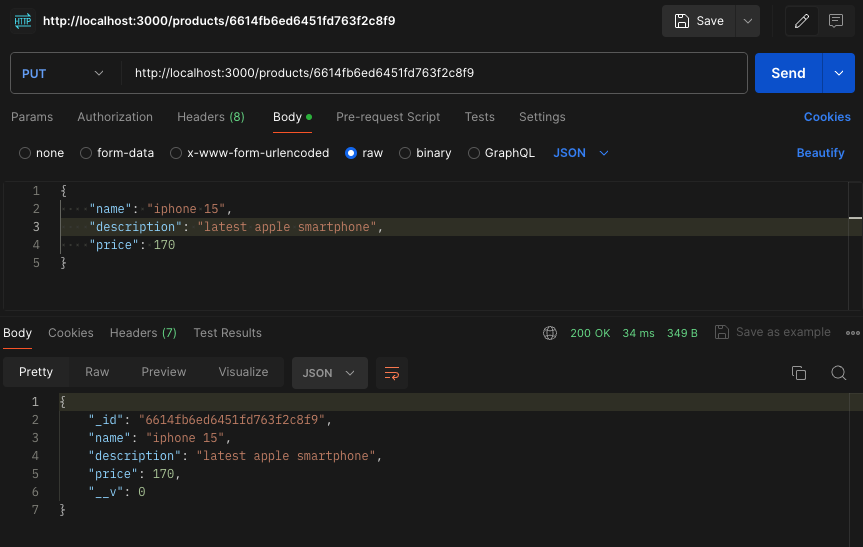
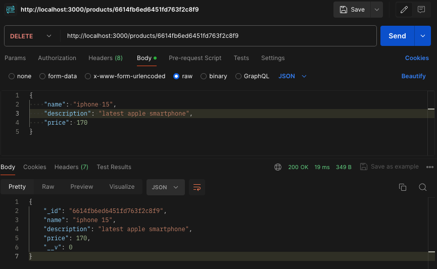
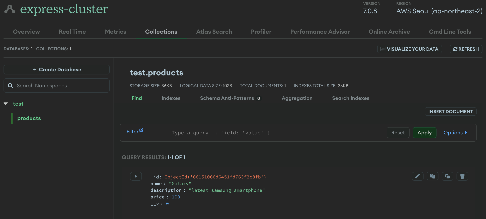

# Mongoose CRUD

## 목차

1. [Schema, Model 생성하기](#1-schema-model-생성하기)
    1. [models 파일 생성](#1-1-models-파일-생성)
    2. [스키마 생성](#1-2-스키마-생성)
    3. [모델 생성](#1-3-모델-생성)
2. [CRUD 구현](#2-crud-구현)
    1. [controllers 파일 생성](#2-1-controllers-파일-생성)
    2. [Create](#2-2-create)
        - [Create 라우트](#--create-라우트)
        - [Create 요청 테스트](#--create-요청-테스트)
    3. [Read](#2-3-read)
        - [Read 라우트](#--read-라우트)
        - [Read 요청 테스트](#--read-요청-테스트)
    4. [Update](#2-4-update)
        - [Update 라우트](#--update-라우트)
        - [Update 요청 테스트](#--update-요청-테스트)
    5. [Delete](#2-5-delete)
        - [Delete 라우트](#--delete-라우트)
        - [Delete 요청 테스트](#--delete-요청-테스트)

<br/>
<br/>

## 1. Schema, Model 생성하기

### 1-1. models 파일 생성

- `models/products.model.js`, `models/users.model.js` 의 디렉토리(models)와 파일 생성

<br/>

### 1-2. 스키마 생성

```js
// models/products.model.js

const {default: mongoose} = required("mongoose");

// 스키마 생성
const productSchema = new mongoose.Schema({
  name: {
    type: String,
    required: true
  },
  description: {
    type: String,
    required: true
  },
  price: {
    type: Number
  }
});
```

<br/>

### 1-3. 모델 생성

```js
// models/products.model.js

const {default: mongoose} = required("mongoose");

const productSchema = new mongoose.Schema({
  name: {
    type: String,
    required: true
  },
  description: {
    type: String,
    required: true
  },
  price: {
    type: Number
  }
});

// 모델 생성 및 내보내기
const Product = mongoose.model("Product", productSchema);

module.exports = Product;
```

<br/>
<br/>

## 2. CRUD 구현

### 2-1. controllers 파일 생성

- `controllers/products.controller.js`의 디렉토리(controllers)와 파일 생성

<br/>

### 2-2. Create

- 모델의 `create()` 메서드 활용하기

```js
// create 예시

// controllers.products.controller.js

const productModel = required('../models/products.model');

async function createProduct(req, res, next) {
  try {
    const createProduct = await productModel.create(req.body);
    res.status(201).json(createProduct);
  } catch (error) {
    next(error);
  }
};

module.exports = {createProduct};
```

- create 성공 status 코드는 201 임
- 코드 내부에 있는 두 개의 createProduct은 서로 다른 변수임을 주의
- 함수 createProduct는 새로운 상품을 생성하는 역할
- try문 안의 createProduct 상수는 productModel.create() 함수의 결과를 저장

<br/>

### - Create 라우트

- `routes/products.router.js`의 디렉토리(routes)와 파일 생성

```js
// 라우터 예시

// routes/products.router.js

// express, controller 가져오기
const express = required('express');
const productsController = required('../controllers/products.controller');

// 라우터 생성
const productsRouter = express.Router();

// 라우터와 controller 연결
// 해당 url로 요청(get, post, put, delete)이 오면 controller 실행
// create는 post 요청
productsRouter.post('/', productsController.createProduct);

// 라우터 내보내기
module.exports = productsRouter;
```

```js
// server.js

const productsRouter = require("./routes/products.router");

// 엔트리 포인트 설정
app.use('/products', productsRouter);
```

<br/>

### - Create 요청 테스트

- postman에서 해당 포트로 요청 보내기
- POST 메서드, URL은 http://localhost:3000/products, Body에 name, description, price 데이터 기입 후, 요청 보내기
- 응답으로 생성된 document의 JSON 데이터를 받음

<p align="center">
  <br/>
  <span>postman으로 create 요청</span>
</p>

<br/>

<p align="center">
  <br/>
  <span>MongoDB Collections 데이터 확인</span>
</p>

<br/>

### 2-3. Read

- 조회의 경우, 전체 documents 조회, 특정 documents 조회와 같이 크게 2가지로 나눠 볼 수 있음
- 전체 조회는 `find()` 메서드에 {} 넣기
- 특정 아이디 조회는 `findById()` 메서드에 url에서 전달된 id 담아 보내기

```js
// read 예시

// controllers.products.controller.js

const productModel = required('../models/products.model');

// 전체 product document 조회
async function getProducts(req, res, next) {
  try {
    const allProducts = await productModel.find({});
    res.status(200).json(allProducts);
  } catch (error) {
    next(error);
  }
};

// 특정 productId의 product document 조회
// '/product/:productId' req에서 params로 productId를 가져와 사용
async function getProductById(req, res, next) {
  try {
    const product = await productModel.findById(req.params.productId);
    // 해당 아이디의 product가 있으면 데이터 전송
    if (product) {
      res.status(200).json(product);
      // product가 없으면 404 메시지 전송
    } else {
      res.status(404).send();
    }
  } catch (error) {
    next(error);
  }
};

module.exports = {getProducts, getProductById};
```

<br/>

### - Read 라우트

```js
// routes/products.router.js

const express = required('express');
const productsController = required('../controllers/products.controller');

const productsRouter = express.Router();

// read는 get 메서드를 사용
productsRouter.get('/', productsController.getProducts);
productsRouter.get('/:productId', productsController.getProductById);

module.exports = productsRouter;
```

<br/>

### - Read 요청 테스트

- postman으로 get 요청 보내서 데이터 응답 확인하기

<p align="center">
  <br/>
  <span>postman으로 전체 데이터 read 요청</span>
</p>

<br/>

<p align="center">
  <br/>
  <span>postman으로 특정 아이디 데이터 read 요청</span>
</p>

<br/>

### 2-4. Update

- `findByIdAndUpdate()` 메서드 사용해서 업데이트 할 수 있음
- 업데이트 적용된 후, document를 응답으로 반환하려면 new 옵션을 true로 설정해야함

```js
// update 예시

// controllers.products.controller.js

const productModel = required('../models/products.model');

async function updateProduct(req, res, next) {
  try {
    let updatedProduct = await productModel.findByIdAndUpdate(
      req, params.productId,
      req.body,
      {new: true}
    );
    if (updatedProduct) {
      res.status(200).json(updatedProduct);
    } else {
      res.send(404).send();
    }
  } catch (error) {
    next(error);
  }
};

module.exports = {updateProduct};
```

<br/>

### - Update 라우트

```js
const express = required('express');
const productsController = required('../controllers/products.controller');

const productsRouter = express.Router();

// read는 put 메서드를 사용
productsRouter.put('/:productId', productsController.updateProduct);

module.exports = productsRouter;
```

<br/>

### - Update 요청 테스트

<p align="center">
  <br/>
  <span>postman으로 특정 아이디 데이터 update 요청</span>
</p>

<br/>

### 2-5. Delete

- findByIdAndDelete() 메서드 사용하여 삭제 할 수 있음

```js
// delete 예시

const productModel = required('../models/products.model');

async function deleteProduct(req, res, next) {
  try {
    let deletedProduct = await productModel.findByIdAndDelete(req, params.productId);
    if (deletedProduct) {
      res.status(200).json(deletedProduct);
    } else {
      res.send(404).send();
    }
  } catch (error) {
    next(error);
  }
};

module.exports = {deleteProduct};
```

<br/>

### - Delete 라우트

```js
const express = required('express');
const productsController = required('../controllers/products.controller');

const productsRouter = express.Router();

// delete는 delete 메서드를 사용
productsRouter.delete('/:productId', productsController.deleteProduct);

module.exports = productsRouter;
```

<br/>

### - Delete 요청 테스트

<p align="center">
  <br/>
  <span>postman으로 특정 아이디 데이터 delete 요청</span>
</p>

<br/>

<p align="center">
  <br/>
  <span>MongoDB Collection 2개에서 delete 요청 후, 1개의 데이터만 남음</span>
</p>