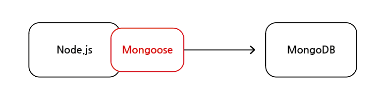
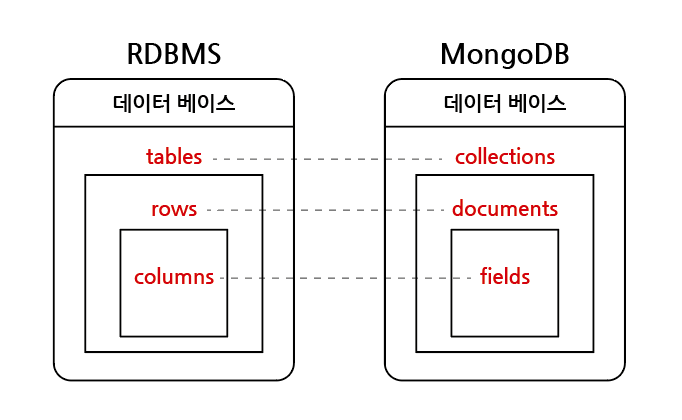
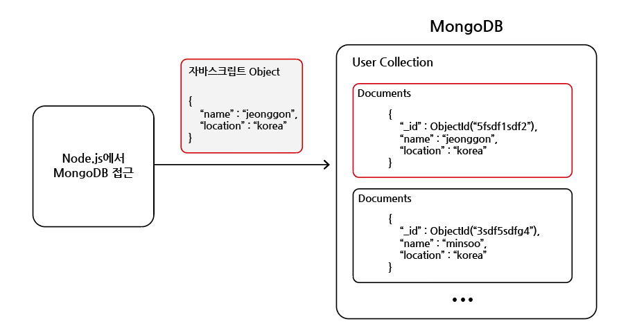

# Mongoose

## 목차

1. [Mongoose란?](#1-mongoose란)
    1. [Mongoose ODM 역할](#1-1-mongoose-odm-역할)
    2. [MongoDB와 RDBMS 비교](#1-2-mongodb와-rdbms-비교)
2. [Mongoose 사용 방법](#2-mongoose-사용-방법)
    1. [스키마 생성](#2-1-스키마-생성)
    2. [스키마를 이용해 모델 만들기](#2-2-스키마를-이용해-모델-만들기)
    3. [모델을 이용해 CRUD 작업 수행](#2-3-모델을-이용해-crud-작업-수행)
3. [schema와 model](#3-schema와-model)
    1. [schema](#3-1-schema)
    2. [model](#3-2-model)

<br/>
<br/>

## 1. Mongoose란?

- MongoDB 사용을 위한 `다양한 기능`을 추가하고 더 `편하게 사용`하게 해주는 모듈
- Mongoose를 이용해 데이터 관리하기 위해서는 먼저 `schema`를 만들고 해당 스키마를 통해 모델을 만듦
- 즉, Mongoose는 `ODM(Object Data Modeling)` 라이브러리
- Mongoose는 MongoDB를 이용할 때, 필수는 아니며 `선택사항`

<br/>

<p align="center">
    <br/>
    <span>Mongoose 다이어그램</span>
</p>

<br/>

### 1-1. Mongoose ODM 역할

- 애플리케이션 계층(Node.js)에서 특정 스키마를 적용
- 모델의 유효성을 검사
- MongoDB 작업을 쉽게 하기 위한 기타 기능

<br/>

### 1-2. MongoDB와 RDBMS 비교

|    RDBMS    |    MongoDB     |
|:-----------:|:--------------:|
|   데이터 베이스   |    데이터 베이스     |
|    table    |   collection   |
| row(tuple)  | document(BSON) |
|   column    |     field      |
|    index    |     index      |
| primary key |      _id       |
| foreign key |       -        |

- `BSON` : Binary JSON의 의미로 JSON에 ObjectId, Timestamp, Date 등의 정보가 결합

<br/>

<p align="center">
    <br/>
    <span>MongoDB 데이터 베이스 명칭</span>
</p>

<br/>

<p align="center">
    <br/>
    <span>MongoDB 데이터 전송</span>
</p>

<br/>
<br/>

## 2. Mongoose 사용 방법

### 2-1. 스키마 생성

- constructor 함수(`Schema()`)를 mongoose에서 제공하여 새로운 스키마를 정의할 수 있도록 함

```js
// 스키마 생성 예시

// mongoose 가져오기
const mongoose = require("mongoose");

// 스키마 생성
// 스키마에 들어가는 데이터와 해당 데이터의 타입, 유효성 검사기 등을 설정
const productSchema = new mongoose.Schema({
  name: {
    type: String,
    required: true
  },
  description: {
    type: String,
    required: true
  },
  price: {
    type: Number
  }
});
```

<br/>

### 2-2. 스키마를 이용해 모델 만들기

- `model(<모델이름>, <스키마>)` 함수로 모델 생성하고 내보내기

```js
// 모델 만들기 예시

const mongoose = require("mongoose");

const productSchema = new mongoose.Schema({
  name: {
    type: String,
    required: true
  },
  description: {
    type: String,
    required: true
  },
  price: {
    type: Number
  }
});

// 모델 만들기
const Product = mongoose.model("Product", productSchema);

// 모델 내보내기
module.exports = Product;
```

<br/>

### 2-3. 모델을 이용해 CRUD 작업 수행

```js
// 데이터 저장 예시

// document 저장
Product.create({
  name: "iphone",
  description: "latest smartphone",
  price: 150
});

// 또는

// 인스턴스를 생성한 후, save() 메서드를 이용해 저장
const product = new Product({
  name: "iphone",
  description: "latest smartphone",
  price: 150
});

product.save();
```

<br/>
<br/>

## 3. schema와 model

### 3-1. schema

- mongoose의 스키마는 문서(document)의 `구조`, `기본 값(ex. default: 0)`, `유효성 검사기(ex. required: true)` 등을 정의

<br/>

### 3-2. model

- 해당 스키마를 이용해 모델을 만들며 mongoose 모델은 레코드 `생성`, `쿼리`, `업데이트`, `삭제` 등을 위한 데이터 베이스 인터페이스 제공