# MongoDB 사용하기

## 목차

1. [MongoDB 사용 방법](#1-mongodb-사용-방법)
    1. [로컬 설치](#1-1-로컬-설치)
    2. [클라우드 서비스 이용](#1-2-클라우드-서비스-이용)

<br>
<br>

## 1. MongoDB 사용 방법

- `로컬에 설치`와 `클라우드 서비스 이용`으로 크게 두 가지로 나누어짐

<br/>

### 1-1. 로컬 설치

1. [MongoDB 공식 사이트 접속](https://www.mongodb.com/ko-kr)
2. 제품(Product) --> 커뮤니티 에디션 --> [MongoDB 커뮤니티 서버 다운로드 페이지](https://www.mongodb.com/try/download/community)

<br/>

### 1-2. 클라우드 서비스 이용

1. 회원가입, 로그인 후, New Project 클릭

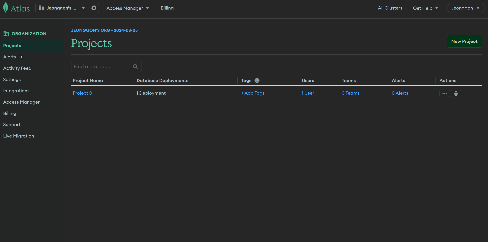

<br/>

2. 프로젝트 이름 짓기

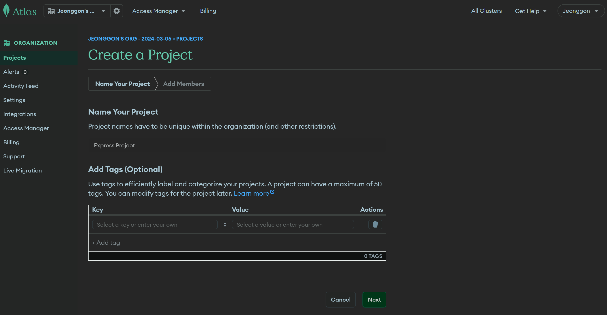

<br/>

3. 멤버를 추가하거나 멤버가 없을 경우, Create Project 클릭

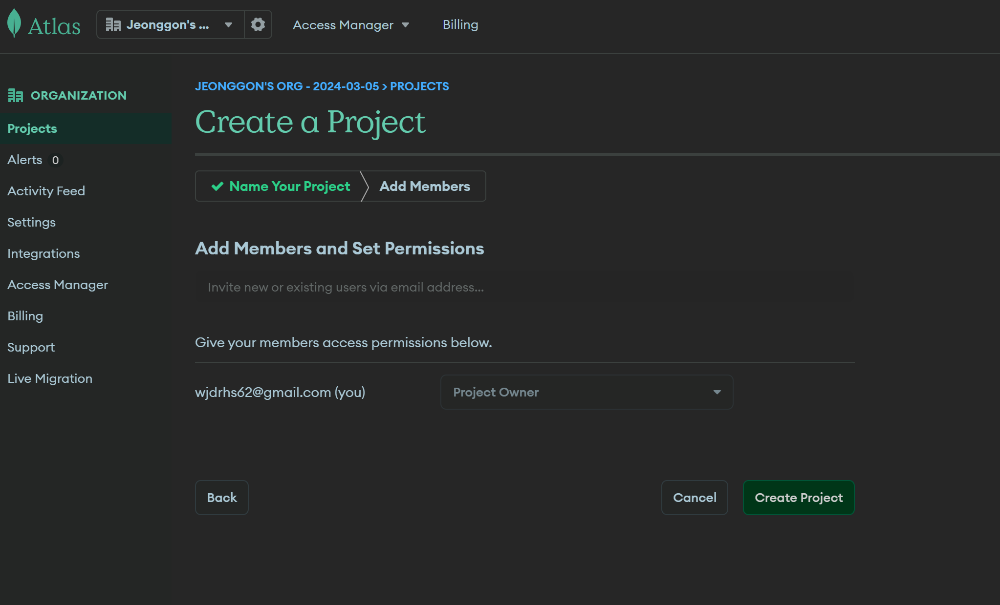

<br/>

4. 프로젝트 생성 완료

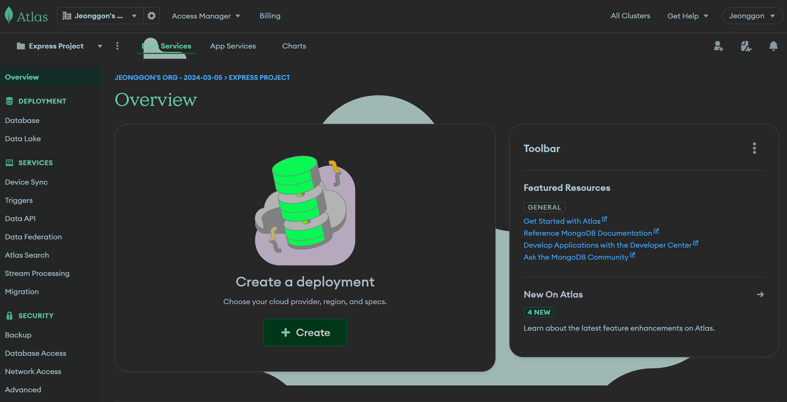

<br/>

5. 좌측 메뉴에서 Database 클릭, Build a Database 클릭

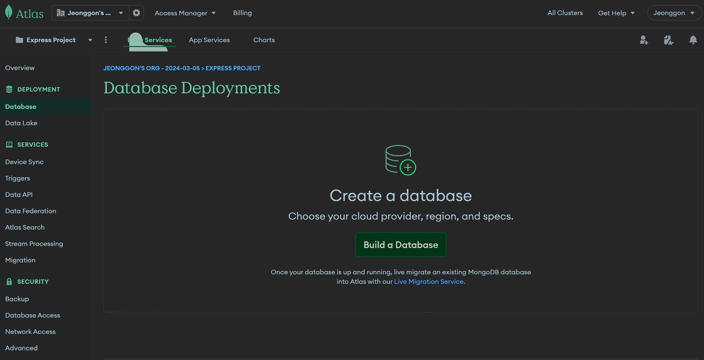

<br/>

6. 무료 데이터 베이스인 M0 선택, 공급자는 AWS로 지역은 서울로 설정, 클러스터 이름 짓고 Create 클릭

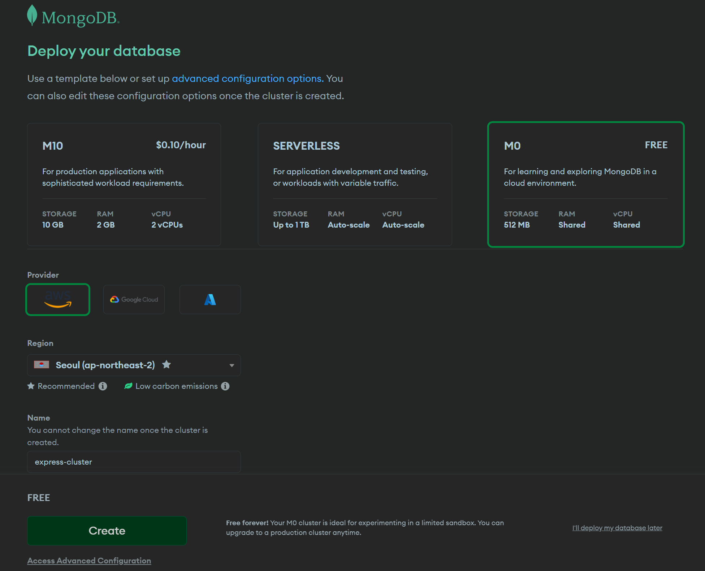

<br/>

7. 해당 데이터 베이스에 접근 할 유저네임과 비밀번호 설정 후, Create User 클릭
    - 유저네임과 비밀번호는 이후에도 사용되기에 기억해야 함

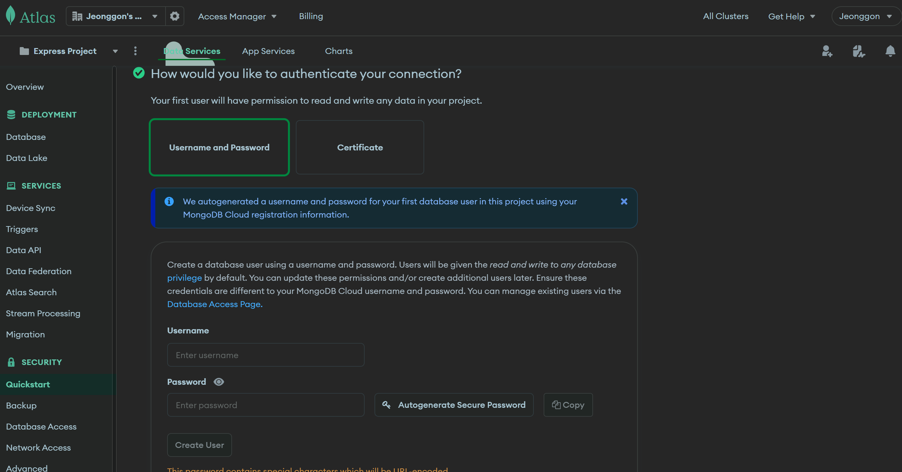

<br/>

8. 로컬 환경 선택, 접근 IP로 현재 IP(Current IP Address) 또는 어떤 IP에서든(0.0.0.0/0) 접근 추가 후, finish 클릭

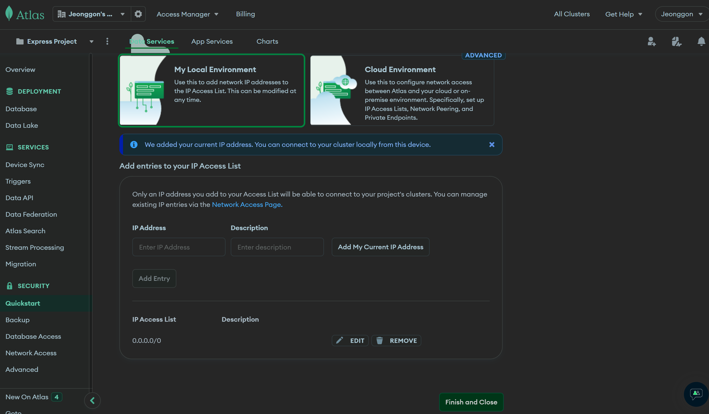

<br/>

9. 데이터 베이스가 생성 된 것을 확인 할 수 있음

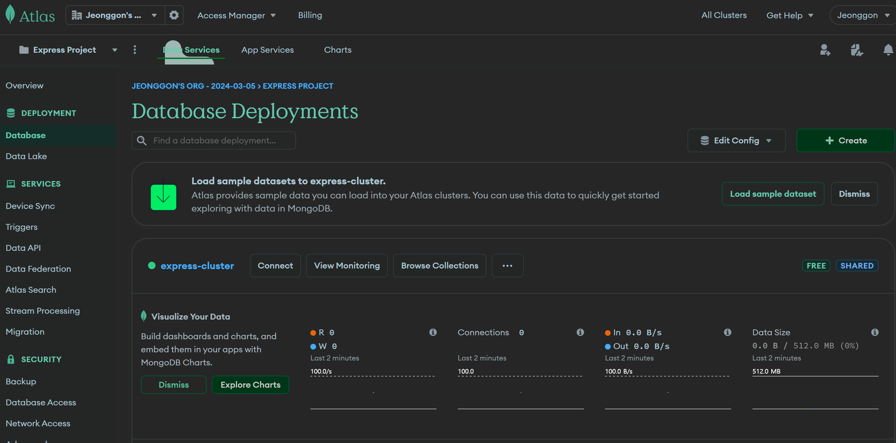

<br/>

10. mongoose 다운로드 하기

```bash
$ npm install mongoose
```

<br/>

11. 앱에 MongoDB 연결하기

```js
// mongoose를 이용한 연결 메서드 connect

await mongoose.connect(MONGO_URL);
```

- `MONGO_URL` : MongoDB 프로젝트의 Database 대쉬보드에서 `Connect` 버튼을 누른 후, 연결 방법 중 Connect to your application의 `Drivers` 선택,
  아래 `Add your connection string into your application code`에서 `view full code sample`을 통해 url을 확인 할 수 있음
- URL 중간에 <password> 부분에 데이터 베이스 생성시 설정한 패스워드 넣어주기

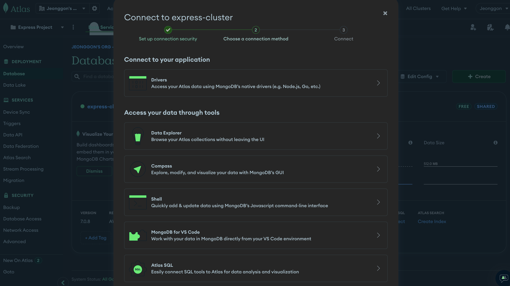

<br/>

```js
// server.js

// ...

// mongoose 가져오기
const {default: demongoose} = require('mongoose');

// url 넣어 연결
mongoose.connect(MONGO_URL)
  // 연결이 잘 되었을 경우 출력할 콘솔 메시지
  .then(() => console.log('mongodb connected'))
  .catch(err => console.log(err))
```

<br/>

12. 서버 실행해서 연결되었는지 확인하기

```bash
$ npm run start
```

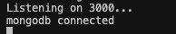

- mongodb connected 문구와 함께 연결된 것을 확인 할 수 있음

<br/>

13. 쿼리 작업을 할 경우, `View Monitoring`의 `Collections`으로 데이터가 들어오게 됨

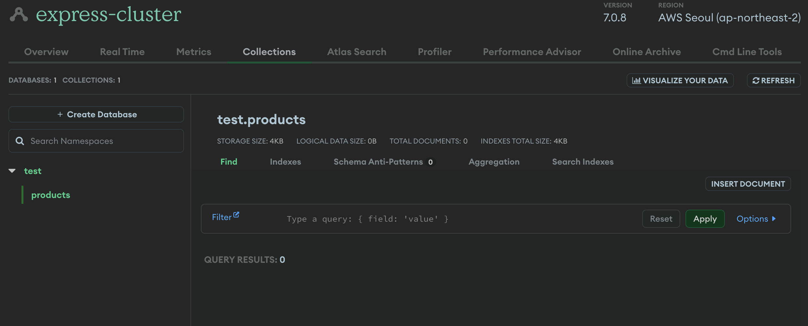