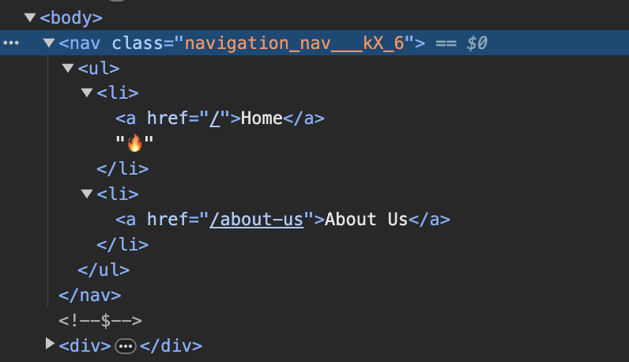

# CSS modules

## 목차

1. [CSS modules on Next.js](#1-css-modules-on-nextjs)
    1. [global CSS 파일 생성](#1-1-global-css-파일-생성)
    2. [컴포넌트를 위한 CSS module](#1-2-컴포넌트를-위한-css-module)
        - [(name).module.css](#--namemodulecss)

<br/>
<br/>

## 1. CSS modules on Next.js

- Next.js에서 별도의 설치나 설정을 따로 하지 않아도 바로 CSS 모듈을 사용할 수 있음
- 물론 Styled component, tailwind, chakra 등을 사용할 수 있음

<br/>

### 1-1. global CSS 파일 생성

- css 파일을 관리할 `styles` 디렉토리 생성
- 해당 디렉토리 내에 전체에 적용할 `global.css` 파일 생성
- global.css 파일을 root인 layout에 import 하기

```css
/*styles/global.css*/

html,
body,
div,
span,
applet,
object,
iframe,
h1,
h2,
h3,
h4,
h5,
h6,
p,
blockquote,
pre,
a,
abbr,
acronym,
address,
big,
cite,
code,
del,
dfn,
em,
img,
ins,
kbd,
q,
s,
samp,
small,
strike,
strong,
sub,
sup,
tt,
var,
b,
u,
i,
center,
dl,
dt,
dd,
ol,
ul,
li,
fieldset,
form,
label,
legend,
table,
caption,
tbody,
tfoot,
thead,
tr,
th,
td,
article,
aside,
canvas,
details,
embed,
figure,
figcaption,
footer,
header,
hgroup,
menu,
nav,
output,
ruby,
section,
summary,
time,
mark,
audio,
video {
    margin: 0;
    padding: 0;
    border: 0;
    font-size: 100%;
    font: inherit;
    vertical-align: baseline;
}

/* HTML5 display-role reset for older browsers */
article,
aside,
details,
figcaption,
figure,
footer,
header,
hgroup,
menu,
nav,
section {
    display: block;
}

body {
    line-height: 1;
}

ol,
ul {
    list-style: none;
}

blockquote,
q {
    quotes: none;
}

blockquote:before,
blockquote:after,
q:before,
q:after {
    content: "";
    content: none;
}

table {
    border-collapse: collapse;
    border-spacing: 0;
}


body {
    font-family: . AppleSystemUIFont;
    background-color: black;
    color: white;
    font-size: 18px;
}

a {
    color: inherit;
    text-decoration: none;
}

a:hover {
    text-decoration: underline;
}
```

```tsx
// app/layout.tsx

import "../styles/global.css"
```

- CSS 파일 자체를 import하고 configuration은 하지 않음

<br/>

### 1-2. 컴포넌트를 위한 CSS module

### - (name).module.css

- `navigation.module.css` 파일 생성하기 (`.module.css`를 이름에 반드시 가지고 있어야 함)
- `classname`으로만 생성 (`div`와 같이 요소 선택자만 사용 불가, `.nav div`와 같이 클래스 선택자로 시작해야 함)

```css
/*styles/navigation.module.css*/

.nav {
    background-color: red;
}
```

<br/>

- 해당 파일은 class를 지닌 JavaScript의 객체로 볼 수 있음
- 해당 파일을 컴포넌트에서 `styles 객체` import 하기
- 스타일 적용 시, `className={styles.(클래스명)}`으로 적용

```tsx
// app/components/navigation.tsx

...
import styles from "../styles/navigation.module.css"

...
return (
    <nav className={styles.nav}>
    </nav>
);
...
```

- `className="nav"`로 적용하지 않는 이유는 global.css 혹은 동일한 이름의 클래스의 스타일을 적용 시, 충돌이 날 수 있음
- 하지만 .module.css 파일의 styles 객체를 이용하여 적용하게 되면 아래 이미지와 같이 클래스 속성을 난수(`___kX_6`)로 생성하여 적용하기에 클래스 충돌을 피할 수 있음

<br/>

