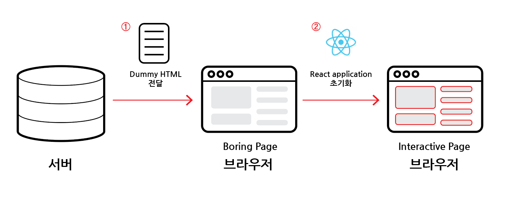

# Client/Server component 비교

## 목차

1. [Hydration](#1-hydration)
    1. [JavaScript 활성화 유무 비교](#1-1-javascript-활성화-유무-비교)
        - [JavaScript 비활성화](#--javascript-비활성화)
        - [JavaScript 활성화](#--javascript-활성화)
    2. [Hydration은 모든 컴포넌트에 발생하는가?](#1-2-hydration은-모든-컴포넌트에-발생하는가)
2. [Client/Server 컴포넌트](#2-clientserver-컴포넌트)
    1. [정의](#2-1-정의)
    2. [Server 컴포넌트 안에 Client 컴포넌트를 가질 수 있는가?](#2-2-server-컴포넌트-안에-client-컴포넌트를-가질-수-있는가)

 
 

## 1. Hydration

- `수분공급`의 의미로 사용자가 최초 HTML 파일을 받은 후, React가 활성화되는 과정을 뜻함

 

### 1-1. JavaScript 활성화 유무 비교

### - JavaScript 비활성화

- 브라우저에서 JavaScript를 비활성화 할 경우, \<a> 태그의 href 속성을 통해 페이지가 바뀌게 되고 이 경우, 화면이 `새로고침`되는 것을 확인 할 수 있음

 

### - JavaScript 활성화

- JavaScript가 비활성화되었을 때보다 훨씬 `빠르게 화면전환`이 가능하며, 새로고침도 발생하지 않음을 확인할 수 있음
- 이는 `React가 hydrate`되었기 때문임
- 처음에는 \<a> 태그의 묶음이었다가 `React의 Link component`로 변환되었기 때문임
- 변환이 된 후에는 클릭이 발생되어도 React가 관여하여 페이지 전체를 새로고침하지 않고 빠르게 전환함

 

<Next.js의 Hydration>

- 서버에서 생성한 HTML 파일을 먼저 보냄으로써 유저는 UI를 미리 볼 수 있고, 이후, React application을 초기화하는 Hydration을 통해 인터랙티브한 페이지 조작이 가능해짐

 

### 1-2. Hydration은 모든 컴포넌트에 발생하는가?

- `server-side render`는 모든 component에 대해 발생함
- 하지만, Hydration 과정이 모든 컴포넌트에 대해 발생하지 않음
- client에서 hydrate되어 인터랙티브하게 만들어질 컴포넌트는 `use client` 지시어를 상단에 가진 컴포넌트들 뿐임

 
 

## 2. Client/Server 컴포넌트

### 2-1. 정의

- Hydration 유무로 나누어짐
- `Client 컴포넌트` : "use client"를 사용하여 frontend에서 hydrate가 일어나는 컴포넌트
- `Server 컴포넌트` : "use client"를 사용하지 않은 모든 컴포넌트

 

### 2-2. Server 컴포넌트 안에 Client 컴포넌트를 가질 수 있는가?

- 가능함
- 하지만, 반대로 Client 컴포넌트에 Server 컴포넌트가 포함되면 모든 자식 컴포넌트는 Client 컴포넌트임
