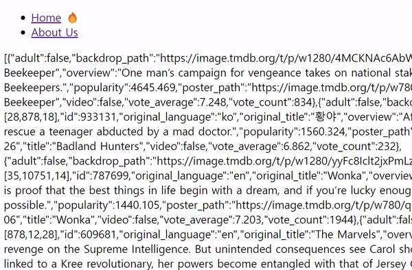
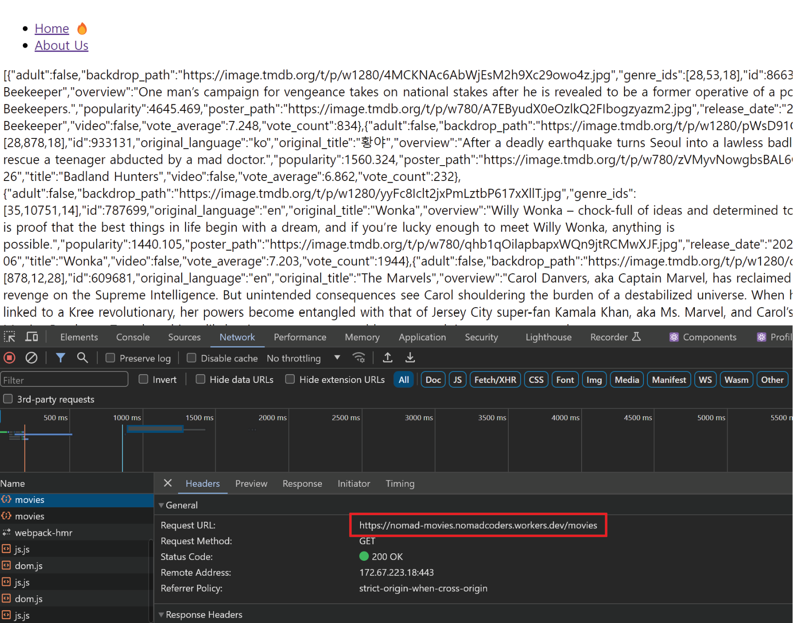
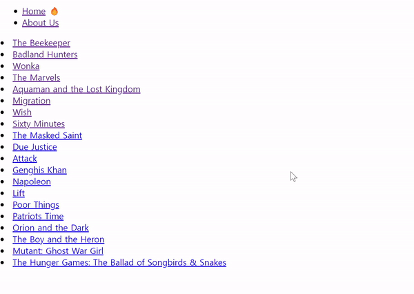
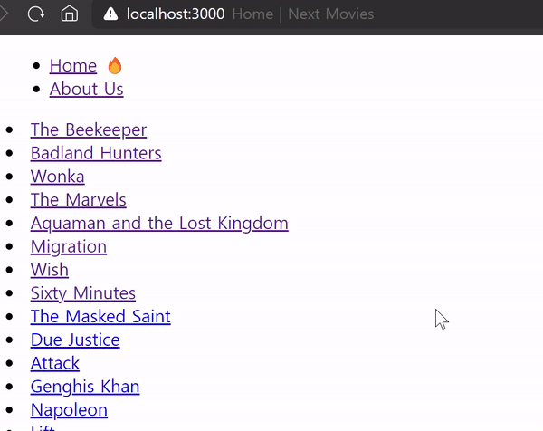

# Data Fetching

## 목차

1. [Data Fetching 해볼 내용](#1-data-fetching-해볼-내용)
2. [Data Fetching](#2-data-fetching)
    1. [Client Component에서 Data Fetching](#2-1-client-component에서-data-fetching)
    2. [Server Component에서 Data Fetching](#2-2-server-component에서-data-fetching)
3. [병렬 요청(Parallel Requests)](#3-병렬-요청parallel-requests)
    1. [home에서 영화 목록 출력](#3-1-home에서-영화-목록-출력)
    2. [movies/id 영화 디테일 페이지](#3-2-moviesid-영화-디테일-페이지)
    3. [영화 디테일에서 여러 개 Data Fetch - 영화 정보, 비디오](#3-3-영화-디테일에서-여러-개-data-fetch---영화-정보-비디오)
    4. [Promise.all()](#3-4-promiseall)
        - [Promise.all()의 문제점](#--promiseall의-문제점)
4. [prefetch](#4-prefetch)
    1. [prefetch 주의](#4-1-prefetch-주의)

<br>
<br>

## 1. Data Fetching 해볼 내용

- 유저가 홈페이지로 가면 영화 목록을 볼 수 있도록 하기 (API 필요)
- 유저가 영화를 클릭하면 해당 영화의 상세정보를 볼 수 있도록 하기

<br>
<br>

## 2. Data Fetching

### 2-1. Client Component에서 Data Fetching

- 외부 라이브러리, 서드파티 없이 data를 fetch하기
- React의 `useEffect`와 `useState`를 같이 사용하여 구현해보기

```tsx
// app/(home)/page.tsx

// useState로 상태변화가 생기므로 "use client"
"use client";

import {useEffect, useState} from "react";

export default function Page() {
    // 현재 로딩 상태인지 파악하는 isLoading
    const [isLoading, setIsLoading] = useState(true);

    // 영화 정보 상태를 담는 movies
    const [movies, setMovies] = useState();

    // getMovies 함수 설정
    const getMovies = async () => {
        const responses = await fetch("https://nomad-movies.nomadcoders.workers.dev/movies");
        const json = await responses.json();
        setMovies(json);
        setIsLoading(false);
    };

    // useEffect를 통해 life cycle을 관리
    useEffect(() => {
        getMovies();
    }, []);

    return <div>{isLoading ? "Loading..." : JSON.stringify(movies)}</div>;
}
```

- `client component`에서는 `metadata를 사용할 수 없음`
- IsLoading 초기 값으로 true
- movies 초기 값 없음
- `getMovies 함수`는 영화정보 url을 fetch하여 response에 담고, 이를 json() 메서드로 변환 해당 데이터를 setMovies 상태 함수에 호출하고, setIsLoading 함수를
  false로 전달
- 이 getMovies 함수는 의존성 배열이 없는 `useEffect`의 콜백함수에서 호출되어, mount 단계에서 실행됨

<br>



<Mount시, Data Fetch하는 예시>

<br>



- 이러한 Data Fetch의 경우, `url이 보호되지 않음`

<br>
<br>

### 2-2. Server Component에서 Data Fetching

- 클라이언트 컴포넌트에서 API를 통해 Data fetch할 때, 중요한 내용이 클라이언트에 유출될 수 있으나, 서버 단에서 Data fetch하면, 서버에 fetch된 데이터가 캐싱되어 중요한 내용을 보호할 수
  있음
- metadata를 사용할 수 있음
- `async/await` 사용

```tsx
// app/(home)/page.tsx

// 메타데이터
export const metadata = {
    title: "Home",
};

// 요청할 URL
const URL = "https://nomad-movies.nomadcoders.workers.dev/movies";

// 비동기로 URL을 요청하는 함수 페이지 컴포넌트 밖에서 정의
async function getMovies() {
    // 서버 컴포넌트이므로 콘솔 출력 안됨
    console.log("im fetching!");

    // fetch 시, next.js는 fetch 정보를 기억함
    const response = await fetch(URL);
    const json = await response.json();
    return json;
}

// 페이지 컴포넌트 앞에 async넣고 URL 요청 함수를 동기적으로 호출
export default async function HomePage() {
    const movies = await getMovies();
    return <div>{JSON.stringify(movies)}</div>;
}
```

- 하지만 서버에서 Data Fetch이 오래 걸리면 그만큼 클라이언트 단에서 로딩 시간이 길어짐
- 이는 사용자 경험적으로 좋지 않음
- 로딩 시, UI 처리 방법이 필요

<br>
<br>

## 3. 병렬 요청(Parallel Requests)

### 3-1. home에서 영화 목록 출력

- movies 데이터를 map으로 순회하여 `Link` 생성

```tsx
// app/(home)/page.tsx

...
<div>
    {movies.map((movie) => (
        <li key={movie.id}>
            <Link href={`/movies/${movie.id}`}>{movie.title}</Link>
        </li>
    ))}
</div>
```

<br>



<영화 목록 링크 생성>

<br>

### 3-2. movies/id 영화 디테일 페이지

- URL 내보내기

```tsx
// app/(home)/page.tsx

export const API_URL = "https://nomad-movies.nomadcoders.workers.dev/movies";
```

<br>

- 재사용할 URL 가져오기
- Server Component에서 Data Fetch할 함수 getMovie 생성
- 페이지 컴포넌트에서 async로 Promise 반환하도록 만들고 해당 데이터를 movie 변수에 담기
- 영화 제목 movie.title 출력

```tsx
// app/(movies)/movies/[id]/page.tsx

import {API_URL} from "../../../(home)/page";

async function getMovie(id: string) {
    const response = await fetch(`${API_URL}/${id}`);
    return response.json();
}

export default async function MovieDetail({params: {id}}: { params: { id: string } }) {
    const movie = await getMovie(id);
    return <h1>{movie.title}</h1>;
}
```

<br>



<영화 디테일 페이지>

<br>

### 3-3. 영화 디테일에서 여러 개 Data Fetch - 영화 정보, 비디오

```tsx
// app/(movies)/movies/[id]/page.tsx

import {get} from "http";
import {API_URL} from "../../../(home)/page";

async function getMovie(id: string) {
    await new Promise((response) => setTimeout(response, 5000));
    const response = await fetch(`${API_URL}/${id}`);
    return response.json();
}

async function getVideos(id: string) {
    await new Promise((response) => setTimeout(response, 5000));
    const response = await fetch(`${API_URL}/${id}/videos`);
    return response.json();
}

export default async function MovieDetail({params: {id}}: { params: { id: string } }) {
    const movie = await getMovie(id);
    const videos = await getVideos(id);
    return <h1>{movie.title}</h1>;
}
```

- Data를 요청하는 `함수를 2개 생성`
- 영화 정보 + 비디오 데이터
- 이 경우, 함수가 `순차적(동기적)으로 호출`되기에 하나의 data fetching이 오래 걸리면 `전체 시간이 오래 걸림`
- 따라서 `병렬 처리가 필요함`

<br>

### 3-4. Promise.all()

- 두 함수 getMovie와 getVideos를 await함

```tsx
// app/(movies)/movies/[id]/page.tsx

...
export default async function MovieDetail({params: {id}}: { params: { id: string } }) {
    const [movie, videos] = await Promise.all([getMovie(id), getVideos(id)]);
    return <h1>{movie.title}</h1>;
}
```

- `Promise.all()`의 파라미터 `배열에 호출하는 함수들을 담으면`, 해당 리턴 값은 배열로 주어짐
- 이를 `비구조화 할당`을 통해 movie와 videos에 담기
- 이렇게 처리하면, 함수를 `병렬적으로 동시에 처리`할 수 있음
- 여러 개의 Data Fetching 시, 최적화에 도움이 됨

<br>

### - Promise.all()의 문제점

- 이 방법의 단점은 Promise.all()이 다 끝나고 movie와 video 모두가 생성되어야 UI를 볼 수 있음
- 동시에 처리하더라도 fetch 함수를 분리하여 `먼저 처리가 끝난 요소`는 화면에 `먼저 출력`되도록 최적화 할 수 있음 (기다릴 필요 없음)

<br/>
<br/>

## 4. prefetch

- Next.js의 prefetch 속성은 페이지를 미리 가져오는(pre-fetching) 기능을 제공함
- 사용자가 링크를 클릭하기 전에 해당 페이지에 `필요한 자원들을 브라우저가 미리 다운로드`하여 성능을 향상시키는데 도움이 됨
- `<Link> 컴포넌트`나 `router.push()`를 통해 연결된 페이지의 자원을 미리 가져오도록 지시

```tsx
// prefetch 예시

return (
    <div className={styles.movie}>
        
        <Link prefetch href={`/movies/${id}`}>{title}</Link>
    </div>
)
```

- 스크롤을 통해 해당 링크가 보이게 되면 그때부터 필요한 자원이 브라우저에 미리 다운로드되기 시작함

<br/>

### 4-1. prefetch 주의

- prefetch 속성을 남용하는 것은 모든 페이지를 불필요하게 미리 가져오게 되어 `네트워크 자원을 낭비`할 수 있고 `DB에 많은 부하를 가할 수 있으므로` 주의가 필요함
- 특히 큰 규모의 애플리케이션에서는 prefetch를 사용하기 전 더욱 신중하게 평가해야함