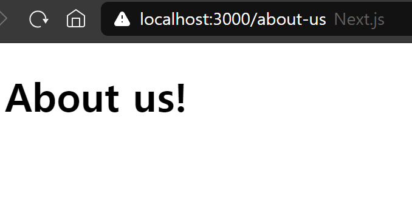
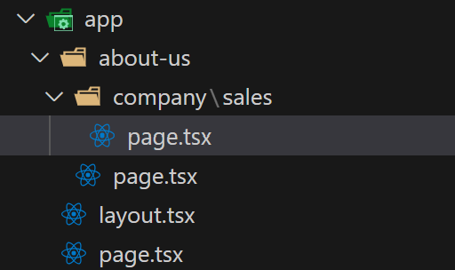

# Routing

## 목차

1. [Routes 정의하기](#1-routes-정의하기)
    1. [Root Segments](#1-1-root-segments)
    2. [Routes 생성](#1-2-routes-생성)
        - [page.tsx 생성을 건너뛸 경우](#--pagetsx-생성을-건너뛸-경우)
        - [page가 아닌 다른 이름의 파일을 만드는 경우](#--page가-아닌-다른-이름의-파일을-만드는-경우)

<br>
<br>

## 1. Routes 정의하기

- Next.js 애플리케이션에서 새로운 페이지를 만드는 방법
- url을 react-router에서 사용한 방법과 같이 직접 적지 않아도 됨
- Next.js에서는 `파일 시스템(폴더와 파일)`을 통해서 url을 표현

<br>

### 1-1. Root Segments

- 각각의 폴더는 URL 세그먼트에 `매칭`되는 `루트 세그먼트`들을 의미함
- 중첩 루트를 생성하기 위해서는, 각각 `폴더 안에 다른 폴더들을 중첩`시킬 수 있음
- 폴더를 생성한다는 것은 폴더명이 잠재적으로 하나의 페이지가 될 수 있음을 의미


이미지 출처 : [Next.js 공식 사이트](https://nextjs.org/docs/app/building-your-application/routing)

- `/` : 루트 세그먼트
- `dashboard` : 세그먼트
- `settings` : 리프 세그먼트

<br>

### 1-2. Routes 생성

1. app 폴더에 `about-us`라는 폴더를 만듦

```
http://localhost:3000/about-us
```

- 이 상태에서 해당 url로 접속하면 404 에러가 발생
- 해당 url 주소의 UI 템플릿이 존재하지 않기 때문

<br>

2. app/about-us 폴더 안에 page.tsx 파일 생성

```tsx
// app/about-us/page.tsx

export default function AboutUs() {
    return <h1>About us!</h1>
}
```

- 이제 해당 url에 접속 시, 화면이 렌더링되는 것을 확인할 수 있음

<br>



<세그먼트를 통한 새로운 url로 페이지 출력>

<br>

### - page.tsx 생성을 건너뛸 경우

- 중간에 page.tsx를 만들지 않고 해당 segment에서 페이지 화면 출력을 건너뛸 수 있음
- 이 경우, page 파일이 없는 폴더는 url의 경로 명의 일부로 사용됨



- 만약 폴더 구조가 위의 그림과 같을 경우

- `localhost:3000/about-us/company/` : 해당 세그먼트에는 page 파일이 없어서 404 에러 발생

- `localhost:3000/about-us/company/sales/` : 해당 경로에 page 파일이 렌더링 됨

<br>

### - page가 아닌 다른 이름의 파일을 만드는 경우

- 폴더를 만들고 `page가 아닌 이름의 tsx 파일`을 생성하면 해당 파일은 렌더링 페이지의 역할은 하지 못함
- 대신 `컴포넌트`의 역할을 할 수 있음
- Next.js는 폴더 안의 `page`라는 이름의 파일만 `페이지로서 렌더링`함