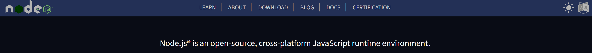

# Node.js 소개

## 목차

1. [Node.js](#1-nodejs)
    1. [JavaScript 엔진](#1-1-javascript-엔진)
        - [Interpreter](#--interpreter)
        - [Compiler](#--compiler)
2. [Node.js 역사](#2-nodejs-역사)
3. [Runtime](#3-runtime)
4. [Node.js 설치](#4-nodejs-설치)
5. [REPL](#5-repl)
6. [Browser APIs vs Node.js APIs](#6-browser-apis-vs-nodejs-apis)
    1. [브라우저와 Node.js 모두 사용하는 API](#6-1-브라우저와-nodejs-모두-사용하는-api)
    2. [브라우저 API](#6-2-브라우저-api)
    3. [Node.js API](#6-3-nodejs-api)

<br>
<br>

## 1. Node.js

- 기존의 JavaScript는 웹 브라우저에서 요소들의 동적인 기능을 위해 개발되어 `브라우저에서만` 사용이 가능하였다. 하지만 JavaScript를 구동하는 엔진을
  사용하여 `브라우저가 아닌 로컬, 서버 등 다양한 영역`에서 사용할 수 있도록 확장성을 부여하였다. 이를 Node.js라고 한다.
- 크로스플랫폼 오픈소스 JavaScript 런타임 환경
- 즉, `V8 JavaScript 엔진`으로 구동되며, 웹 브라우저 바깥에서 자바스크립트 코드를 실행 가능



<공식 사이트 - Node.js 정의>

<br>

### 1-1. JavaScript 엔진

- JavaScript 엔진은 JavaScript 코드를 실행하는 소프트웨어 구성 요소로서 초기에는 단순한 `Interpreter`였으나, 최신 엔진은 성능 향상을 위해 `Just-In-Time 컴파일`을 사용함

<br/>

| 브라우저  | 엔진             |
|-------|----------------|
| 크롬    | V8             |
| 파이어폭스 | SpiderMonkey   |
| 사파리   | JavascriptCore |
| ...   | ...            |

<브라우저 별 엔진>

<br/>

### - Interpreter

- Interpreter는 `한 줄씩` 번역 및 분석
- 속도 측면에서 매우 느림

```
High Level Language(고급언어) --> Interpreter --> Output(결과)
```

<br/>

### - Compiler

- Compiler은 작성 된 코드를 `한 번에` 기계어로 변환
- 최근에는 웹에서 무거운 기능들도 수행하기에 더 나은 성능을 위해 JIT 컴파일을 이용함

```
High Level Language(고급언어) --> Compiler --> Machine Language(기계어 010110..) --> Output(결과)
```

<br/>
<br/>

## 2. Node.js 역사

| 년도   | 내용                                                                    |
|------|-----------------------------------------------------------------------|
| 1995 | Netscape 브라우저가 JavaScript 소개                                          |
| 2008 | Web2.0<br/>Google이 크롬 브라우저 발표<br/>V8엔진 사용                             |
| 2009 | Ryan Dahl이 Node.js 만듦<br/>브라우저 외부에서 V8엔진을 사용해 JavaScript를 실행하겠다는 아이디어 |

<br/>
<br/>

## 3. Runtime

- 런타임이란 프로그래밍 언어가 구동되는 환경을 말함
- ex) 브라우저, Node.js ...
- 즉, Node.js는 프로그래밍 언어도 프레임워크도 아닌 JavaScript의 런타임
- Node.js는 `V8`과 `libuv`를 결합한 것

<br/>

| 요소    | 특징                                                   |
|-------|------------------------------------------------------|
| V8    | JavaScript 코드를 실행해 줌                                 |
| libuv | JavaScript 코드 읽기 외에 데이터 베이스 접근, 파일 읽기 등 V8 이외의 기능 처리 |

<Node.js 런타임 환경>

<br/>
<br/>

## 4. Node.js 설치

- [Node.js 공식 사이트](https://nodejs.org/en)
- 안정화 된 LTS 버전 설치 추천

<br/>

1. 설치 확인

```bash
$ node --version
```

<br/>

2. node 환경 (REPL 환경) 진입

```bash
$ node
```

<br/>

3. node 환경 나오기

```bash
$ .exit

# 또는

# ctrl + c 두 번 입력
```

<br/>
<br/>

## 5. REPL

- REPL은 `Read-Evaluation-Print-Loop`의 약어로 특정 코드 `입력` 후, 해당 코드를 `평가`하고 실행결과를 `출력`해주는 것을 `반복` 해주는 환경을 의미함
- JavaScript 학습 중 간단한 코드를 즉석에서 실행하여 결과를 확인해 볼 경우에 주로 사용함
- 터미널에 `node` 입력 시, REPL 환경 활성화 됨
- `.exit` 또는 `ctrl + c 두 번`으로 REPL 환경에서 나올 수 있음

<br/>
<br/>

## 6. Browser APIs vs Node.js APIs

### 6-1. 브라우저와 Node.js 모두 사용하는 API

- console API

<br/>

- 브라우저에서 사용하는 API와 Node에서 사용되는 API간에 gap을 줄이려고 노력함
- 이는 Node.js가 Browser의 컨벤션을 따를려고 하는 것

| Browser APIs | Node.js APIs |
|--------------|--------------|
| url          | url          |
| setTimeout   | setTimeout   |
| ...          | ...          |

<비슷하게 사용되는 API>

<br/>

### 6-2. 브라우저 API

- window 객체 사용
- window 객체는 JavaScript가 아닌 브라우저에서 제공하는 객체로 Node.js의 REPL 환경에서 사용 불가함

<br/>

### 6-3. Node.js API

- process 객체 사용
- process 객체는 JavaScript가 아닌 Node.js에서 제공해주는 객체임

<br/>

| Browser APIs | Node.js APIs |
|--------------|--------------|
| window       | global       |
| document     | process      |
| history      | module       |
| location     | filename     |
| navigator    | require()    |
| ...          | ...          |

<여러 Browser API와 Node.js API>