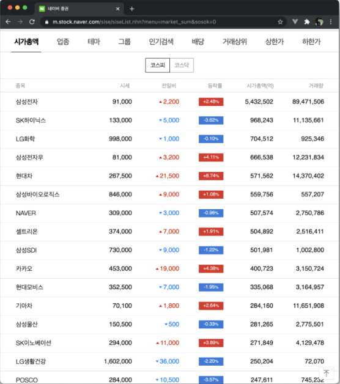

# API

## 목차

1. [외부 패키지 활용](#1-외부-패키지-활용requests)
    1. [요청과 응답](#1-1-요청과-응답)
2. [API](#2-api)
    1. [API(Application Programming Interface)](#2-1-apiapplication-programming-interface)
        - [API를 이해하기 쉬운 예시](#api를-이해하기-쉬운-예시)
    2. [API 활용 시 확인 사항](#2-2-api-활용-시-확인-사항)
3. [API 활용 문서 예시](#3-api-활용-문서-예시)
    1. [네이버 로그인 API 명세](#3-1-네이버-로그인-api-명세)
    2. [TMDB API 명세](#3-2-tmdb-api-명세)

 
 

## 1. 외부 패키지 활용(requests)

### 1-1. 요청과 응답

- `브라우저`를 통해 `주소`로 `요청`을 보내고, `응답결과`를 브라우저가 웹 `화면에 렌더링`한다.
- `파이썬`을 통해 주소로 요청을 보내고 응답결과를 파이썬으로 조작한다.

 
 

## 2. API

<브라우저 상의 데이터 및 정보>

 

<JSON 타입의 데이터 원형>

 

<정제된 형태의 JSON 데이터>

 

### 2-1. API(Application Programming Interface)

- 컴퓨터나 컴퓨터 프로그램 사이의 연결
- 일종의 소프트웨어 인터페이스이며 다른 종류의 소프트웨어에 서비스를 제공
- 사용하는 방법을 기술하는 문서나 표준은 API 사양/명세(specification)

 

### - API를 이해하기 쉬운 예시

Q) TV를 조작하기 위한 인터페이스는 무엇인가?
A) 리모컨

Q) 리모컨 활용 시, 확인해야하는 것은?
A) 제품 사용 설명서

Q) API를 사용하기 전, 확인해야할 것은?
A) 어떻게 조작해야하는지에 대한 명세

 

### 2-2. API 활용 시 확인 사항

- 요청하는 방식에 대한 이해

    - 인증 방식
    - URL 생성
        - 기본 주소
        - 원하는 기능에 대한 추가 경로
        - 요청 변수 (필수와 선택)

- 응답 결과에 대한 이해
    - 응답 결과 타입(JSON)
    - 응답 결과 구조

 
 

## 3. API 활용 문서 예시

### 3-1. 네이버 로그인 API 명세

- 네이버 로그인 화면
  

 

- 요청 보내는 메서드 및 URL
  

 

- 요청 시, 변수들의 정보
  

 

- 응답 정보
  

 

### 3-2. TMDB API 명세

- TMDB(The Movie Database)

    - 영화 데이터의 API를 제공하는 웹서비스

      

 

- 요청하는 방식

  

    - 기본 주소

 

- API 이용 명세

  

    - 요청 할 수 있는 API 정보
    - 요청 메서드
    - 요청 변수, 변수타입, 필수 여부
    - 응답 정보, 타입
    - 응답 코드
    - API 요청 언어
    - 토큰값(보안 필요)
    - 필요한 패키지 다운로드
    - 요청 코드 예시

 

- 응답 예시
  

    - JSON 형태의 응답을 반환함
