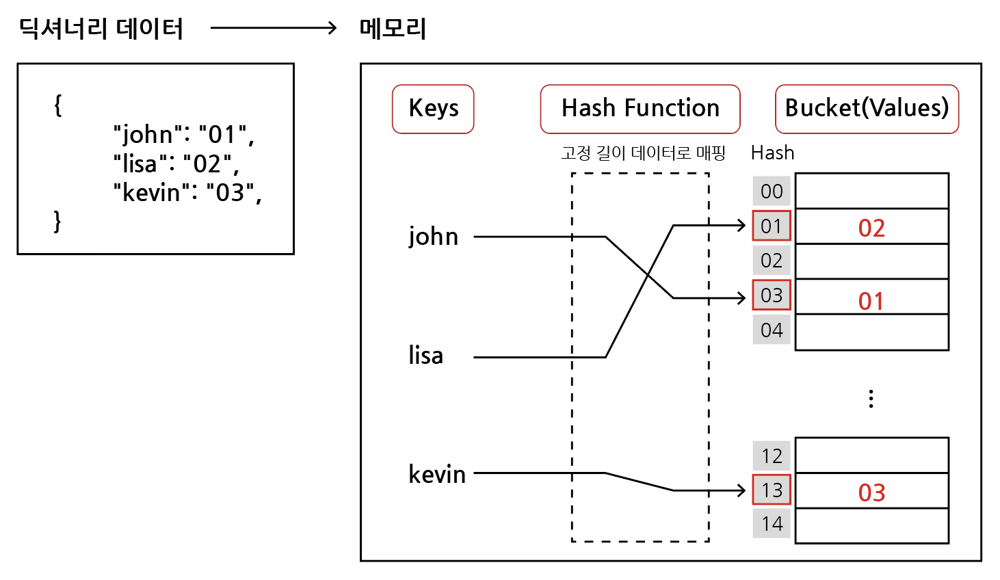

# 딕셔너리(Dictionary)

## 목차

1. [딕셔너리(Dictionary)](#1-딕셔너리dictionary)
    1. [딕셔너리 생성](#1-1-딕셔너리-생성)
2. [해시 테이블](#2-해시-테이블)
    1. [해시 함수(Hash Function)](#2-1-해시-함수hash-function)
    2. [해시(Hash)](#2-2-해시hash)
    3. [파이썬의 딕셔너리(Dictionary) 특징](#2-3-파이썬의-딕셔너리dictionary-특징)
    4. [딕셔너리 연산의 시간 복잡도](#2-4-딕셔너리-연산의-시간-복잡도)
        - [딕셔너리는 언제 사용해야 하는가?](#q-딕셔너리는-언제-사용해야-하는가)
    5. [파이썬 리스트와 딕셔너리 비교](#2-5-파이썬-리스트와-딕셔너리-비교)
3. [딕셔너리 기본 문법](#3-딕셔너리-기본-문법)
    1. [선언](#3-1-선언)
    2. [삽입 / 수정](#3-2-삽입--수정)
    3. [삭제1](#3-3-삭제1)
    4. [삭제2](#3-4-삭제2)
    5. [조회](#3-5-조회)
4. [딕셔너리 메서드](#4-딕셔너리-메서드)
    1. [keys()](#4-1-keys)
    2. [values()](#4-2-values)
    3. [items()](#4-3-items)

<br>
<br>

## 1. 딕셔너리(Dictionary)

### 1-1. 딕셔너리 생성

- 키-값(key-value) 쌍으로 이루어진 모음(collection)
    - 키(key)
        - 불변 자료형(string, integer, float, boolean, tuple, range)만 가능(리스트, 딕셔너리 등은 불가능함)
    - 값(value)
        - 어떠한 형태든 관계없음
- 키와 값은 ':'으로 구분된다. 개별 요소는 ','로 구분된다.
- 변경 가능하며(mutable), 반복 가능하다.(iterable)
    - 딕셔너리는 반복하면 키가 반환된다.

<br>
<br>

## 2. 해시 테이블

- 파이썬에는 딕셔너리(dict) 자료구조가 내장되어 있다.
- None-sequence & Key-Value(키-값 쌍의 구조)

```python
# ex)

{
  "name": "jeonggon",
  "gender": "male",
  "address": "Hamyang",
}

# Key는 immutable(변경 불가능)
```

<br>

### 2-1. 해시 함수(Hash Function)

- 임의 길이의 데이터를 고정 길이의 데이터로 매핑하는 함수

<br>

### 2-2. 해시(Hash)

- 해시 함수를 통해 얻어진 값



<br>

### 2-3. 파이썬의 딕셔너리(Dictionary) 특징

- 해시 함수와 해시 테이블을 이용하기 때문에 삽입, 삭제, 수정, 조회 `연산의 속도가 리스트보다 빠르다.`
- 이는 Hash function을 이용한 산술 계산으로 `값이 있는 위치`를 바로 알 수 있기 때문이다.

<br>

### 2-4. 딕셔너리 연산의 시간 복잡도

| 연산 종류       | 시간 복잡도 |
|-------------|--------|
| Get Item    | O(1)   |
| Insert Item | O(1)   |
| Update Item | O(1)   |
| Delete Item | O(1)   |
| Search Item | O(1)   |

<br>

### Q) 딕셔너리는 언제 사용해야 하는가?

- Key-Value 구조로 데이터를 관리해야 하는 경우(순서나 인덱스가 아닌 경우)
- 데이터에 대한 빠른 접근 및 탐색이 필요한 경우

<br>

### 2-5. 파이썬 리스트와 딕셔너리 비교

| 연산 종류       | 딕셔너리(Dictionary) | 리스트(List)    |
|-------------|------------------|--------------|
| Get Item    | O(1)             | O(1)         |
| Insert Item | O(1)             | O(1) 또는 O(N) |
| Update Item | O(1)             | O(1)         |
| Delete Item | O(1)             | O(1) 또는 O(N) |
| Search Item | O(1)             | O(N)         |

<br>
<br>

## 3. 딕셔너리 기본 문법

### 3-1. 선언

- 변수 = { key1: value1, key2: value2 ... }

```python
# ex)

a = {
  "name": "james",
  "gender": "male",
  "address": "Seoul",
}

print(a)

# 출력
# {'name': 'james', 'gender': 'male', 'address': 'Seoul'}
```

<br>

### 3-2. 삽입 / 수정

- 딕셔너리 [key] = value
- 내부에 해당하는 key가 없으면 삽입, 있으면 수정

```python
# ex) 딕셔너리 삽입

a = {
  "name": "james",
  "gender": "male",
  "address": "Seoul",
}

a["job"] = "programmer" # 해당 key가 없기에 삽입

print(a)

# 출력
# {'name': 'james', 'gender': 'male', 'address': 'Seoul', 'job': 'programmer'}

-------------------------------------------------------

# ex) 딕셔너리 수정

a = {
  "name": "james",
  "gender": "male",
  "address": "Seoul",
}

a["name"] = "sam" # 딕셔너리에 해당 key가 있기에 수정

print(a)

# 출력
# {'name': 'sam', 'gender': 'male', 'address': 'Seoul'}
```

<br>

### 3-3. 삭제1

- 딕셔너리.pop(key)
- 내부에 존재하는 key에 대한 value 삭제 및 반환, 존재하지 않는 key에 대해서는 KeyError 발생

```python
# ex) 정상적인 삭제

a = {
  "name": "james",
  "gender": "male",
  "address": "Seoul",
}

gender = a.pop("gender")

print(a)
print(gender)

# 출력
# {'name': 'james', 'address': 'Seoul'}
# 'male'

------------------------------------------------

# ex) 삭제 시, 키 에러 발생

a = {
  "name": "james",
  "gender": "male",
  "address": "Seoul",
}

phone = a.pop("phone")

print(a)
print(phone)

# 출력
# KeyError....
```

<br>

### 3-4. 삭제2

- 딕셔너리.pop(key, default)
- 두 번째 인자로 default(기본값)을 지정하여 KeyError 방지 가능

```python
# ex)

a = {
  "name": "james",
  "gender": "male",
  "address": "Seoul",
}

phone = a.pop("phone", "010-1234-5678") # 두 번째 인자로 기본값 지정

print(a)
print(phone)

# 출력
# {'name': 'james', 'gender': 'male', 'address': 'Seoul'}
# '010-1234-5678'
```

<br>

### 3-5. 조회

- 딕셔너리[key]
- 딕셔너리.get(key)
- key에 해당하는 value 반환
- 없는 키를 조회할 경우, KeyError가 발생할 수 있다.
- .get() 에서 두 번째 인자로 기본값을 지정하여 KeyError를 방지 할 수 있다.

```python
# ex) 대괄호 사용 조회

a = {
  "name": "james",
  "gender": "male",
  "address": "Seoul",
}

print(a["name"])

# 출력
# 'james'

--------------------------------------

# ex) .get() 사용 조회

a = {
  "name": "james",
  "gender": "male",
  "address": "Seoul",
}

print(a.get("name"))

# 출력
# 'james'

--------------------------------------

# ex) 없는 키를 조회할 경우 KeyError

a = {
  "name": "james",
  "gender": "male",
  "address": "Seoul",
}

print(a["phone"])

# 출력
# KeyError...

--------------------------------------

# ex) .get()에 두 번째 인자로 기본값 지정

a = {
  "name": "james",
  "gender": "male",
  "address": "Seoul",
}

print(a.get("phone", "없음"))

# 출력
# '없음'
```

<br>
<br>

## 4. 딕셔너리 메서드

### 4-1. keys()

- 딕셔너리 key 목록이 담긴 dict_keys 객체 반환

```python
# ex)

a = {
  "name": "james",
  "gender": "male",
  "address": "Seoul",
}

print(a.keys())

# 출력
# dict_keys(['name', 'gender', 'address'])

-------------------------------------------------------

# ex)

a = {
  "name": "james",
  "gender": "male",
  "address": "Seoul",
}

for key in a.keys():
    print(key)

# 출력
# 'name'
# 'gender'
# 'address'

-------------------------------------------------------

# ex)

a = {
  "name": "james",
  "gender": "male",
  "address": "Seoul",
}

for key in a:
    print(key)

# 출력
# 'name'
# 'gender'
# 'address'
```

<br>

### 4-2. values()

- 딕셔너리 value 목록이 담긴 dict_values 객체 반환

```python
# ex)

a = {
  "name": "james",
  "gender": "male",
  "address": "Seoul",
}

print(a.values())

# 출력
# dict_values(['james', 'male', 'Seoul'])

------------------------------------------------------

# ex)

a = {
  "name": "james",
  "gender": "male",
  "address": "Seoul",
}

for value in a.values():
    print(value)

# 출력
# 'james'
# 'male'
# 'Seoul'
```

<br>

### 4-3. items()

- 딕셔너리의 (key, value) 쌍 목록이 담긴 dict_items 객체 반환

```python
# ex)

a = {
  "name": "james",
  "gender": "male",
  "address": "Seoul",
}

print(a.items())

# 출력
# dict_items([('name', 'james'), ('gender', 'male'), ('address', 'Seoul')])

-------------------------------------------------------

# ex)

a = {
  "name": "james",
  "gender": "male",
  "address": "Seoul",
}

for item in a.items():
    print(item)

# 출력
# ('name', 'james')
# ('gender', 'male')
# ('address', 'Seoul')

-------------------------------------------------------

# ex)

a = {
  "name": "james",
  "gender": "male",
  "address": "Seoul",
}

for key, value in a.items():
    print(key, value)

# 출력
# 'name' 'james'
# 'gender' ' male'
# 'address' 'Seoul'
```
