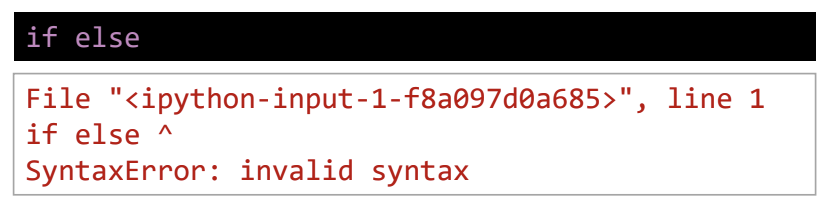
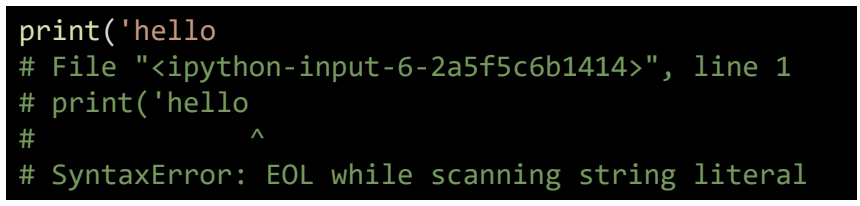
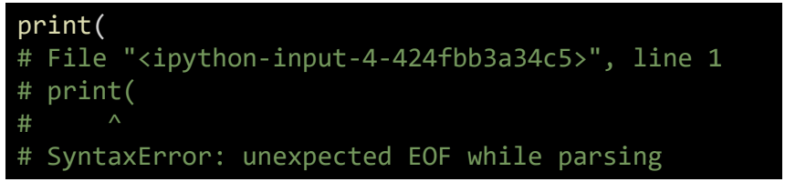
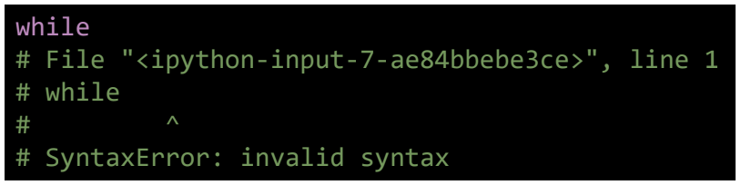
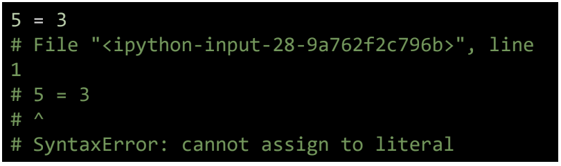

# 에러/예외 처리(Error/Exception Handling)

## 목차

1. [디버깅](#1-디버깅)
2. [에러와 예외](#2-에러와-예외)
    1. [문법 에러(Syntax Error)](#2-1-문법-에러syntax-error)
        - [EOL(End of Line)](#eolend-of-line)
        - [EOF(End of File)](#eofend-of-file)
        - [Invalid Syntax](#invalid-syntax)
        - [assign to literal](#assign-to-literal)
    2. [예외(Exception)](#2-2-예외exception)
        - [ZeroDivisionError](#zerodivisionerror)
        - [NameError](#nameerror)
        - [TypeError](#typeerror)
        - [ValueError](#valueerror)
        - [IndexError](#indexerror)
        - [KeyError](#keyerror)
        - [ModuleNotFoundError](#modulenotfounderror)
        - [ImportError](#importerror)
        - [IndentationError](#indentationerror)
        - [KeyboardInterrupt](#keyboardinterrupt)
        - [파이썬 내장 예외(built-in-exceptions)](#파이썬-내장-예외built-in-exceptions)
3. [예외처리](#3-예외처리)
    1. [처리순서](#3-1-처리순서)
    2. [작성방법](#3-2-작성방법)
    3. [정리](#3-3-정리)
4. [예외 발생 시키기](#4-예외-발생-시키기)
    1. [raise statement](#4-1-raise-statement)
    2. [assert](#4-2-assert)
    3. [raise vs assert](#4-3-raise-vs-assert)

 
 

## 1. 디버깅

- 디버깅은 어떻게 해야하는가?
- 오류는 어디서 많이 발생하는가?
- 어느 부분을 중점적으로 살펴봐야 하는가?
- 제어(조건, 반복, 함수)가 되는 시점 (= 값이 변경되는 시점)을 살펴봄

> "코드의 상태를 신중하게 출력해가며 심사숙고하는 것보다 효과적인 디버깅 도구는 없다." - 브라이언 커니핸

- `print` 함수 활용
    - 특정 함수 결과, 반복/조건 결과 등 나눠서 생각, 코드를 이분법(bisection)으로 나눠서 생각
- `개발 환경(text editor, IDE)` 등에서 제공하는 기능 활용
    - breakpoint, 변수 조회 등
- `Python tutor` 활용(단순 파이썬 코드인 경우)
- 손코딩, 뇌컴파일, 눈디버깅

 
 

## 2. 에러와 예외

- `에러 메시지`가 발생하는 경우
    - 해당하는 위치를 찾아 메시지를 해결
- `로직 에러`가 발생하는 경우
    - 명시적인 에러 메시지 없이 예상과 다른 결과가 나온 경우
        - 정상적으로 동작하였던 코드 이후 작성된 코드를 생각해봄
        - 전체 코드를 살펴봄
        - 휴식을 가진다 (= 너무 매몰되어 오류가 난 부분이 안 보일 수 있음)
        - 누군가에게 설명을 해본다 (= 설명을 하기위해 다시 코드를 하나하나 보면 오류를 찾을 수 있음)

 

### 2-1. 문법 에러(Syntax Error)

- SyntaxError가 발생하면, 파이썬 프로그램은 실행이 되지 않음
- 파일이름, 줄번호, ^ 문자를 통해 파이썬이 코드를 읽어 나갈 때(parse) 문제가 발생한 위치를 표현
- 줄에서 에러가 감지된 가장 앞의 위치를 가리키는 캐럿(caret)기호(^)를 표시

 

### - EOL(End of Line)

-

 

### - EOF(End of File)

-

 

### - Invalid syntax

-

 

### - assign to literal

-

 

### 2-2. 예외(Exception)

- 실행 도중 예상치 못한 상황을 맞이하면, 프로그램을 멈춤
    - 문장이나 표현식이 문법적으로 올바르더라도 발생하는 에러
- 실행 중에 감지되는 에러들을 예외(Exception)라고 부름
- 예외는 여러 타입(type)으로 나타나고, 타입이 메시지의 일부로 출력됨
    - NameError, TypeError 등은 발생한 예외 타입의 종류(이름)
- 모든 내장 예외는 Exception Class를 상속받아 이뤄짐
- 사용자 정의 예외를 만들어 관리할 수 있음

 

### - ZeroDivisionError

- 0으로 나누려고 할 때 발생

 

### - NameError

- Namespace 상에 이름이 없는 경우

 

### - TypeError

- 타입 불일치 하거나 메서드, 함수가 받는 arguments의 개수가 맞지 않을 경우 발생

 

### - ValueError

- 타입은 올바르지만 값이 적절하지 않거나 없는 경우 발생

 

### - IndexError

-

 

### - KeyError

-

 

### - ModuleNotFoundError

- 존재하지 않는 모듈을 import하는 경우 발생

 

### - ImportError

- Module은 있으나 존재하지 않는 클래스나 함수를 가져오는 경우 발생

 

### - IndentationError

- Indentation이 적절하지 않는 경우 발생

 

### - KeyboardInterrupt

- 임의로 프로그램을 종료하였을때 발생

 

### - 파이썬 내장 예외(built-in-exceptions)

 
 

## 3. 예외처리

- try문(statement) / except절(clause)을 이용하여 예외처리를 할 수 있음

- try문

    - 오류가 발생할 가능성이 있는 코드를 실행
    - 예외가 발생되지 않으면, except 없이 실행 종료

- except절
    - 예외가 발생하면, except절이 실행
    - 예외 상황을 처리하는 코드를 받아서 적절한 조치를 취함

 

### 3-1. 처리순서

 

### 3-2. 작성방법

 

### 3-3. 정리

- try

    - 코드를 실행함

- except

    - try문에서 예외가 발생 시, 실행함

- else

    - try문에서 예외가 발생하지 않으면 실행함

- finally
    - 예외 발생 여부와 관계없이 항상 실행함

 
 

## 4. 예외 발생 시키기

### 4-1. raise statement

- raise를 통해 예외를 강제로 발생 시킬 수 있다.

> raise <표현식> (메시지)

- 표현식에는 예외 타입을 지정해야한다. (지정하지 않을 경우, 현재 스코프에서 활성화된 마지막 예외를 다시 일으킨다.)

 

### 4-2. assert

- assert를 통해 예외를 강제로 발생
- assert는 상태 검증에 사용되며, 표현식이 False인 경우, AssertionError
- 일반적으로 디버깅 용도로 사용

 

### 4-3. raise vs assert

- raise: 실제 프로덕션 코드에서 활용
- assert: 특정 조건이 거짓이면 발생, 디버깅 및 테스트에서 활용
    - -O 옵션으로 실행하는 경우, assert문과 **debug**에 따른 조건부 코드를 제거 후 실행
