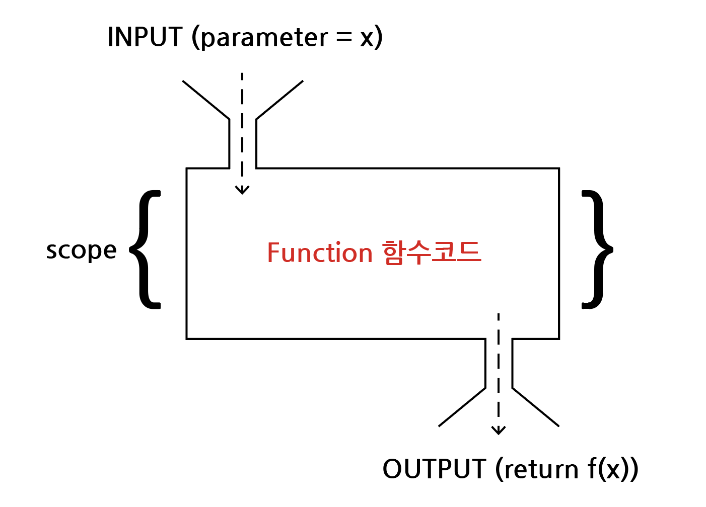

# 함수

## 목차

1. [함수 기초](#1-함수-기초)
    1. [함수의 정의](#1-1-함수의-정의)
        - [함수는 왜 사용하는 것일까?](#q-함수는-왜-사용하는-것일까)
        - [사용자 함수(Custom Function)](#사용자-함수custom-function)
    2. [함수 기본 구조](#1-2-함수-기본-구조)
2. [내장 함수](#2-내장-함수)
    1. [자주 사용하는 함수](#2-1-자주-사용하는-함수)
        - [print()](#print)
        - [len(s)](#lens)
        - [sum(iterable, start=0)](#sumiterable-start0)
        - [max(iterable)](#maxiterable)
        - [min(iterable)](#miniterable)
    2. [수학 관련 함수](#2-2-수학-관련-함수)
        - [abs(x)](#absx)
        - [divmod(a, b)](#divmoda-b)
        - [pow(base, exp, mod=None)](#powbase-exp-modnone)
        - [round(number, ndigit=None)](#roundnumber-ndigitnone)
    3. [논리 관련 함수](#2-3-논리-관련-함수)
        - [all(iterable)](#alliterable)
        - [any(iterable)](#anyiterable)
    4. [기타 함수](#2-4-기타-함수)
        - [bin(x)](#binx)
        - [hex(x)](#hexx)
        - [oct(x)](#octx)
        - [chr(i)](#chri)
        - [map(function, iterable)](#mapfunction-iterable)

<br>
<br>

## 1. 함수 기초

### 1-1. 함수의 정의

- `특정한 기능`을 하는 코드의 조각(묶음)
- 특정 명령을 수행하는 코드를 매번 `반복적으로 작성하지 않고`, 필요시 `호출`하여 간단히 사용

<br>

### Q) 함수는 왜 사용하는 것일까?

- 추상(Abstraction)을 통해 `복잡한 내용을 숨기고`, 기능에 집중하여 사용할 수 있다.(블랙박스)
- `재사용성`, `가독성`, `생산`

<br>

### - 사용자 함수(Custom Function)

- 구현되어 있는 함수가 없는 경우, 사용자가 직접 함수를 작성하는 것이 가능
- def 키워드 + 코드블럭 + return 값

```python
def function_name(factor)-
    # code block
    return returning_value
```

```python
# ex) 표준편차 구하는 코드

values = [100, 75, 85, 90, 65, 95]
total = 0
cnt = 0


# 평균 구하기
for value in values-
    total += value
    cnt += 1
mean = total / cnt


# 주어진 값들의 분산을 구하기
total_var = 0
for value in values-
    total_var += (value - mean) ** 2

sum_var = total_var / cnt
target = sum_var


# 표준편차 구하기
while True-
    root = 0.5 * (target + (sum_var/target))
    if (abs(root - target) < 0.00000000001)-
        break
    target = root

std_dev = target
print(std_dev)


# 매우 길며, 재사용성이 떨어진다.

-------------------------------------------------------

# 내장함수(Built-in Function)를 활용하여 좀 더 간단히 표현

import math

values = [100, 75, 85, 90, 65, 95]
mean = sum(values) / len(values)
sum_var = sum(pow(value - mean, 2) for value in values) / len(values)
std_dev = math.sqrt(sum_var)
print(std_dev)

-------------------------------------------------------

# pstdev 함수(파이썬 표준 라이브러리 - statistics)로 더 간단히 구할 수 있다.

import statistics

values = [100, 75, 85, 90, 65, 95]
statistics.pstdev(values)

# 코드 중복을 방지하며, 재사용성이 용이하다.
```

<br>

### 1-2. 함수 기본 구조

- 선언과 호출(define & call)
- 입력(input)
- 범위(scope)
- 결과값(output)



<br>
<br>

## 2. 내장 함수

### 2-1. 자주 사용하는 함수

### - print()

- 객체를 `출력`한다.

<br>

### - len(s)

- 객체의 `길이`를 반환한다. 인자는 시퀀스 또는 컬렉션일 수 있다.

```python
# ex)


```

<br>

### - sum(iterable, start=0)

- start 및 iterable의 항목들을 왼쪽에서 오른쪽으로 합하고 `합계`를 돌려준다.
- iterable의 항목은 일반적으로 숫자이며, 시작값은 문자열이 될 수 없다.

```python
# ex)


```

<br>

### - max(iterable)

- iterable에서 가장 큰 항목이나, 두 개 이상의 인자 중 `가장 큰 것`을 반환한다.
- 여러 항목이 최댓값이면, 함수는 처음 만난 항목을 반환한다.

```python
# ex)


```

<br>

### - min(iterable)

- iterable에서 가장 작은 항목이나, 두 개 이상의 인자 중 `가장 작은 것`을 반환한다.
- 여러 항목이 최솟값이면, 함수는 처음 만난 항목을 반환한다.

```python
# ex)


```

<br>

### 2-2. 수학 관련 함수

### - abs(x)

- 숫자의 `절댓값`을 반환한다. 인자는 정수, 실수 또는 **abs**()를 구현하는 객체이다.
- 인자가 복소수면 그 크기를 반환한다.

```python
# ex)


```

<br>

### - divmod(a, b)

- 두 수를 받아 `몫과 나머지`를 반환한다.

```python
# ex)


```

<br>

### - pow(base, exp, mod=None)

- base의 exp `거듭제곱`을 반환한다.
- mod가 있는 경우, base의 exp 거듭제곱의 모듈로 mod를 반환한다.

```python
# ex)


```

<br>

### - round(number, ndigit=None)

- number를 소수점 다음에 ndigits 정밀도로 `반올림한 값`을 반환한다.
- ndigits가 생략되거나 None이면, 입력에 가장 가까운 정수를 반환한다.

```python
# ex)


```

<br>

### 2-3. 논리 관련 함수

### - all(iterable)

- iterable의 `모든 요소가 참이면` (또는 iterable이 비어있으면) `True`를 반환한다.

```python
# ex)


```

<br>

### - any(iterable)

- iterable의 요소 중 `어느 하나라도 참`이면 `True`를 반환한다.
- iterable이 비어있으면 False를 반환한다.

```python
# ex)


```

<br>

### 2-4. 기타 함수

### - bin(x)

- 정수를 '0b'접두사가 붙은 `이진 문자열`로 반환한다.

```python
# ex)


```

<br>

### - hex(x)

- 정수를 '0x'접두사가 붙은 `16진수 문자열`로 반환한다.

```python
# ex)


```

<br>

### - oct(x)

- 정수를 '0o'접두사가 붙은 `8진수의 문자열`로 반환한다.

```python
# ex)


```

<br>

### - ord(c)

- 유니코드(아스키코드) 문자 c에 대응되는 `유니코드 숫자`를 반환한다.

```python
# ex)


```

<br>

### - chr(i)

- 유니코드(아스키코드) 숫자 i에 `대응되는 문자`를 반환한다.

```python
# ex)


```

<br>

### - map(function, iterable)

- iterable의 `모든 요소에 함수(function)을 적용`하고, 그 결과를 map object로 반환한다.

```python
# ex)


```
