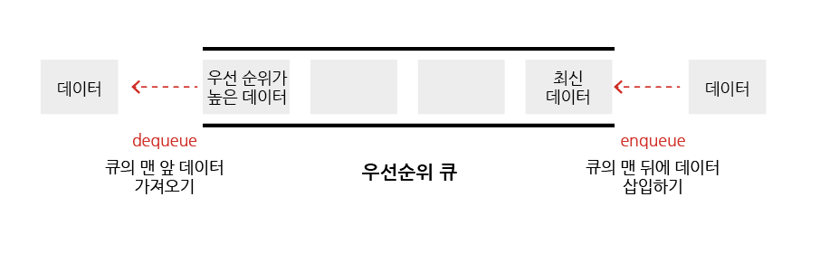
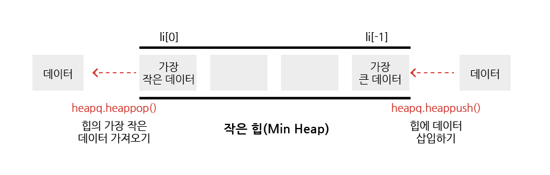

# 힙

## 목차

1. [힙(Heap)](#1-힙heap)
    1. [우선순위 큐(Priority Queue)](#1-1-우선순위-큐priority-queue)
    2. [우선순위 큐를 구현하는 방법](#1-2-우선순위-큐를-구현하는-방법)
        - [우선순위 큐 구현 별 시간 복잡도](#우선순위-큐-구현-별-시간-복잡도)
    3. [힙(Heap)의 특징](#1-3-힙heap의-특징)
        - [힙은 언제 사용하는가?](#힙은-언제-사용하는가)
    4. [힙의 종류](#1-4-힙의-종류)
        - [최대 힙(max heap)](#최대-힙max-heap)
        - [최소 힙(min heap)](#최소-힙min-heap)
    5. [힙의 사용](#1-5-힙의-사용)
    6. [힙과 리스트 비교](#1-6-힙과-리스트-비교)

 
 

## 1. 힙(Heap)

### 1-1. 우선순위 큐(Priority Queue)

- 일반적인 `큐(Queue)`는 `들어온 순서`를 기준으로 가장 먼저 들어온 데이터가 가장 먼저 나가는
  FIFO(First-in First-out, 선입선출) 방식인 반면, `우선순위 큐(Priority Queue)`는
  `우선순위(중요도, 크기 등 순서 이외의 기준)`를 기준으로 가장 우선순위가 높은 데이터가 가장 먼저 나가는 방식이다.

ex) 가중치가 있는 데이터, 작업 스케줄링, 네트워크

 

### 1-2. 우선순위 큐를 구현하는 방법

- 배열(Array)
- 연결 리스트(Linked List)
- 힙(Heap)

 

### - 우선순위 큐 구현 별 시간 복잡도

| 연산 종류     | Enqueue | Dequeue | 최솟값 탐색 |
|-----------|---------|---------|--------|
| 배열(Array) | O(1)    | O(N)    | O(N)   |
| 정렬된 배열    | O(N)    | O(1)    | O(1)   |
| 힙(Heap)   | O(logN) | O(logN) | O(1)   |

 

### 1-3. 힙(Heap)의 특징

- `최대값 또는 최소값`을 빠르게 찾아내도록 만들어진 데이터 구조
- `완전 이진 트리의 형태`로 느슨한 정렬 상태를 지속적으로 유지한다.
    - 큰 값이 상위 레벨에 존재하며 작은 값은 하위 레벨에 있다.
    - 즉, 부모 노드의 키 값이 자식 노드의 키 값 보다 항상 큰(작은) 이진 트리를 말한다.
- 힙 트리에서는 `중복 값을 허용`한다.(이진 탐색 트리에서는 중복된 값을 허용하지 않는다.)

 

### - 힙은 언제 사용하는가?

- 데이터가 지속적으로 정렬되어야 하는 경우
- 데이터에 삽입/삭제가 빈번할 경우

 

### 1-4. 힙의 종류

### - 최대 힙(max heap)

- 부모 노드의 키 값이 자식 노드에 위치한 키 값보다 크거나 같은 완전 이진 트리 (부모노드 key >= 자식노드 key)

### - 최소 힙(min heap)

- 부모 노드의 키 값이 자식 노드에 위치한 키 값보다 작거나 같은 완전 이진 트리 (부모노드 key <= 자식노드 key)

https://gmlwjd9405.github.io/2018/05/10/data-structure-heap.html

 

### 1-5. 힙의 사용

- 파이썬의 heapq 모듈을 사용한다.
- Minheap(최소 힙)으로 구현되어 있음(= 가장 작은 값이 먼저 온다)
- 삽입, 삭제, 수정, 조회 연산의 속도가 리스트보다 빠르다.

 

| 문법                         | 설명                                                                   |
|----------------------------|----------------------------------------------------------------------|
| heapq.heapify(arr)         | 주어진 배열을 힙 속성을 갖도록 변환하는데 사용되며, 주로 힙 정렬 알고리즘과 함께 사용되며, 시간 복잡도는 O(N)이다. |
| heapq.heappop(heap)        | 배열 heap에서 가장 작은 요소를 가져오고 배열에서 해당 요소를 삭제한다.                           |
| heapq.heappush(heap, item) | 배열 heap에 요소 item을 삽입한다.                                              |

 

### 1-6. 힙과 리스트 비교

| 연산 종류       | 힙(Heap) | 리스트(List)    |
|-------------|---------|--------------|
| Get Item    | O(1)    | O(1)         |
| Insert Item | O(logN) | O(1) 또는 O(N) |
| Delete Item | O(logN) | O(1) 또는 O(N) |
| Search Item | O(N)    | O(N)         |
