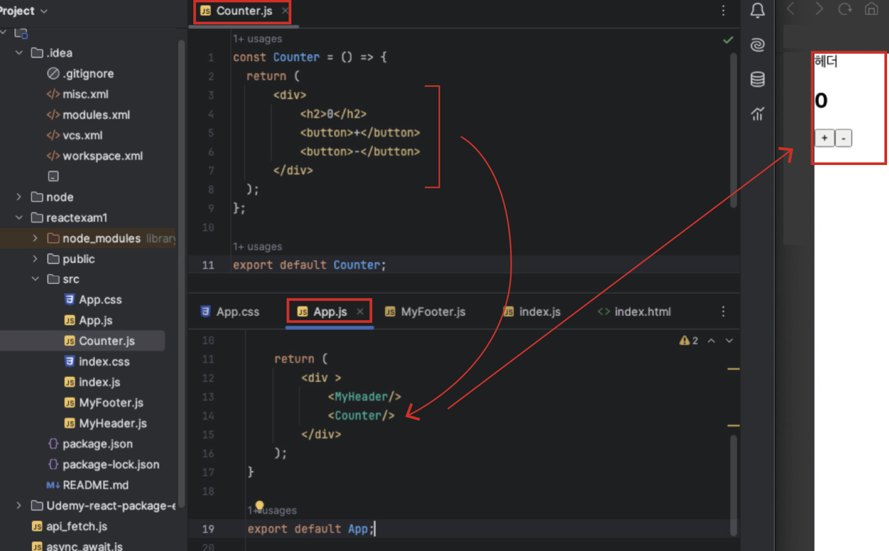
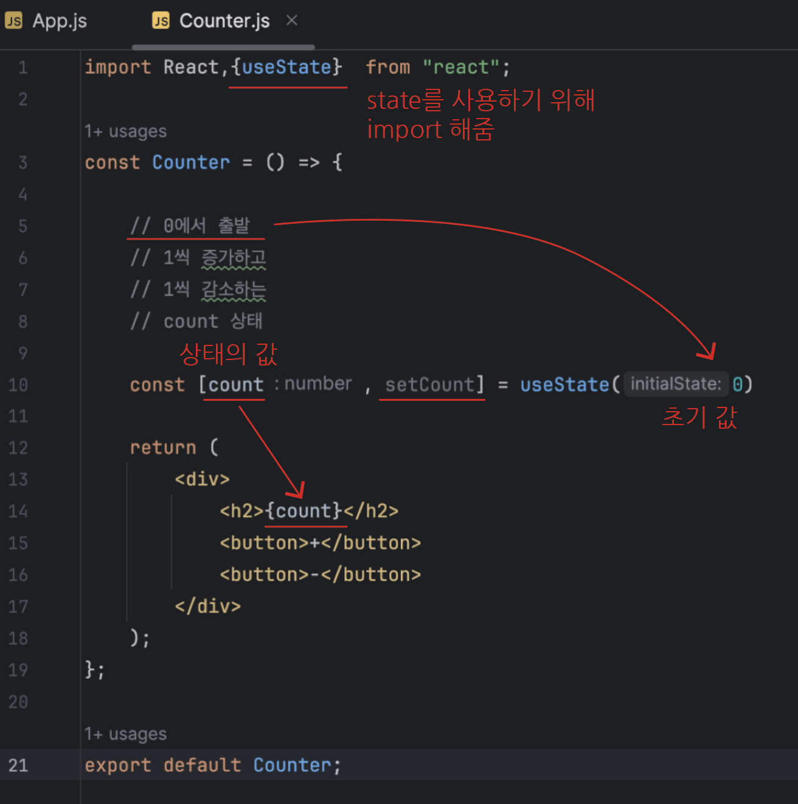
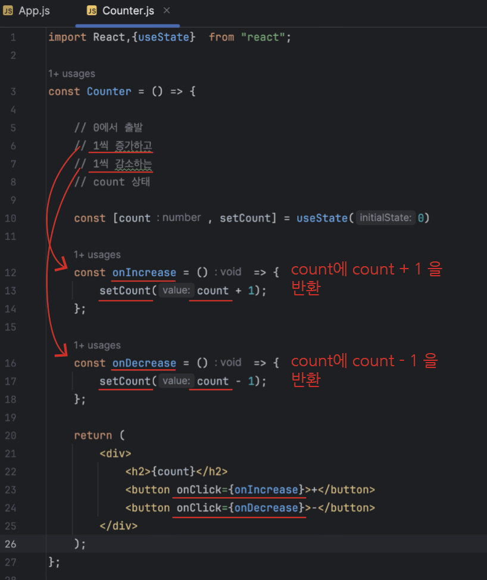

# State

## 목차

1. [State(상태)](#1-state상태)
    1. [State를 이용할 수 있는 Counter 만들기](#1-1-state를-이용할-수-있는-counter-만들기)
    2. [추가 정보](#1-2-추가-정보)

 
 

## 1. State(상태)

- 계속해서 `변화하는` 특정 상태로 상태에 따라 `각각 다른 동작`을 함
- ex) 다크모드, 카운트 ...
- 리액트의 상태는 컴포넌트가 갖는 테마(다크모드)처럼 계속 값이 바뀌는 `동적인 데이터`이고 상태를 바꾸는 관리는 상태를 가진 컴포넌트가 직접 함

 

### 1-1. State를 이용할 수 있는 Counter 만들기

<카운터 숫자, 버튼 세팅 및 렌더링>

- 아직은 구조만 있고 아무 동작이 정의되지 않아 버튼이 작동하지 않음
- 원하는 것: '+' 누르면 \<h2>0\</h2>의 숫자가 증가, '-' 누르면 반대로 감소
- 동적이여야 하는 값 : 숫자 0

 

<state 적용>

- `useState`라는 리액트의 메서드는 `배열`을 반환
- 배열의 `비구조화 할당`을 통해 `인덱스 0`의 `count`, `인덱스 1`의 `setCount`라는 상수로 받아옴
- 인덱스 0의 count는 `상태의 값`으로 사용
    - 값이기 때문에 JSX 코드에서 리턴하여 화면에 표시 가능
- 인덱스 1의 setCount는 count의 상태를 변화시키는 `상태변화 함수`로서 사용
- useState 메서드의 인자 '0'은 count 상태 값의 `초기 값`으로 사용

 

<상태변화 함수>

- 증가하는 함수 : onIncrease
- 감소하는 함수 : onDecrease
- 기존 HTML에서 JS함수 사용은 onclick = 함수명()이었으나, 해당 버튼 클릭 시, 함수기능을 작동하도록
  하기 위해 리액트, JSX에서는 `onClick = {함수명}` (카멜케이스 + 중괄호 + 함수명) 사용
- state는 결국 count값이 바뀜에 따라 JSX 코드 리턴을 다시 하게 되고 이 counter 컴포넌트를 사용하는 App.js에서는 `리렌더` 발생

 

### 1-2. 추가 정보

- 하나의 컴포넌트에 여러 개의 상태 사용 가능
- 위의 예시에서와 마찬가지로, 위에서 사용한 count, setCount와 같은 `변수명, 함수명은 겹치지 않도록` 함
- state는 매우 짧은 코드와 유연한 문법으로 화면에 나타나는 데이터를 `쉽게 교체`하고 `업데이트` 할 수 있도록 해줌
- 따라서 리액트의 state를 잘 이용하면, 사용자의 버튼 클릭과 같은 이벤트, 동작들에 반응해서 요소들이 동적으로 바뀌는 프로그램을 만들 수 있음
