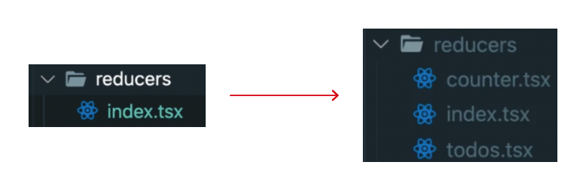

# combineReducers

## 목차

1. [다른 reducer 추가하기](#1-다른-reducer-추가하기)
    1. [root reducer, sub reducer](#1-1-root-reducer-sub-reducer)
        - [root reducer 구조 작성하기](#--root-reducer-구조-작성하기)
        - [sub reducer를 root reducer로 가져오기](#--sub-reducer를-root-reducer로-가져오기)
        - [sub reducer 작성하기](#--sub-reducer-작성하기)
        - [createStore()에 root reducer로 교체](#--createstore에-root-reducer로-교체)

<br/>
<br/>

## 1. 다른 reducer 추가하기

- 카운터 앱에 Todo 앱 추가하기

<br/>

### 1-1. root reducer, sub reducer

- reducer는 1개만 존재해야 함
- 만약 reducer를 추가하기 위해서는 root reducer를 만들어서 그 하위에 sub reducer들(counter, todos...)을 넣어주면 됨
- `root reducer`를 만들 때, 사용하는 것이 `combineReducers`임

<br/>

<p align="center">
    <br/>
    <span>root reducer와 sub reducer로 분리</span>
</p>

<br/>

### - root reducer 구조 작성하기

- src/reducers/index.tsx 파일 수정

```tsx
// src/reducer/index.tsx

// redux 라이브러리에서 제공하는 combineReducers 가져오기
import {combineReducers} from "redux";

// rootReducer 생성
const rootReducer = combineReducers({});

export default rootReducer;
```

<br/>

### - sub reducer를 root reducer로 가져오기

```tsx
// src/reducers/index.tsx

import {combineReducers} from "redux";
// sub reducer 가져오기
import todos from "./todos";
import counter from "./counter";

// combineReducers로 sub reducer 묶기
const rootReducer = combineReducers({todos, counter});

export default rootReducer;
```

<br/>

### - sub reducer 작성하기

- todos.tsx 작성

```tsx
// src/reducers/todos.tsx

enum ActionType {
    ADD_TODO = "ADD_TODO",
    DELETE_TODO = "DELETE_TODO",
}

interface Action {
    type: ActionType;
    text: string;
}

const todos = (state = [], action: Action) => {
    switch (action.type) {
        case "ADD_TODO":
            return [...state, action.text];

        default:
            return state;
    }
};

export default todos;
```

<br/>

- counter.tsx 작성

```tsx
// src/reducers/counter.tsx

interface Action {
    type: string;
}

const counter = (state = 0, action: Action) => {
    switch (action.type) {
        case "INCREMENT":
            return state + 1;

        case "DECREMENT":
            return state - 1;

        default:
            return state;
    }
};

export default counter;
```

<br/>

### - createStore()에 root reducer로 교체

```tsx
// src/index.tsx

import {createStore} from "redux";
// rootReducer 가져오기
import rootReducer from "./reducers";

// ...

// rootReducer로 교체
const store = createStore(rootReducer);
```