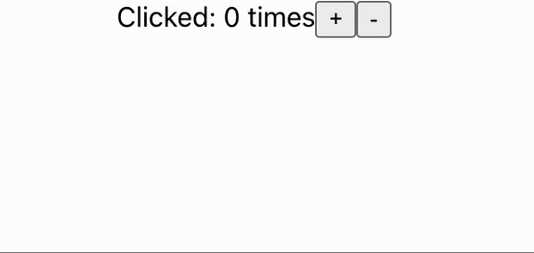

# Redux 카운터 앱 - without middleware

## 목차

1. [미들웨어 없이 Redux 카운터 앱 만들기](#1-미들웨어-없이-redux-카운터-앱-만들기)
    1. [React 앱 설치하기](#1-1-react-앱-설치하기)
    2. [Redux 라이브러리 설치하기](#1-2-redux-라이브러리-설치하기)
    3. [카운터 UI 및 함수 생성](#1-3-카운터-ui-및-함수-생성)
    4. [Reducer 생성](#1-4-reducer-생성)
    5. [Store 생성 및 Action 전달](#1-5-store-생성-및-action-전달)
    6. [App.tsx Props 가져오기](#1-6-apptsx-props-가져오기)
    7. [변경된 state 반영하기](#1-7-변경된-state-반영하기)

<br/>
<br/>

## 1. 미들웨어 없이 Redux 카운터 앱 만들기

- 실무에서는 Redux를 사용하면 미들웨어를 이용하지만 Redux 자체에 대해 알아보기위해 미들웨어 없이 Redux 카운터 앱 만들어보기

<br/>

### 1-1. React 앱 설치하기

- TypeScript로 설정

```bash
$ npx create-react-app my-app --template typescript
```

<br/>

### 1-2. Redux 라이브러리 설치하기

```bash
$ npm install redux --save
```

<br/>

### 1-3. 카운터 UI 및 함수 생성

- src/App.tsx 파일 수정

```tsx
// src/App.tsx

import "./App.css";

function App() {
    return (
        <div className="App">
            Clicked: times
            <button>+</button>
            <button>-</button>
        </div>
    );
}

export default App;
```

<br/>

### 1-4. Reducer 생성

- `src/reducers/index.tsx` 파일 생성

```tsx
// src/reducers/index.tsx

// counter reducer는 state와 action을 받음
// action 객체는 type 값을 가짐
const counter = (state = 0, action: { type: string }) => {
    // action의 type의 값 확인
    switch (action.type) {
        // 만약 "INCREMENT"이면 state에 1 더하기
        case "INCREMENT":
            return state + 1;

        // "DECREMENT"이면 state에 1 빼기
        case "DECREMENT":
            return state - 1;

        // 기본적으로 state 값을 반환    
        default:
            return state;
    }
};

export default counter;
```

<br/>

### 1-5. Store 생성 및 Action 전달

- `createStore()` 함수를 `redux` 라이브러리에서 제공
- 최신 Redux에서는 Redux toolkit에서 제공하는 configureStore 사용을 추천함
- createStore()는 앱의 `전체 상태 트리를 보유`하는 `Redux Store`를 만듦
- 앱에는 `하나`의 Redux Store만 있어야 함
- `getState()`는 애플리케이션의 `현재 상태 트리`를 반환하며 store의 `reducer가 반환한 마지막 값`임

```tsx
// src/index.tsx

import React from "react";
import ReactDOM from "react-dom/client";
import "./index.css";
import App from "./App";
import reportWebVitals from "./reportWebVitals";

// redux 라이브러리에서 createStore 가져오기
import {createStore} from "redux";
// counter reducer 가져오기
import counter from "./reducers";

const root = ReactDOM.createRoot(document.getElementById("root") as HTMLElement);

// createStore를 통해 counter reducer를 위한 store 생성
const store = createStore(counter);

root.render(
    <React.StrictMode>
        <App
            // App.tsx 컴포넌트에 value(store의 최신 state) 및
            // dispatch action인 Increment와 Decrement를 props로 전달
            value={store.getState()}
            onIncrement={() => store.dispatch({type: "INCREMENT"})}
            onDecrement={() => store.dispatch({type: "DECREMENT"})}
        />
    </React.StrictMode>
);
```

<br/>

### 1-6. App.tsx Props 가져오기

```tsx
// src/App.tsx

// Props 타입 지정
type Props = {
    value: number;
    onIncrement: () => void;
    onDecrement: () => void;
};

// Props 가져오기 및 타입 연결
function App({value, onIncrement, onDecrement}: Props) {
    return (
        <div className="App">
            {/*value state 넣기*/}
            Clicked: {value} times
            <button onClick={onIncrement}>+</button>
            <button onClick={onDecrement}>-</button>
        </div>
    );
}

export default App;
```

<br/>

- src/App.test.tsx 파일 에러 발생할 수 있음

```tsx
// src/App.test.tsx

// 함수 내부 지우기
test("renders learn react link", () => {
});
```

- '+', '-' 버튼을 클릭해도 아무 변화가 없음

<br/>

### 1-7. 변경된 state 반영하기

- `subscribe()`를 사용해야 함
- [Redux 공식 사이트 - subscribe(listener)](https://redux.js.org/api/store#subscribelistener)
- `change listener`로서 작업이 전달될 때마다 호출

```tsx
// src/index.tsx

import React from "react";
import ReactDOM from "react-dom/client";
import "./index.css";
import App from "./App";
import reportWebVitals from "./reportWebVitals";
import {createStore} from "redux";
import counter from "./reducers";

const root = ReactDOM.createRoot(document.getElementById("root") as HTMLElement);

const store = createStore(counter);

// render 함수로 만들기
const render = () =>
    root.render(
        <React.StrictMode>
            <App value={store.getState()} onIncrement={() => store.dispatch({type: "INCREMENT"})}
                 onDecrement={() => store.dispatch({type: "DECREMENT"})}/>
        </React.StrictMode>
    );

// render 함수 호출
render();

// subscribe()에 render 함수 넣기
store.subscribe(render);
```

<br/>

<p align="center">
    <br/>
    <span>Redux 카운터 앱</span>
</p>