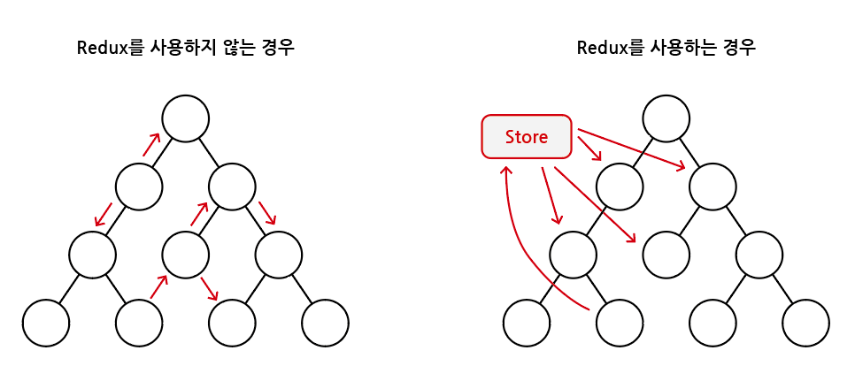
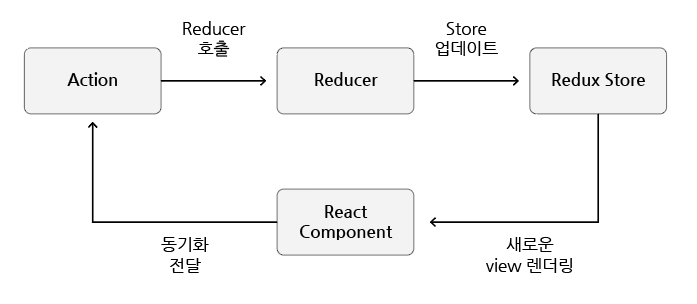

# Redux 소개

## 목차

1. [Redux란?](#1-redux란)
    1. [상태 관리](#1-1-상태-관리)
        - [Props vs State](#--props-vs-state)
    2. [Redux 데이터 흐름 (strict unidirectional data flow)](#1-2-redux-데이터-흐름-strict-unidirectional-data-flow)
        - [Action](#--action)
        - [Reducer](#--reducer)
        - [Redux Store](#--redux-store)

<br/>
<br/>

## 1. Redux란?

- JavaScript 애플리케이션을 위한 `상태 관리 라이브러리`

<br/>

### 1-1. 상태 관리

### - Props vs State

1. Props
    - 구성 요소(component) 간에 서로 통신하는 방법
    - 상위 구성 요소(부모)에서 아래(자식) 쪽으로 흐름이 전달
    - 해당 값을 변경하려면 부모의 내부 상태(state)를 변경해야 함

```jsx
// props 예시

<ChatMessages
  messages={messages}
  currentMember={member}
/>
```

<br/>

2. State
    - 부모에서 자식으로 데이터를 보내는 것이 아닌 컴포넌트 내에서 데이터를 전달하려면 state 이용
    - state는 조작 가능하며 변할 수 있음(mutable)
    - state가 변하면 re-rendering 됨

```jsx
// state 예시

state = {
  message: '',
  attachFile: undefined,
  openMenu: false,
};
```

<br/>

- `Redux`는 `State를 관리`하는 것
- 기존에는 State를 변경하고 props로 전달하는 등 복잡한 과정이 요구되었으나, `Redux`를 사용하면 별도의 `store` 공간에 상태를 저장하고 변경하고 가져다 사용하는 방식으로 편하게 이용할 수 있음

<p align="center">
   <br/>
   <span>Redux 컨셉 다이어그램</span>
</p>

<br/>

### 1-2. Redux 데이터 흐름 (strict unidirectional data flow)

- 단방향으로 데이터가 흐르게 됨

<p align="center">
   <br/>
   <span>Redux 데이터 흐름</span>
</p>

<br/>

<p align="center">
   <br/>
   <span>Redux 데이터 흐름 예시 [출처: Redux 공식 사이트]</span>
</p>

<br/>

### - Action

- 간단한 `JavaScript 객체`로 수행하는 `작업의 유형`을 지정하는 `type` 속성이 있으며, 옵션으로 Redux Store에 일부 데이터를 보내는데 사용되는 `payload` 속성을 가질 수도 있음

```
Action 예시

{type: 'LIKE_ARTICLE', articleId: 42}
  {type: 'FETCH_USER_SUCCESS', response: {id: 3, name: 'Mary'}}
  {type: 'ADD_TODO', text: 'Read the Redux docs.'}
```

<br/>

### - Reducer

- 애플리케이션 `상태의 변경 사항을 결정`하고 `업데이트 된 상태를 반환`하는 `함수`
- 인자로 action을 가지고 store 내부의 상태를 업데이트 함

```
Reducer 예시

(previousState, action) => nextState

이전 state와 action 객체를 받은 후, 업데이트된 state를 반환
```

- Reducer는 `pure function`이므로 reducer 내부에서 하지 말아야하는 `주의사항`이 있음
    1. arguments 조작하기
    2. API 호출, 트랜지션 라우팅과 같은 사이드 이펙트 수행하기
    3. Date.now(), Math.random()과 같은 non-pure function 호출하기

<br/>

### - Redux Store

- action과 reducer를 `하나로 모으는` `객체 저장소`로 애플리케이션 `전체 상태 트리를 보유함`
- 내부 상태를 변경하는 유일한 방법은 해당 상태에 대한 action을 전달하는 것
- Redux Store는 클래스가 아니며, 몇 가지 메서드를 가진 객체임
- `<Provider/>`는 React Redux에서 제공하는 최상위 컴포넌트임 