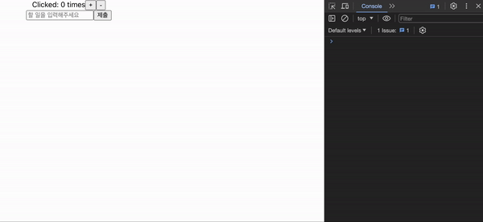
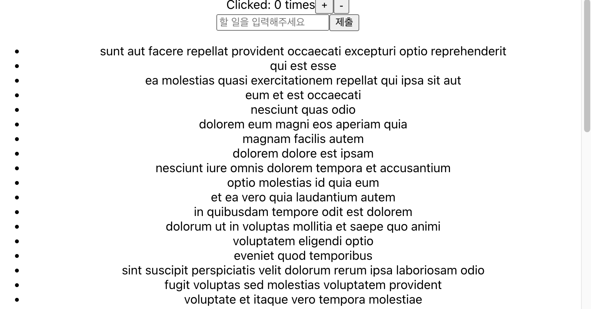

# Middleware - logger, thunk

## 목차

1. [Redux Middleware](#1-redux-middleware)
2. [logger](#2-logger)
    1. [로깅 미들웨어 함수 생성](#2-1-로깅-미들웨어-함수-생성)
        - [미들웨어 등록](#--미들웨어-등록)
        - [store 생성 코드 수정](#--store-생성-코드-수정)
3. [Redux Thunk](#3-redux-thunk)
    1. [thunk](#3-1-thunk)
    2. [thunk 사용](#3-2-thunk-사용)
        - [Axios 모듈 설치](#--axios-모듈-설치)
        - [posts reducer 생성](#--posts-reducer-생성)
        - [root reducer에 combineReducers로 묶기](#--root-reducer에-combinereducers로-묶기)
        - [posts 데이터를 위한 요청 보내기](#--posts-데이터를-위한-요청-보내기)
        - [에러 원인](#--에러-원인)
        - [thunk 미들웨어 설치](#--thunk-미들웨어-설치)
        - [thunk 미들웨어 등록](#--thunk-미들웨어-등록)
        - [thunk의 작동 방식](#--thunk의-작동-방식)
    3. [thunk로 가져온 posts 데이터 화면에 출력하기](#3-3-thunk로-가져온-posts-데이터-화면에-출력하기)
    4. [Action 코드 actions 폴더에 분리해서 관리](#3-4-action-코드-actions-폴더에-분리해서-관리)
        - [modern ES2015 형태로 수정](#--modern-es2015-형태로-수정)

<br/>
<br/>

## 1. Redux Middleware

- Redux Middleware는 Action을 dispatch 전달하고 `reducer에 도달하는 순간 사이`에 `사전에 지정된 작업을 실행`할 수 있게 해주는 중간자
- ex) 로깅, 충돌 보고, 비동기 API와 통신, 라우팅 등...

<br/>

<p align="center">
    <br/>
    <span>Redux Middleware 컨셉 다이어그램</span>
</p>

<br/>

```tsx
// 미들웨어 구조 예시

// 구조1
const loggerMiddleware1 = (store) => (next) => (action) => {
    // 코드 작성
};

// 구조2
const loggerMiddleware2 = function (store) {
    return function (next) {
        return function (action) {
            // 코드 작성
        };
    };
};

// 구조2는 구조1을 풀어서 작성한 것으로 동일한 함수임
```

<br/>

## 2. logger

- Redux를 이용할 때, 나오는 로그를 찍어주는 미들웨어 생성하기

<br/>

### 2-1. 로깅 미들웨어 함수 생성

### - 미들웨어 등록

- `applyMiddleware()` : redux 라이브러리에서 제공하는 하나 이상의 미들웨어를 받은 후, 함수를 리턴하는 함수 (미들웨어 등록)

```tsx
// src/index.tsx

import {applyMiddleware, createStore} from "redux";

const loggerMiddleware = (store: any) => (next: any) => (action: any) => {
    // 로그 기록 출력
    console.log("store", store);
    console.log("action", action);

    // 다음 미들웨어로 넘어가기
    next(action);
};

// loggerMiddleware 등록
const middleware = applyMiddleware(loggerMiddleware);
```

<br/>

### - store 생성 코드 수정

```tsx
// src/index.tsx

import {applyMiddleware, createStore} from "redux";

const loggerMiddleware = (store: any) => (next: any) => (action: any) => {
    console.log("store", store);
    console.log("action", action);
    next(action);
};

const middleware = applyMiddleware(loggerMiddleware);

// 생성 후 등록한 미들웨어를 store 생성 시, 3번째 인자로 넣어주기
// creatStore의 2번째 인자는 preloadedState(any)로 초기 상태임
const store = createStore(rootReducer, undefined, middleware);
```

<br/>

<p align="center">
    <br/>
    <span>로깅 미들웨어를 통한 로그 출력</span>
</p>

<br/>
<br/>

## 3. Redux Thunk

- redux를 사용하는 앱에서 `비동기 작업`을 할 때, 많이 사용하는 방법이 `redux-thunk`임
- thunk도 loggerMiddleware와 같이 redux 미들웨어임

<br/>

### 3-1. thunk

- "thunk"라는 단어는 "일부 `지연된 작업`을 수행하는 코드 조각"을 의미하는 프로그래밍 용어
- 지금 당장 실행할 로직 대신, `나중에 작업을 수행하는데 필요한 함수나 코드`를 작성할 수 있음

```js
let x = 1 + 2;

let foo = () => 1 + 2;

// x의 경우, 즉시 3의 값으로 계산되지만, foo 함수의 경우, 해당 함수가 호출되어야 3을 반환함
// foo 함수의 경우, thunk 임
```

<br/>

### 3-2. thunk 사용

- `서버에 요청`을 보내서 `데이터를 가져올 때`, 주로 비동기 요청을 보냄
- 비동기로 `https://jsonplaceholder.typicode.com/posts` 에 요청 보내고, Dummy 데이터를 받아 해당 데이터로 포스트 만들기

<br/>

### - Axios 모듈 설치

```bash
$ npm install axios --save
```

<br/>

### - posts reducer 생성

```tsx
// src/reducers/posts.tsx

enum ActionType {
    FETCH_POSTS = "FETCH_POSTS",
    DELETE_POST = "DELETE_POSTS"
}

interface Post {
    userId: number;
    id: number;
    title: string;
}

interface Action {
    type: ActionType;
    payload: Post[];
}

const posts = (state = [], action: Action) => {
    switch (action.type) {
        case 'FETCH_POSTS':
            return [...state, ...action.payload];
        default:
            return state;
    }
};

export default posts;
```

<br/>

### - root reducer에 combineReducers로 묶기

```tsx
// src/reducers/index.tsx

import {combineReducers} from "redux";
import todos from "./todos";
import counter from "./counter";
// posts reducer 가져오기
import posts from "./posts";

// combineReducers로 posts reducer 묶기
const rootReducer = combineReducers({
    todos,
    counter,
    posts
});

export default rootReducer;

export type RootState = ReturnType<typeof rootReducer>;
```

<br/>

### - posts 데이터를 위한 요청 보내기

```tsx
// src/App.tsx

import axios from "axios";

// ...

useEffect(() => {
    // dispatch의 action으로 fetchPost() 함수 전달
    dispatch(fetchPosts());
}, [dispatch]);

// fetchPosts는 thunk action 생성자
const fetchPosts = (): any => {
    // fetchPostsThunk는 thunk 함수
    return async function fetchPostsThunk(dispatch: any, getState: any) {
        // 요청 보내고 응답을 기다리기
        const response = await axios.get("https://jsonplaceholder.typicode.com/posts");
        // 응답이 오면 다시 dispatch로 action 객체 전달하기
        dispatch({type: "FETCH_POSTS", payload: response.data});
    };
};

// ...
```

- 에러가 발생함

<br/>

### - 에러 원인

- `Action`은 `{type: ..., payload: ...}`와 같이 `객체`여야 하는데 현재 useEffect 콜백함수를 보면 `dispatch(fetchPosts());`와 같이 함수를
  dispatch하고 있기에 에러가 발생함

<br/>

### - thunk 미들웨어 설치

- `함수`를 `dispatch` 할 수 있도록 해주는 `redux-thunk` 미들웨어를 설치해야 함

```bash
$ npm install redux-thunk --save
```

<br/>

### - thunk 미들웨어 등록

```tsx
// src/index.tsx

// thunk 미들웨어 가져오기
import {thunk} from "redux-thunk";

// thunk 미들웨어 등록하기
const middleware = applyMiddleware(loggerMiddleware, thunk);
// ...
```

<br/>

### - thunk의 작동 방식

- Action을 dispatch([action])에 전달하고 action이 `함수가 아니면` 바로 `reducer로 전달`하여 처리
- Action이 `함수`이면 해당 함수를 `dispatch`와 `getState` 함수를 인자로 호출함
- 즉, Redux-Thunk를 사용함으로써 action 생성자가 하나의 action 객체를 생성할 뿐만 아니라 `그 내부 안에서 여러 가지 작업`을 할 수 있도록 만들어 줌

<br/>

### 3-3. thunk로 가져온 posts 데이터 화면에 출력하기

```tsx
// src/App.tsx

// ...

// posts 타입 위한 interface 생성
interface Posts {
    userId: number;
    id: number;
    title: string;
}

function App({onIncrement, onDecrement}: Props) {

    // posts reducer의 state 가져오기
    const posts: Posts[] = useSelector((state: RootState) => state.posts);

    useEffect(() => {
        dispatch(fetchPosts());
    }, [dispatch]);

    const fetchPosts = (): any => {
        return async function fetchPostsThunk(dispatch: any, getState: any) {
            const response = await axios.get("https://jsonplaceholder.typicode.com/posts");
            dispatch({type: "FETCH_POSTS", payload: response.data});
        };
    };

    // ...

    return (
        <div className="App">
            {/*...*/}

            {/*가져온 posts 데이터 list로 출력*/}
            <ul>
                {posts.map((post, index) => (
                    <li key={index}>{post.title}</li>
                ))}
            </ul>
        </div>
    );
}

export default App;
```

<br/>

<p align="center">
    <br/>
    <span>thunk 미들웨이로 가져온 posts 데이터 출력</span>
</p>

<br/>

### 3-4. Action 코드 actions 폴더에 분리해서 관리

- src/actions/posts.tsx 폴더 및 파일 생성
- action 함수인 fetchPosts 가져오기

```tsx
// src/actions/posts.tsx

import axios from "axios";

export const fetchPosts = (): any => {
    return async function fetchPostsThunk(dispatch: any, getState: any) {
        const response = await axios.get("https://jsonplaceholder.typicode.com/posts");
        dispatch({type: "FETCH_POSTS", payload: response.data});
    };
};
```

<br/>

- App.tsx 에서 action 함수 제거

```tsx
// src/App.tsx

import {fetchPosts} from "./actions/posts";

useEffect(() => {
    dispatch(fetchPosts());
}, [dispatch]);
```

<br/>

### - modern ES2015 형태로 수정

- fetchPosts action 코드를 ES2015 버전으로 간단하게 수정하기

```tsx
// src/actions/posts.tsx

import axios from "axios";

// ES2015 버전
export const fetchPosts = (): any => async (dispatch: any, getState: any) => {
    const response = await axios.get("https://jsonplaceholder.typicode.com/posts");
    dispatch({type: "FETCH_POSTS", payload: response.data});
};
```