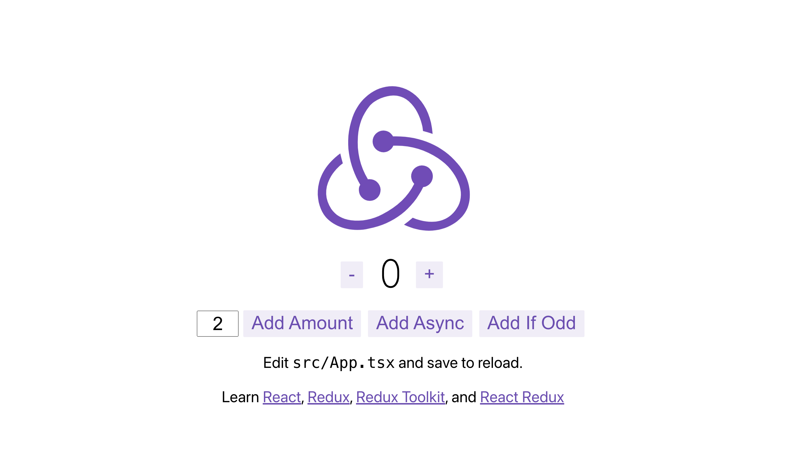

# Redux Toolkit

## 목차

1. [Redux Toolkit](#1-redux-toolkit)
    1. [Redux Toolkit 앱 살펴보기](#1-1-redux-toolkit-앱-살펴보기)
        - [기본 소스코드 살펴보기](#--기본-소스코드-살펴보기)
        - [store 생성하기 - configureStore](#--store-생성하기---configurestore)
        - [React에 Redux Store 제공하기](#--react에-redux-store-제공하기)
        - [Redux State Slice 생성](#--redux-state-slice-생성)
        - [store에 slice reducer 추가](#--store에-slice-reducer-추가)
        - [React 컴포넌트에서 Redux State 및 Actions 사용하기](#--react-컴포넌트에서-redux-state-및-actions-사용하기)
    2. [Redux Toolkit APIs](#1-2-redux-toolkit-apis)

<br/>
<br/>

## 1. Redux Toolkit

- `Redux`가 효율적이기는 하나 사용할 때, `복잡하고 헷갈리는 부분이 많음`
- `Redux Toolkit`은 Redux 로직을 작성하기 위한 `공식 권장 접근 방식`으로 강력히 사용을 권장함
- Redux 코어를 포함하며, Redux 앱을 빌드하는데 `필수적인 패키지와 기능`을 가지고 있음
- Redux 작업을 `단순화`하고 `실수를 방지`하고 Redux 앱을 더 쉽게 작성할 수 있도록 해줌
- [Redux Toolkit - 공식 사이트](https://ko.redux.js.org/redux-toolkit/overview/)

<br/>

### 1-1. Redux Toolkit 앱 살펴보기

- Redux에서 제공하는 기본 템플릿 이용해서 프로젝트 시작하기
- [GitHub 레포지토리 - reduxjs/cra-template-redux](https://github.com/reduxjs/cra-template-redux)

```bash
$ npx create-reate-app my-app --template redux-typescript
```

<br/>

- 프로젝트 실행하기

```bash
$ yarn start

#또는

$ npm run start
```

<br/>

<p align="center">
    <br/>
    <span>Redux 템플릿 실행</span>
</p>

<br/>

### - 기본 소스코드 살펴보기

```json
//package.json

{
  "dependencies": {
    //redux-tookit이 있음
    "@reduxjs/toolkit": "^1.9.7",
    "@testing-library/jest-dom": "^5.17.0",
    "@testing-library/react": "^13.4.0",
    "@testing-library/user-event": "^14.5.2",
    "@types/jest": "^27.5.2",
    "@types/node": "^17.0.45",
    "@types/react": "^18.2.73",
    "@types/react-dom": "^18.2.23",
    "react": "^18.2.0",
    "react-dom": "^18.2.0",
    //기존에는 redux만 사용했었음
    "react-redux": "^8.1.3",
    "react-scripts": "5.0.1",
    "typescript": "^4.9.5",
    "web-vitals": "^2.1.4"
  }
}
```

<br/>

### - store 생성하기 - configureStore

- 기존 Redux의 createStore() 대신 `toolkit`의 `configureStore()`를 이용하여 store 생성하기

```ts
// src/app/store.ts

import {configureStore} from '@reduxjs/tookit';

export const store = configureStore({
    reducer: {},
});
```

<br/>

### - React에 Redux Store 제공하기

- store를 제공하는 방법은 기존의 redux에서 store 제공하는 방법과 동일함

```tsx
// src/index.tsx

import React from 'react';
import {createRoot} from 'react-dom/client';

// redux에서 Provider 컴포넌트 가져오기
import {Provider} from 'react-redux';

// 앞서 src/app/store.ts에서 생성한 store 가져오기
import {store} from './app/store';
import App from './App';
import reportWebVitals from './reportWebVitals';
import './index.css';

const container = document.getElementById('root')!;
const root = createRoot(container);

root.render(
    <React.StrictMode>
        {/*Provider 컴포넌트로 감싸고 store 저장소 전달*/}
        <Provider store={store}>
            <App/>
        </Provider>
    </React.StrictMode>
);

reportWebVitals();
```

<br/>

### - Redux State Slice 생성

- src/features/counterSlice.ts 라는 파일이 있으며, 해당 `slice 파일`이 `reducer` 부분을 포함함

```ts
// src/features/counter/counterSlice.ts

import {createSlice} from '@reduxjs/toolkit';
import type {PayloadAction} from '@reduxjs/toolkit';

export interface CounterState {
    value: number
};

const initialState: CounterState = {
    value: 0
};

// Slice는 slice의 이름, 초기 상태, 초기 상태를 어떻게 변경할 지에 관한 모든 것을 담고 있음
// reducer에서 mutating로직을 작성하며, Immer 라이브러리를 사용하기에 state 자체를 변경하지 않고
// draft state 초안을 작성한 다음, 업데이트 하기에 불변성을 지켜줌
export const counterSlice = createSlice({
    name: 'counter',
    initialState,
    reducers: {
        increment: (state) => {
            state.value += 1
        },
        decrement: (state) => {
            state.value -= 1
        },
        incrementByAmount: (state, action: PayloadAction<number>) => {
            state.value += action.payload
        },
    },
});

export const {increment, decrement, incrementByAmount} = counterSlice.actions;
export default counterSlice.reducer;
```

<br/>

- reducer는 애플리케이션 상태의 변경 사항을 결정하고 업데이트 된 상태를 반환하는 함수로 action을 인자로 가지고 store 내부 상태를 업데이트 함

<br/>

### - store에 slice reducer 추가

```ts
// src/app/store.ts

import {configureStore} from '@reduxjs/tookit';

// reducer 가져오기
import counterReducer from '../features/counter/counterSlice';

export const store = configureStore({
    reducer: {
        // counter reducer 추가하기
        counter: counterReducer,
    },
});
```

<br/>

### - React 컴포넌트에서 Redux State 및 Actions 사용하기

- useSelector : store에서 state 조회하기
- useDispatch : Action 전달하기

```tsx
// src/features/counter/Counter.tsx

export function Counter() {
    const count = useSelector((state: RootState) => state.counter.value);
    const dispatch = useDispatch();

    return (
        <div>
            <button
                aria-label="Increment value"
                onClick={() => dispatch(increment())}
            >Increment
            </button>
        </div>
    );
};
```

<br/>

### 1-2. Redux Toolkit APIs

- redux toolkit에서 제공하는 API들 살펴보기

<br/>

