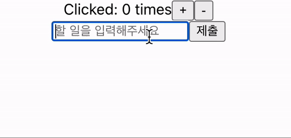

# useSelector, useDispatch

## 목차

1. [useSelector, useDispatch](#1-useselector-usedispatch)
    1. [useSelector](#1-1-useselector)
        - [타입 에러 문제](#--타입-에러-문제)
        - [해결 방법](#--해결-방법)
        - [Todo UI 작성](#--todo-ui-작성)
    2. [useDispatch](#1-2-usedispatch)

<br/>
<br/>

## 1. useSelector, useDispatch

- `useSelector`와 `useDispatch`는 Redux에서 제공하는 `Hooks`로 해당 Hooks를 사용해 `Provider`로 둘러싸인 컴포넌트에서 `store에 접근 가능함`

<br/>

### 1-1. useSelector

- useSelector를 이용해 `store의 값을 가져올 수 있음`

```tsx
// useSelector 예시

// src/App.tsx

import {useSelector} from "react-redux";

const counter = useSelector((state) => state.counter);
const todos = useSelector((state) => state.todos);
```

<br/>

### - 타입 에러 문제

- state에서 타입 에러가 발생할 수 있음

<br/>

### - 해결 방법

1. root reducer에 RootState 타입 생성하기

```tsx
// src/reducers/index.tsx

import {combineReducers} from "redux";
import todos from "./todos";
import counter from "./counter";

const rootReducer = combineReducers({todos, counter});

export default rootReducer;

// RootState 타입 생성 및 내보내기
export type RootState = ReturnType<typeof rootReducer>;
```

<br/>

2. 생성한 RootState를 가져와서 State 객체에 제공하기

```tsx
// src/App.tsx

import {useSelector} from "react-redux";
import {RootState} from "./reducers"

const counter = useSelector((state: RootState) => state.counter);
const todos: string[] = useSelector((state: RootState) => state.todos);
```

<br/>

### - Todo UI 작성

- useSelector로 가져온 todos 데이터를 리스트로 출력하기

```tsx
// src/App.tsx

// ...
const todos = useSelector((state: RootState) => state.todos);
const counter = useSelector((state: RootState) => state.counter);

// ...
return (
    <div className="App">
        {/*value 대신 counter로 수정*/}
        Clicked: {counter} times
        <button onClick={onIncrement}>+</button>
        <button onClick={onDecrement}>-</button>
        <form onSubmit={addTodo}>
            <input type="text" value={todoValue} onChange={handleChange} placeholder="할 일을 입력해주세요"/>
            <input type="submit"/>
        </form>

        <ul>
            {/*todos 데이터 순회하면서 각 to do 마다 li 요소 생성*/}
            {todos.map((todo, index) => (
                <li key={index}>{todo}</li>
            ))}
        </ul>
    </div>
);

// ...
```

<br/>

### 1-2. useDispatch

- useDispatch를 이용해 store에 있는 `dispatch 함수에 접근할 수 있음` (Action 보내기)

```tsx
// src/App.tsx

// ...

// useDispatch 가져오기
import {useDispatch, useSelector} from "react-redux";
import {RootState} from "./reducers";

// ...

function App({onIncrement, onDecrement}: Props) {
    // useDispatch 함수를 dispatch에 할당
    const dispatch = useDispatch();

    const counter = useSelector((state: RootState) => state.counter);
    const todos = useSelector((state: RootState) => state.todos);

    const [todoValue, setTodoValue] = useState("");
    const handleChange = (e: React.ChangeEvent<HTMLInputElement>) => {
        setTodoValue(e.target.value);
    };

    // submit이 발생하면 호출되는 addTodo에서 dispatch 실행
    const addTodo = (e: React.FormEvent<HTMLFormElement>) => {
        e.preventDefault();
        // type은 "ADD_TODO"로 payload로 전달하는 text 값은 입력 값 상태관리의 todoValue로 전달
        dispatch({type: "ADD_TODO", text: todoValue});
        setTodoValue("");
    };
    return (
        // ...
    );
}

export default App;
```

<br/>

<p align="center">
    <br/>
    <span>useSelector, useDispatch로 구현한 To do</span>
</p>