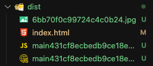
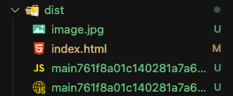

# Resource Asset

## 목차

1. [Resource Asset](#1-resource-asset)
    1. [이미지 사용](#1-1-이미지-사용)
        - [이미지 파일 준비](#--이미지-파일-준비)
        - [HTML 파일 수정](#--html-파일-수정)
        - [JS 파일 수정](#--js-파일-수정)
        - [빌드 에러 발생](#--빌드-에러-발생)
    2. [해결하기](#1-2-해결하기)
        - [module 설정하기](#--module-설정하기)
        - [빌드하기](#--빌드하기)
    3. [에셋 파일 이름 원래대로 출력](#1-3-에셋-파일-이름-원래대로-출력)
        - [output 설정하기](#--output-설정하기)

<br/>
<br/>

## 1. Resource Asset

- 대표적으로 이미지 파일들이 있음
- png, svg, jpeg 파일 등의 에셋을 사용하려할 경우, 에러 발생

<br/>

### 1-1. 이미지 사용

### - 이미지 파일 준비

- src/assets/image.jpeg 파일 준비

<br/>

### - HTML 파일 수정

- 기존 카드 이미지 태그 수정

```html
<!--src/index.html-->

<div class="image">
    
</div>
```

<br/>

### - JS 파일 수정

```js
// src/index.js

// 이미지 파일 가져오기
import mainImage from "./assets/image.jpg";

// DOM을 통해 img 태그 src 속성에 이미지 파일 넣기
const img = document.getElementById("mainImage");
img.src = mainImage;
```

<br/>

### - 빌드 에러 발생

- npm run build 명령어 실행 시, 에러 발생
- 이미지 파일 타입을 사용하기 위해 적절한 로더가 필요하다는 에러 메세지가 표시됨

```bash
ERROR in ./src/assets/image.jpg 1:0
Module parse failed: Unexpected character '�' (1:0)
You may need an appropriate loader to handle this file type, currently no loaders are configured to process this file. See https://webpack.js.org/concepts#loaders
(Source code omitted for this binary file)
 @ ./src/index.js 4:0-43 8:10-19

webpack 5.90.3 compiled with 1 error in 1100 ms
```

<br/>

### 1-2. 해결하기

### - module 설정하기

- webpack.config.js 파일의 module의 rules에 로더 추가 작성

```js
// webpack.config.js

const path = require("path");
const HtmlWebpackPlugin = require("html-webpack-plugin");

module.exports = {
  module: {
    rules: [

      // 로더 추가
      {
        // 타겟으로 지원할 여러 확장자들 지정
        test: /\.(png|svg|jpg|jpeg|gif)$/,
        type: "asset/resource",
      },
    ],
  }
};
```

<br/>

### - 빌드하기

- npm run build로 다시 빌드 진행
- 에러 없이 dist 폴더에 이미지 파일까지 번들됨

<br/>

<p align="center">
    <br/>
    <span>dist 폴더에 번들된 이미지 파일</span>
</p>

<br/>

### 1-3. 에셋 파일 이름 원래대로 출력

- 번들된 이미지 파일의 이름을 보면 해쉬 값처럼 난수로 표기된 것을 확인 할 수 있음
- 번들된 에셋 파일들의 이름을 원래대로 나오도록 하기

<br/>

### - output 설정하기

- webpack.config.js 파일의 output에 assetModuleFilename을 추가 작성하기

```js
// webpack.config.js

const path = require("path");
const HtmlWebpackPlugin = require("html-webpack-plugin");

module.exports = {
  output: {
    path: path.resolve(__dirname, "dist"),
    filename: "[name][contenthash].js",
    clean: true,

    // 해당 설정 추가
    assetModuleFilename: "[name][ext]",
  }
};
```

<br/>

<p align="center">
    <br/>
    <span>dist 폴더에 번들된 이미지 파일 이름 원래대로 나오게 하기</span>
</p>