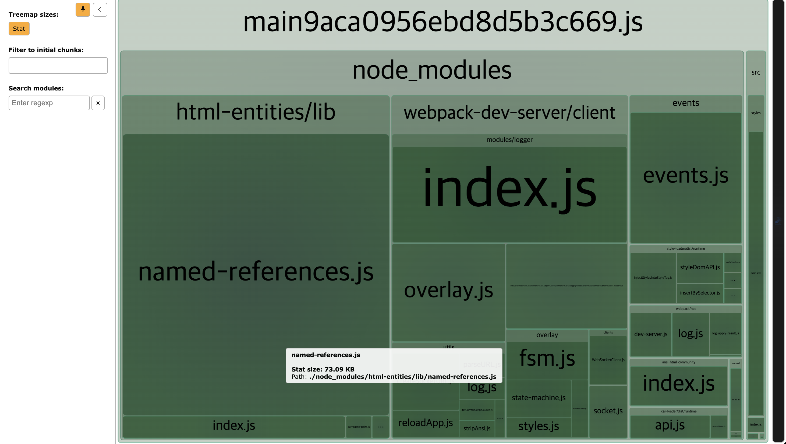

# bundle analyzer

## 목차

1. [bundle analyzer](#1-bundle-analyzer)
    1. [장점](#1-1-장점)
    2. [사용하기](#1-2-사용하기)
        - [패키지 설치](#--패키지-설치)
        - [plugins 설정하기](#--plugins-설정하기)
        - [서버 실행](#--서버-실행)

<br/>
<br/>

## 1. bundle analyzer

- 해당 프로젝트에서 사용하는 모듈의 종류, 모듈 및 gzip 파일의 크기(용량), 경로 등 여러 정보를 파악할 수 있도록 다이어그램을 이용하여 도와줌
- [GitHub - webpack-bundle-analyzer 레포지토리](https://github.com/webpack-contrib/webpack-bundle-analyzer)

<br/>

### 1-1. 장점

- 번들 내부에 무엇이 있는지 파악
- 크기를 많이 차지하는 모듈 파악
- 최적화
- 축소된 번들 지원
- gzip 파일 크기 파악

<br/>

### 1-2. 사용하기

### - 패키지 설치

- webpack-bundle-analyzer 패키지 설치

```bash
# NPM
$ npm install --save-dev webpack-bundle-analyzer

# YARN
$ yarn add -D webpack-bundle-analyzer
```

<br/>

### - plugins 설정하기

```js
// webpack.config.js

const path = require("path");
const HtmlWebpackPlugin = require("html-webpack-plugin");

// 플러그인 가져오기
const BundleAnalyzerPlugin = require("webpack-bundle-analyzer").BundleAnalyzerPlugin;

module.exports = {
  plugins: [

    // 플러그인 인스턴스 추가
    new BundleAnalyzerPlugin(),
  ]
};
```

<br/>

### - 서버 실행

- npm run dev 명령어 실행
- bundle-analyzer 화면이 함께 실행되는 것을 확인할 수 있고 해당 정보를 통해 최적화를 진행할 수 있음

<br/>

<p align="center">
    <br/>
    <span>웹 화면과 함께 bundle-analyzer 화면도 실행됨</span>
</p>